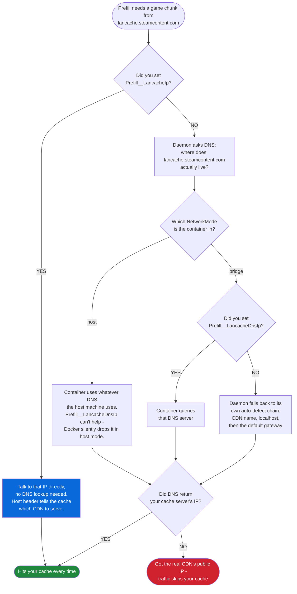
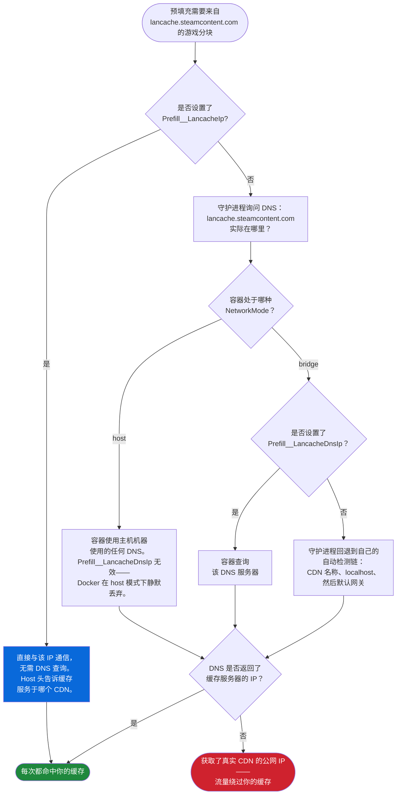

<div align="center">

[**English**](#en) | [**中文**](#zh)

</div>

---

<a id="en"></a>

# LANCache Manager

A web UI for [LANCache](https://lancache.net/). Watch downloads as they happen, see what's already cached, track bandwidth saved, and prefill Steam and Epic games before your next LAN party.

> [!IMPORTANT]
> **Always pull the `latest` tag.** GitHub's package page surfaces `:dev` because dev builds publish more often, but `:dev` is for testing only and can break at any time.
>
> ```bash
> docker pull ghcr.io/regix1/lancache-manager:latest
> ```

## Image Variants

Two images, same code, different size:

| Tag | Embedded PostgreSQL | When to use |
|---|---|---|
| `:latest` | ✓ Bundled inside the container | One-container setup. Works out of the box - no external DB needed. |
| `:latest-slim` | ✗ Not installed (~150 MB smaller) | You're running PostgreSQL separately (sidecar, remote host, or managed service). Requires `POSTGRES_MODE=external`. |

Same applies to dev builds: `:dev` (full) and `:dev-slim` (slim).

```bash
# Full - default, supports both embedded and external Postgres
docker pull ghcr.io/regix1/lancache-manager:latest

# Slim - external Postgres only
docker pull ghcr.io/regix1/lancache-manager:latest-slim
```

See [Configuration → PostgreSQL](#postgresql) for the two compose examples (embedded vs external).

-----

## Table of Contents

- [Image Variants](#image-variants)
- [Screenshots](#screenshots)
- [Quick Start](#quick-start)
- [Docker Compose](#docker-compose)
- [Configuration](#configuration)
  - [Volumes](#volumes)
  - [Required Settings](#required-settings)
  - [PostgreSQL](#postgresql)
  - [Security](#security)
  - [Prefill](#prefill-config)
  - [Paths and Datasources](#paths-and-datasources)
  - [Nginx Log Rotation](#nginx-log-rotation)
  - [API and Advanced](#api-and-advanced)
- [Prefill (Steam & Epic)](#prefill-steam--epic)
- [Custom Themes](#custom-themes)
- [Multiple Datasources](#multiple-datasources)
- [Reverse Proxy (Nginx)](#nginx-reverse-proxy)
- [Monitoring (Grafana & Prometheus)](#grafana--prometheus)
- [Troubleshooting](#troubleshooting)
- [Building from Source](#building-from-source)
- [Contributing Translations](#contributing-translations)
- [Support and License](#support-and-license)

-----

<a id="screenshots"></a>
## Screenshots

<div align="center">

### Dashboard


*Stats at a glance with draggable cards, service analytics, and top clients*

### Downloads

**Normal View**


**Compact View**


**Retro View**


*Three view modes to browse your cached games*

### Clients


*Monitor which devices are using your cache*

### Events


*Calendar view of download activity and LAN events*

### Prefill


*Pick between Steam and Epic to start a prefill session*


*Game selection, download settings, and real-time activity log*

### Management


*Authentication, demo mode, and display preferences*


*Log processing, corruption detection, and game cache detection*


*Browse installed themes or create your own with the theme editor*


*Assign friendly names to client IPs and exclude clients from stats*

</div>

-----

<a id="quick-start"></a>
## Quick Start

Run the container, point it at your existing LANCache logs and cache, and you're online in under a minute.

```bash
docker run -d \
  --name lancache-manager \
  -p 8080:80 \
  -v ./data:/data \
  -v /path/to/lancache/logs:/logs:ro \
  -v /path/to/lancache/cache:/cache:ro \
  -e TZ=America/Chicago \
  -e LanCache__LogPath=/logs/access.log \
  -e LanCache__CachePath=/cache \
  ghcr.io/regix1/lancache-manager:latest
```

Then:

1. Grab your API key from the container logs:

   ```bash
   docker logs lancache-manager | grep "API Key"
   ```

   It's also written to `/data/security/api_key.txt`.

2. Open `http://localhost:8080`.
3. Head to **Management**, paste your API key, and click **Process Logs** to import your existing cache history.

-----

<a id="docker-compose"></a>
## Docker Compose

For anything beyond a quick test, use Compose. Here's the minimum that gets you running:

```yaml
services:
  lancache-manager:
    image: ghcr.io/regix1/lancache-manager:latest
    container_name: lancache-manager
    restart: unless-stopped
    ports:
      - "8080:80"
    volumes:
      - ./data:/data
      - /mnt/lancache/logs:/logs:ro
      - /mnt/lancache/cache:/cache:ro
      - /var/run/docker.sock:/var/run/docker.sock  # Optional: for prefill and log rotation
    environment:
      - PUID=33
      - PGID=33
      - TZ=America/Chicago
      - LanCache__LogPath=/logs/access.log
      - LanCache__CachePath=/cache
```

Drop `:ro` from the `/cache` mount if you want to clear cache or remove individual games from the UI. The Docker socket is optional - you only need it for nginx log rotation and prefill (Steam or Epic).

A complete compose file showing every available environment variable, all commented out:

```yaml
services:
  lancache-manager:
    image: ghcr.io/regix1/lancache-manager:latest
    container_name: lancache-manager
    restart: unless-stopped
    ports:
      - "8080:80"
    volumes:
      - ./data:/data
      - /mnt/lancache/logs:/logs:ro
      - /mnt/lancache/cache:/cache:ro
      - /var/run/docker.sock:/var/run/docker.sock
    environment:
      # Required
      - PUID=33
      - PGID=33
      - TZ=America/Chicago
      - LanCache__LogPath=/logs/access.log
      - LanCache__CachePath=/cache
      - ASPNETCORE_URLS=http://+:80

      # Security
      # - Security__EnableAuthentication=true
      # - Security__MaxAdminDevices=3
      # - Security__GuestSessionDurationHours=6
      # - Security__RequireAuthForMetrics=false
      # - Security__ProtectSwagger=true
      # - Security__AllowedOrigins=
      # - Security__AllowedBrowsePaths=

      # Prefill (Steam & Epic) - see Configuration > Prefill for the full reference
      # Most installs need none of these; auto-detection covers the common cases.
      # - Prefill__LancacheIp=192.168.1.10        # Cache server IP. The single most reliable override.
      # - Prefill__LancacheDnsIp=192.168.1.20     # DNS server IP. Bridge mode only.
      # - Prefill__NetworkMode=bridge             # `host`, `bridge`, or a Docker network name.
      # - Prefill__SteamDockerImage=ghcr.io/regix1/steam-prefill-daemon:latest
      # - Prefill__EpicDockerImage=ghcr.io/regix1/epic-prefill-daemon:latest

      # Nginx Log Rotation
      # - NginxLogRotation__Enabled=true
      # - NginxLogRotation__ContainerName=auto
      # - NginxLogRotation__ScheduleHours=24

      # API Options
      # - ApiOptions__MaxClientsPerRequest=1000
      # - ApiOptions__DefaultClientsLimit=100

      # Optimization
      # - Optimizations__EnableGarbageCollectionManagement=false

      # Paths & Datasources
      # - LanCache__EnvFilePath=/lancache/.env
      # - LanCache__AutoDiscoverDatasources=true

      # Debugging
      # - Logging__LogLevel__LancacheManager.Infrastructure.Platform=Debug
```

-----

<a id="configuration"></a>
## Configuration

<a id="volumes"></a>
### Volumes

| Volume | Purpose | Notes |
|--------|---------|-------|
| `/data` | PostgreSQL database, security, state and config, themes, cached images | Required |
| `/logs` | LANCache access logs | Add `:ro` for read-only |
| `/cache` | LANCache cached files | Add `:ro` to monitor without touching files |
| `/var/run/docker.sock` | Docker API access | Optional. Needed for nginx log rotation and Steam/Epic prefill |

<a id="required-settings"></a>
### Required Settings

| Variable | Default | Description |
|----------|---------|-------------|
| `PUID` | `33` | User ID the app runs as. Match the owner of your cache and log files. |
| `PGID` | `33` | Group ID the app runs as. |
| `TZ` | `UTC` | Timezone for log timestamps (e.g., `America/Chicago`). `TimeZone` is also accepted as a fallback. |
| `LanCache__LogPath` | - | Path inside the container to the LANCache access log. |
| `LanCache__CachePath` | - | Path inside the container to the LANCache cache directory. |

<a id="postgresql"></a>
### PostgreSQL

LANCache Manager stores everything in PostgreSQL. Pick one of two modes:

| Mode | When to use it |
|------|----------------|
| **Embedded** (default) | Single-container deployment, simplest setup. PostgreSQL 17 runs inside the lancache-manager container over a Unix socket. Nothing extra to configure. |
| **External** | Standard Docker pattern, easier upgrades, lets you point at a managed Postgres (RDS, Azure DB, Cloud SQL). Requires a separate Postgres service or a remote host. |

Image-tag pairing — see [Image Variants](#image-variants) at the top of this README:

- **Embedded mode** → use `:latest` (or `:dev`)
- **External mode** → either `:latest` works, or use `:latest-slim` to drop the unused embedded Postgres binary

Switching from embedded to external on an existing install? See [docs/external-postgres-migration.md](docs/external-postgres-migration.md) for the `pg_dump`/`pg_restore` commands.

#### Environment variables

| Variable | Default | Description |
|----------|---------|-------------|
| `POSTGRES_MODE` | `embedded` | `embedded` or `external`. |
| `POSTGRES_USER` | `lancache` | PostgreSQL username. Both modes. |
| `POSTGRES_PASSWORD` | - | PostgreSQL password. In embedded mode the UI shows a setup page if this is unset. In external mode it must be set (or entered via the UI fallback before the app can connect). |
| `POSTGRES_HOST` | - | **External mode only.** Hostname or IP of the Postgres server. |
| `POSTGRES_PORT` | `5432` | **External mode only.** |
| `POSTGRES_DB` | `lancache` | Database name. Both modes. |

If you're upgrading from an older SQLite build, the migration runs automatically on first start in either mode — your downloads, settings, and cached data carry over with no manual steps. On managed Postgres services some `ALTER SYSTEM` tuning is forbidden; the migration treats it as best-effort and continues without it.

#### Example 1: Embedded (default)

Single container, no sidecar. The simplest possible setup.

```yaml
services:
  lancache-manager:
    image: ghcr.io/regix1/lancache-manager:latest
    container_name: lancache-manager
    restart: unless-stopped
    ports:
      - "8080:80"
    volumes:
      - ./data:/data
      - /mnt/lancache/logs:/logs:ro
      - /mnt/lancache/cache:/cache:ro
      - /var/run/docker.sock:/var/run/docker.sock
    environment:
      - PUID=33
      - PGID=33
      - TZ=America/Chicago
      - LanCache__LogPath=/logs/access.log
      - LanCache__CachePath=/cache
      - POSTGRES_PASSWORD=your-secure-password
```

Bring it up:

```bash
docker compose up -d
```

That's it. Leave `POSTGRES_PASSWORD` unset and the first-run UI will prompt for it.

#### Example 2: External (sidecar Postgres)

Two services: `lancache-manager` connects over TCP to `lancache-db`. The `:latest-slim` image drops the unused embedded Postgres for a smaller footprint.

```yaml
services:
  lancache-manager:
    image: ghcr.io/regix1/lancache-manager:latest-slim
    container_name: lancache-manager
    restart: unless-stopped
    ports:
      - "8080:80"
    volumes:
      - ./data:/data
      - /mnt/lancache/logs:/logs:ro
      - /mnt/lancache/cache:/cache:ro
      - /var/run/docker.sock:/var/run/docker.sock
    environment:
      - PUID=33
      - PGID=33
      - TZ=America/Chicago
      - LanCache__LogPath=/logs/access.log
      - LanCache__CachePath=/cache
      - POSTGRES_MODE=external
      - POSTGRES_HOST=lancache-db
      - POSTGRES_PORT=5432
      - POSTGRES_DB=lancache
      - POSTGRES_USER=lancache
      - POSTGRES_PASSWORD=change-this-password
    depends_on:
      - lancache-db

  lancache-db:
    image: postgres:17-alpine
    container_name: lancache-db
    restart: unless-stopped
    environment:
      - POSTGRES_USER=lancache
      - POSTGRES_PASSWORD=change-this-password
      - POSTGRES_DB=lancache
    volumes:
      - postgres_data:/var/lib/postgresql/data

volumes:
  postgres_data:
```

`POSTGRES_PASSWORD` must match between the two services. Bring both up at once:

```bash
docker compose up -d
```

Pointing at a remote/managed Postgres? Set `POSTGRES_HOST` to its hostname, drop the `lancache-db` service, drop `depends_on`, and skip the named volume.

If you set `POSTGRES_MODE=external` but leave the other connection env vars unset, the app boots in setup-only mode and shows a UI form. Credentials submitted there are saved to `/data/config/postgres-credentials.json`; you'll be asked to restart the container so the new connection takes effect.

<a id="security"></a>
### Security

| Variable | Default | Description |
|----------|---------|-------------|
| `Security__EnableAuthentication` | `true` | Require an API key for admin actions. Only turn off for local dev. |
| `Security__MaxAdminDevices` | `3` | How many devices can share the same API key. |
| `Security__GuestSessionDurationHours` | `6` | Default guest session length (also configurable in the UI). |
| `Security__RequireAuthForMetrics` | `false` | Require an API key on `/metrics`. The UI toggle in Management → Security overrides this when set. |
| `Security__ProtectSwagger` | `true` | Require auth on Swagger docs in production. |
| `Security__AllowedOrigins` | (empty) | Comma-separated CORS allow list. Empty allows all. |
| `Security__AllowedBrowsePaths` | (empty) | Comma-separated allow-list of file-browser roots. Empty disables the file browser entirely (every request returns `403`). Example: `/data,/mnt`. |
| `Security__ApiKeyPath` | `/data/security/api_key.txt` | Override the file path the admin API key is read from and written to. Useful if you bind-mount secrets from outside `/data`. |
| `Security__KnownProxyNetworks` | (empty) | Comma-separated CIDR list of trusted proxy networks for `X-Forwarded-For` (e.g. `172.16.0.0/12,10.0.0.0/8`). Set this when nginx, Traefik, or another reverse proxy fronts the manager so client IPs are reported correctly. Loopback is always trusted. |
| `Security__TrustAllProxies` | `false` | Trust every upstream proxy unconditionally. Convenient for local dev. **Never enable on an internet-exposed host** - anyone can spoof a client IP. |

#### Access Levels

| Level | What you can do | Examples |
|-------|----------------|----------|
| **Admin** | Everything. Requires the API key. | Clear cache, process logs, change settings |
| **Guest** | Read-only views. Requires admin auth or a guest session. | Browse downloads, stats, events, client data |

To hand out a guest link without sharing your API key, open the **Users** tab and click **Create Guest Link**. Guests can browse the dashboard but can't change anything. Nothing is public - every endpoint requires either admin auth or a valid guest session.

#### File Browser (DeveLanCacheUI Import)

The DeveLanCacheUI import flow uses an admin-only file browser endpoint (`/api/filebrowser/list`) to find a `.db` file on the server. For safety, the browser is **disabled by default** - without an explicit allow-list, every request returns `403` and you'll see this in the log:

```
warn: LancacheManager.Controllers.FileBrowserController[0]
      FileBrowser: Security:AllowedBrowsePaths is not configured. All file-browse requests will be rejected (403) until paths are configured.
```

To turn it on, set `Security__AllowedBrowsePaths` to a comma-separated list of directories the browser is allowed to enter. Subdirectories of each root are fine; everything outside the list returns `403`.

```yaml
environment:
  - Security__AllowedBrowsePaths=/data,/mnt
```

If you don't use the DeveLanCacheUI importer, leave it empty. The warning is informational - nothing else in the app cares.

<a id="prefill-config"></a>
### Prefill

Prefill auto-detects the right values for almost everything in this table. The one variable worth knowing about is **`Prefill__LancacheIp`** - set it to your cache server's IP and prefill stops depending on DNS at all. Reach for the others only when auto-detection gets it wrong.

For setup decisions (when do I need which override?), see [Prefill (Steam & Epic) → Network setup](#prefill-network).

| Variable | Default | Description |
|----------|---------|-------------|
| `Prefill__LancacheIp` | (unset) | IP or hostname of your **cache server** (the HTTP server holding cached files, port 80). Forwarded to the daemon as `LANCACHE_IP`; the daemon then connects directly with a spoofed `Host:` header and skips DNS for CDN traffic. The single most reliable override - set this whenever your DNS isn't a stock `lancache-dns`. |
| `Prefill__LancacheDnsIp` | `auto` | IP of your **DNS server** (lancache-dns, AdGuard, Pi-hole - port 53). Written into the prefill container's `/etc/resolv.conf` so the daemon resolves CDN hostnames against it. Used in `bridge` mode only - Docker silently drops DNS overrides on `host`-network containers. `auto` reuses the IP of your detected `lancache-dns` container. |
| `Prefill__NetworkMode` | `auto` | Docker network mode for prefill containers. Accepts `host`, `bridge`, or a Docker network name. `auto` infers the mode from your `lancache-dns` container. |
| `Prefill__SteamDockerImage` | `ghcr.io/regix1/steam-prefill-daemon:latest` | Docker image used for Steam prefill containers. |
| `Prefill__EpicDockerImage` | `ghcr.io/regix1/epic-prefill-daemon:latest` | Docker image used for Epic prefill containers. |
| `Prefill__SessionTimeoutMinutes` | `120` | Minutes of inactivity before an idle prefill session is cleaned up. |
| `Prefill__DaemonBasePath` | `/data/prefill` | Container path where prefill session state is stored. |
| `Prefill__HostDataPath` | `auto` | Host path that maps to the manager's `/data` volume. Detected from the manager's mount config; set explicitly only when detection fails (unusual platforms, custom volume drivers). |
| `Prefill__UseTcp` | `auto` | Communicate with the daemon over TCP instead of a Unix domain socket. `auto` resolves to `true` on Windows, `false` on Linux. *Linux users only need to set this if they want to force TCP mode.* |
| `Prefill__TcpPort` | `45555` | TCP port the daemon listens on inside its container. *Used in TCP mode only - Windows by default, Linux only when `Prefill__UseTcp=true`.* |
| `Prefill__HostTcpPort` | (random free port) | TCP port the daemon's container publishes on the host. *TCP mode only.* |
| `Prefill__TcpHost` | `127.0.0.1` | Host the daemon binds to and the manager connects to over TCP. *TCP mode only.* |

> [!NOTE]
> **TCP mode is the platform divide.** On Windows, prefill containers communicate over TCP because Windows doesn't expose Unix domain sockets to Docker. On Linux, prefill uses a Unix domain socket by default - the four TCP variables above are ignored unless you set `Prefill__UseTcp=true`. Stock Linux installs can skip the TCP rows entirely.

<a id="paths-and-datasources"></a>
### Paths and Datasources

| Variable | Default | Description |
|----------|---------|-------------|
| `LanCache__EnvFilePath` | (auto) | Path to the lancache `.env` file (used to read `CACHE_DISK_SIZE`). Searches common locations if unset. |
| `LanCache__AutoDiscoverDatasources` | `false` | Auto-detect datasources from matching subdirectories under `/cache` and `/logs`. |

If you run more than one cache instance or split services across drives, see [Multiple Datasources](#multiple-datasources).

<a id="nginx-log-rotation"></a>
### Nginx Log Rotation

| Variable | Default | Description |
|----------|---------|-------------|
| `NginxLogRotation__Enabled` | `true` | Tell nginx to reopen its logs after the app rotates them. Requires the Docker socket. |
| `NginxLogRotation__ContainerName` | `auto` | LANCache container name. `auto` finds containers with "lancache" in the name. |
| `NginxLogRotation__ScheduleHours` | `24` | How often to check whether rotation is needed. |

<a id="api-and-advanced"></a>
### API and Advanced

| Variable | Default | Description |
|----------|---------|-------------|
| `ApiOptions__MaxClientsPerRequest` | `1000` | Max clients returned in a single stats request. |
| `ApiOptions__DefaultClientsLimit` | `100` | Default client limit when none is provided. |
| `Optimizations__EnableGarbageCollectionManagement` | `false` | Show memory management controls in Management. Helpful on low-memory hosts. |
| `ASPNETCORE_URLS` | `http://+:80` | Internal port binding. Don't change unless you know exactly why. |

-----

<a id="prefill-steam--epic"></a>
## Prefill (Steam & Epic)

Prefill downloads games into your cache *before* people connect. When guests show up, every install reads from your cache instead of the public internet - full LAN speed, no bandwidth bottleneck.

Steam and Epic each run in their own container, so you can prefill both at the same time without them interfering. Progress streams live to the UI.

### Running a prefill

The flow is the same for both services:

1. Open the **Prefill** tab and pick **Steam** or **Epic Games**
2. Sign in (Steam Guard for Steam, OAuth for Epic)
3. Pick games from your library
4. Hit **Start**

That's it. Leave it running - when guests arrive, everything's cached.

> [!NOTE]
> Steam prefill is built on [steam-prefill-daemon](https://github.com/regix1/steam-prefill-daemon), a fork of [steam-lancache-prefill](https://github.com/tpill90/steam-lancache-prefill) by [@tpill90](https://github.com/tpill90). Epic prefill uses [epic-prefill-daemon](https://github.com/regix1/epic-prefill-daemon).

### Importing Steam App IDs

Have a list of App IDs from `steam-lancache-prefill` or somewhere else? Skip the library browser:

1. Click **Select Apps**
2. Click **Import App IDs**
3. Paste your IDs in any of these formats:
   - Comma-separated: `730, 570, 440`
   - JSON array: `[730, 570, 440]`
   - One per line
4. Click **Import**

The dialog tells you how many games were added, how many were already selected, and how many IDs aren't in your Steam library (those are skipped at prefill time).

> [!TIP]
> **Coming from `steam-lancache-prefill`?** Open `selectedAppsToPrefill.json` and paste the contents straight into the import field - the JSON array is parsed as-is.

### Requirements

- Docker socket mounted (`/var/run/docker.sock`)
- Logged in as admin in lancache-manager
- Your cache server is reachable from the prefill container (see [Network setup](#prefill-network) below)

<a id="prefill-network"></a>
### Network setup

**Most installs need zero config.** If you run the standard `lancache` + `lancache-dns` containers, lancache-manager auto-detects them and prefill works without further setup.

If your DNS isn't a stock `lancache-dns` (you use AdGuard Home, Pi-hole, public DNS, etc.) or your routing is unusual, set one env var and you're done.

#### Quick recommendation

| Your setup | What to set |
|---|---|
| Stock `lancache` + `lancache-dns` containers | nothing |
| Single-box install (lancache on the same host as lancache-manager) | nothing |
| AdGuard Home, Pi-hole, or any DNS replacement | `Prefill__LancacheIp=<your-cache-ip>` |
| Host networking, host's DNS doesn't route CDN to your cache | `Prefill__LancacheIp=<your-cache-ip>` |
| Caddy/Squid/non-nginx cache that routes by `Host:` header | `Prefill__LancacheIp=<your-cache-ip>` |
| You want predictable behavior regardless of environment | always set `Prefill__LancacheIp` |

> [!TIP]
> **`Prefill__LancacheIp` is the universal override.** When set, prefill talks to your cache by IP and never asks DNS where the cache lives. Network mode and DNS server settings stop mattering for CDN traffic.

Full descriptions and defaults for `Prefill__LancacheIp`, `Prefill__LancacheDnsIp`, and `Prefill__NetworkMode` live in the [Configuration → Prefill](#prefill-config) reference table.

> [!IMPORTANT]
> **`LancacheIp` and `LancacheDnsIp` are different services, even on the same machine.** Quick mental model:
>
> | | What it is | Port | Job |
> |---|---|---|---|
> | `LancacheIp` | The **cache server** (`lancachenet/monolithic`, or any HTTP cache) | HTTP / 80 | Holds the actual cached game files |
> | `LancacheDnsIp` | The **DNS server** (`lancachenet/lancache-dns`, AdGuard Home, Pi-hole, etc.) | DNS / 53 | Translates `lancache.steamcontent.com` into the cache's IP |
>
> Think of a small town. The **cache** is the library (where the books live). The **DNS server** is the information booth (where you ask "which way to the library?"). Both can sit in the same building - same IP, different ports - but they do completely different jobs. You can't borrow a book from the information booth, and the librarian doesn't give directions.
>
> When you set `LancacheIp`, the daemon skips the information booth entirely and walks straight to the library. That's why it's the universal override: DNS becomes irrelevant for cache traffic.

> [!IMPORTANT]
> Steam (`api.steampowered.com`) and Epic (`*.epicgames.com`) auth and manifest endpoints still use normal DNS. `LANCACHE_IP` only redirects CDN chunk traffic - the only domains lancache caches. Your login and metadata traffic is unaffected.

#### Examples

**Most reliable** - `LancacheIp` makes CDN routing DNS-independent:

```yaml
environment:
  - Prefill__NetworkMode=host
  - Prefill__LancacheIp=192.168.1.10
```

**Bridge mode with a non-standard DNS** (e.g., AdGuard Home replacing lancache-dns):

```yaml
environment:
  - Prefill__NetworkMode=bridge
  - Prefill__LancacheIp=192.168.1.10        # cache server
  - Prefill__LancacheDnsIp=192.168.1.20     # DNS server
```

**Bridge mode, stock lancache-dns, no IP override** (legacy DNS-driven path):

```yaml
environment:
  - Prefill__NetworkMode=bridge
  - Prefill__LancacheDnsIp=192.168.1.20
```

> [!TIP]
> **Prefill container has no internet?** Try `Prefill__NetworkMode=bridge`. Some Docker setups block outbound traffic in host mode.

#### Network diagnostics

Each prefill session runs a connectivity test on startup and writes the result to logs:

```
═══════════════════════════════════════════════════════════════════════
  PREFILL CONTAINER NETWORK DIAGNOSTICS - prefill-daemon-abc123
═══════════════════════════════════════════════════════════════════════
  Internet connectivity: OK (reached api.steampowered.com)
  lancache.steamcontent.com resolved to 192.168.1.10
  DNS looks correct (private IP - likely your lancache server)
═══════════════════════════════════════════════════════════════════════
```

If the resolved IP is a public address (Steam's real CDN IPs look like `162.254.x.x`), traffic is bypassing your cache. Set `Prefill__LancacheIp` and restart the session.

<a id="prefill-routing"></a>
#### How routing works (advanced)

For when you want to know exactly which path a request takes:



Every combination, in one table:

| `NetworkMode` | `LancacheIp` | `LancacheDnsIp` | Outcome |
|:---:|:---:|:---:|---|
| `host` | set | (any) | Reliable. `LANCACHE_IP` injected; DNS irrelevant. |
| `host` | unset | (any) | Risky. DnsIp is silently dropped (Docker limitation). Works only if the host's DNS already resolves CDN to your cache. |
| `bridge` | set | unset | Reliable. `LANCACHE_IP` injected; DNS irrelevant. |
| `bridge` | set | set | Reliable. `LANCACHE_IP` for CDN, DnsIp for auth/manifest. |
| `bridge` | unset | set | Works if DnsIp resolves CDN to your cache. Container DNS forced to DnsIp. |
| `bridge` | unset | unset | Inconsistent. Auto-detect probes localhost/gateway. Works for some setups. |

**Why `LancacheIp` always works**: with the env var set, the daemon builds requests like `GET http://192.168.1.10/depot/123/chunk/abc` with `Host: lancache.steamcontent.com`. Your cache (nginx, Caddy, or any HTTP server that routes by `Host:`) sees the right hostname and serves from cache. DNS is never consulted for the CDN domain.

-----

<a id="custom-themes"></a>
## Custom Themes

Open **Management > Preferences > Theme Management** to:

- Build themes from scratch with a live preview
- Browse and install community themes
- Import and export themes as TOML

Themes live in `/data/themes/`. Here's the minimum format:

```toml
[meta]
name = "My Theme"
id = "my-theme"
isDark = true
version = "1.0.0"
author = "Your Name"

[colors]
primaryColor = "#3b82f6"
bgPrimary = "#111827"
textPrimary = "#ffffff"
```

-----

<a id="multiple-datasources"></a>
## Multiple Datasources

Most people run a single LANCache instance and never touch this section. You only need it if you've split services across cache directories or you run more than one LANCache server and want them combined in a single dashboard.

A "datasource" is a paired log + cache directory. Each one is processed and tracked separately, then aggregated in the dashboard and downloads views.

Common reasons to use it:

- **Outsourced services** - Steam lives on a separate drive from everything else.
- **Multiple LANCache instances** - separate cache servers for different rooms or purposes.
- **Segmented storage** - different services on different partitions.

### Auto-discovery (recommended)

Point the app at the parent directories and let it scan:

```yaml
environment:
  - LanCache__LogPath=/logs
  - LanCache__CachePath=/cache
  - LanCache__AutoDiscoverDatasources=true
```

Two things get detected:

1. **Root-level datasource** - if `/logs/access.log` exists and `/cache` contains LANCache hash directories (`00/`, `01/`, etc.), it creates a "Default" datasource.
2. **Subdirectory datasources** - for each folder that exists in *both* `/cache` and `/logs`, it creates a named datasource (e.g., `/cache/steam` + `/logs/steam` becomes "Steam").

Folder matching is case-insensitive: `Steam`, `steam`, and `STEAM` all match.

Example layout that creates three datasources (Default, Steam, Epic):

```
/mnt/lancache/
├── cache/
│   ├── 00/, 01/, a1/, ff/    ← Default cache (hash dirs at root)
│   ├── steam/
│   │   └── 00/, 01/, ...     ← Outsourced Steam
│   └── epic/
│       └── 00/, 01/, ...     ← Outsourced Epic
└── logs/
    ├── access.log            ← Default log
    ├── steam/
    │   └── access.log        ← Steam log
    └── epic/
        └── access.log        ← Epic log
```

### Manual configuration

For drives in totally separate locations or finer control, declare each datasource explicitly. Manual config wins over auto-discovery if both are set.

```yaml
environment:
  # Main LANCache
  - LanCache__DataSources__0__Name=Default
  - LanCache__DataSources__0__CachePath=/cache
  - LanCache__DataSources__0__LogPath=/logs
  - LanCache__DataSources__0__Enabled=true

  # Steam on a separate drive
  - LanCache__DataSources__1__Name=Steam
  - LanCache__DataSources__1__CachePath=/steam-cache
  - LanCache__DataSources__1__LogPath=/steam-logs
  - LanCache__DataSources__1__Enabled=true
```

With matching volume mounts:

```yaml
volumes:
  - /mnt/lancache/cache:/cache:ro
  - /mnt/lancache/logs:/logs:ro
  - /mnt/steam-drive/cache:/steam-cache:ro
  - /mnt/steam-drive/logs:/steam-logs:ro
```

-----

<a id="nginx-reverse-proxy"></a>
## Reverse Proxy (Nginx)

LANCache Manager runs fine behind nginx. HTTPS is recommended, and required if you plan to use guest sessions across origins (cross-origin image cookies need `Secure`).

### Single origin (recommended)

Serve the UI and API from the same hostname. Cookies stay first-party, CORS is a non-issue.

```nginx
server {
  listen 443 ssl http2;
  server_name lancache.example.com;

  ssl_certificate     /etc/letsencrypt/live/lancache.example.com/fullchain.pem;
  ssl_certificate_key /etc/letsencrypt/live/lancache.example.com/privkey.pem;

  # Increase if you have large responses
  client_max_body_size 50m;

  location / {
    proxy_pass http://127.0.0.1:8080;
    proxy_http_version 1.1;
    proxy_set_header Host $host;
    proxy_set_header X-Real-IP $remote_addr;
    proxy_set_header X-Forwarded-For $proxy_add_x_forwarded_for;
    proxy_set_header X-Forwarded-Proto $scheme;
    proxy_set_header X-Forwarded-Host $host;

    # SignalR (WebSockets)
    proxy_set_header Upgrade $http_upgrade;
    proxy_set_header Connection "upgrade";
    proxy_read_timeout 600s;  # Must match SignalR timeout (10 min) to prevent nginx killing idle WebSocket connections
  }
}

server {
  listen 80;
  server_name lancache.example.com;
  return 301 https://$host$request_uri;
}
```

### Separate API origin (only if you must)

If the UI and API live on different hostnames:

- Build the UI with `VITE_API_URL=https://api.lancache.example.com`.
- Keep `SameSite=None; Secure` cookies (the app already sets this).
- Allow credentials in CORS for the UI origin.

```nginx
server {
  listen 443 ssl http2;
  server_name api.lancache.example.com;

  ssl_certificate     /etc/letsencrypt/live/api.lancache.example.com/fullchain.pem;
  ssl_certificate_key /etc/letsencrypt/live/api.lancache.example.com/privkey.pem;

  location / {
    proxy_pass http://127.0.0.1:8080;
    proxy_http_version 1.1;
    proxy_set_header Host $host;
    proxy_set_header X-Real-IP $remote_addr;
    proxy_set_header X-Forwarded-For $proxy_add_x_forwarded_for;
    proxy_set_header X-Forwarded-Proto $scheme;
    proxy_set_header X-Forwarded-Host $host;

    # SignalR (WebSockets)
    proxy_set_header Upgrade $http_upgrade;
    proxy_set_header Connection "upgrade";
    proxy_read_timeout 600s;  # Must match SignalR timeout (10 min) to prevent nginx killing idle WebSocket connections
  }
}
```

-----

<a id="grafana--prometheus"></a>
## Monitoring (Grafana & Prometheus)

The app exposes Prometheus metrics on `/metrics`. Scrape them, build dashboards, alert on cache hit ratio - whatever you need.

### Available metrics

| Metric | Description |
|--------|-------------|
| `lancache_cache_capacity_bytes` | Total storage capacity |
| `lancache_cache_size_bytes` | Currently used space |
| `lancache_cache_hit_bytes_total` | Bandwidth saved (cache hits) |
| `lancache_cache_miss_bytes_total` | New data downloaded |
| `lancache_active_downloads` | Current active downloads |
| `lancache_cache_hit_ratio` | Cache effectiveness (0-1) |
| `lancache_downloads_by_service` | Downloads per service |
| `lancache_bytes_served_by_service` | Bandwidth per service |

### Prometheus config

```yaml
scrape_configs:
  - job_name: 'lancache-manager'
    static_configs:
      - targets: ['lancache-manager:80']
    scrape_interval: 30s
    metrics_path: /metrics
```

If you've set `Security__RequireAuthForMetrics=true`, add bearer auth:

```yaml
    authorization:
      type: Bearer
      credentials: 'your-api-key-here'
```

### Example queries

```promql
# Cache hit rate as percentage
lancache_cache_hit_ratio * 100

# Bandwidth saved in last 24 hours
increase(lancache_cache_hit_bytes_total[24h])

# Cache size in GB
lancache_cache_size_bytes / 1024 / 1024 / 1024
```

-----

<a id="troubleshooting"></a>
## Troubleshooting

### Logs aren't processing

1. Check the log path in **Management > Settings**.
2. Confirm your volume mount lines up with `LanCache__LogPath`.
3. Click **Process Logs** in Management.
4. Look at the container logs: `docker logs lancache-manager`.

### Games aren't being identified

**Steam:**

1. Pull the latest mappings from **Management > Depot Mappings**.
2. Add custom mappings for any private depots you care about.
3. Click **Reprocess All Logs** after adding mappings.

**Epic:**

1. Open **Management > Integrations** and run Epic game mapping.
2. The mapping service queries the Epic API to identify what's in your cache.
3. Game names and cover art come down automatically.

### Lost API key

```bash
cat ./data/security/api_key.txt
# or
docker logs lancache-manager | grep "API Key"
```

To rotate the key, stop the container, delete `./data/security/api_key.txt`, and start it again.

### Permission issues

Make sure `PUID` and `PGID` match the owner of your cache and log files:

```bash
ls -n /path/to/cache
```

### Prefill won't run

This applies to both Steam and Epic.

1. Confirm the Docker socket is mounted.
2. Confirm you're authenticated as admin in lancache-manager.
3. Look in the container logs for the network diagnostics block (`═══ PREFILL CONTAINER NETWORK DIAGNOSTICS ═══`).
4. **No internet inside the prefill container.** The container can't reach Steam or Epic. Common fixes:
   - Set `Prefill__NetworkMode=bridge` (works for most setups).
   - Confirm your Docker network has outbound internet.
   - Check firewall rules for outbound traffic.
5. **HTTP 400 errors during download.** The container can't resolve CDN domains to your cache. Try one of these:
   - `Prefill__NetworkMode=host` if your `lancache-dns` runs on host networking.
   - `Prefill__LancacheDnsIp` set to your DNS server IP.
   - Or, the most reliable option: set `Prefill__LancacheIp` to your cache server's IP. This bypasses DNS entirely for CDN traffic and works with any HTTP cache that routes by `Host:` header. See the [Network setup](#prefill-network) section for details.
6. **IPv6 traffic bypassing DNS.** If your network has IPv6, queries can bypass `lancache-dns`. The app already disables IPv6 in prefill containers to prevent this.
7. **Epic OAuth never connects.** Complete the OAuth flow in the browser window that pops open. The token is stored securely and persists across sessions.

To find the IP of your `lancache-dns`:

```bash
docker inspect lancache-dns | grep IPAddress
```

A few configurations as a starting point:

```yaml
# Bridge mode (recommended default)
environment:
  - Prefill__NetworkMode=bridge
```

```yaml
# Host networking (when lancache-dns also uses host mode)
environment:
  - Prefill__NetworkMode=host
```

```yaml
# Explicit DNS IP (when auto-detection picks the wrong one)
environment:
  - Prefill__LancacheDnsIp=192.168.1.20
```

```yaml
# Lancache IP injection - works in host or bridge mode
environment:
  - Prefill__NetworkMode=host
  - Prefill__LancacheIp=192.168.1.10        # your cache server IP - bypasses DNS for CDN traffic
  - Prefill__LancacheDnsIp=192.168.1.20     # optional - only used in bridge mode
```

### Debug logging

If you're chasing a path resolution, file system, or Docker socket issue, turn on verbose platform logging:

```yaml
environment:
  - Logging__LogLevel__LancacheManager.Infrastructure.Platform=Debug
```

You'll get extra detail on:

- Path resolution (container vs host paths)
- File system operations and permission checks
- Docker socket communication and container detection
- Volume mount detection
- Linux/Windows platform differences

To use it: add the variable, restart with `docker compose up -d`, reproduce the issue, then check `docker logs lancache-manager`. Remove the variable when you're done - it's noisy.

This is most useful when path auto-detection fails, prefill containers won't spawn, volume mounts look wrong, or you're on an unusual platform.

-----

<a id="building-from-source"></a>
## Building from Source

You'll need .NET 8 SDK, Node.js 20+, and Rust 1.75+.

```bash
git clone https://github.com/regix1/lancache-manager.git
cd lancache-manager

# Rust processor
cd rust-processor && cargo build --release

# Web interface
cd ../Web && npm install && npm run dev  # http://localhost:3000

# API
cd ../Api/LancacheManager && dotnet run  # http://localhost:5000
```

Multi-arch Docker build:

```bash
docker buildx build \
  --platform linux/amd64,linux/arm64 \
  -t ghcr.io/regix1/lancache-manager:latest \
  --push .
```

-----

<a id="contributing-translations"></a>
## Contributing Translations

LANCache Manager supports internationalization (i18n) and welcomes community translations. Every UI string is already externalized - there's nothing to refactor before you can translate.

### How to contribute

1. **Fork the repository** on GitHub.
2. Open `Web/src/i18n/locales/`.
3. Copy `en.json` to a file named for your language (e.g., `de.json`, `fr.json`, `es.json`, `pt-BR.json`).
4. Translate the values. Leave the keys alone.
5. Submit a **pull request**.

### File layout

```
Web/src/i18n/locales/
├── en.json          ← English (reference)
├── de.json          ← German (your contribution)
├── fr.json          ← French (your contribution)
└── ...
```

### Guidelines

- **Don't change JSON keys** - only translate the string values.
- **Preserve placeholders** - keep `{{variable}}` intact (e.g., `{{name}}`).
- **Preserve formatting** - leave HTML tags like `<strong>` alone.
- **Test locally** - run the app and verify your translations render correctly.

### Example

```json
// en.json
{
  "dashboard": {
    "title": "Dashboard",
    "recentDownloads": "Recent Downloads",
    "totalCache": "Total Cache: {{size}}"
  }
}

// de.json
{
  "dashboard": {
    "title": "Übersicht",
    "recentDownloads": "Letzte Downloads",
    "totalCache": "Gesamter Cache: {{size}}"
  }
}
```

-----

<a id="support-and-license"></a>
## Support and License

Stuck on something? [Open an issue](https://github.com/regix1/lancache-manager/issues) on GitHub, or come find the LANCache community on the [LanCache.NET Discord](https://discord.com/invite/BKnBS4u).

If LANCache Manager has been useful to you and you'd like to support development, you can [buy me a coffee](https://www.buymeacoffee.com/regix). Every bit helps keep the project alive.

<div align="center">

<a href="https://www.buymeacoffee.com/regix">
  
</a>

</div>

Released under the [MIT License](https://github.com/regix1/lancache-manager/blob/main/LICENSE).


---

<a id="zh"></a>

# LANCache Manager

[LANCache](https://lancache.net/) 的 Web 管理界面。实时查看下载进度、查看已缓存内容、追踪节省的带宽，以及在下次 LAN 聚会前预填充 Steam 和 Epic 游戏。

> [!IMPORTANT]
> **始终拉取 `latest` 标签。** GitHub 的包页面会展示 `:dev`，因为开发版构建更频繁，但 `:dev` 仅用于测试，随时可能出问题。
>
> ```bash
> docker pull ghcr.io/regix1/lancache-manager:latest
> ```

## 镜像变体

两个镜像，代码相同，大小不同：

| 标签 | 内嵌 PostgreSQL | 使用场景 |
|---|---|---|
| `:latest` | ✓ 打包在容器内 | 单容器部署，开箱即用，无需外部数据库。 |
| `:latest-slim` | ✗ 未安装（约小 150 MB） | 你单独运行 PostgreSQL（边车容器、远程主机或托管服务）。需要设置 `POSTGRES_MODE=external`。 |

开发版同样适用：`:dev`（完整版）和 `:dev-slim`（精简版）。

```bash
# 完整版 - 默认，支持内嵌和外部 Postgres
docker pull ghcr.io/regix1/lancache-manager:latest

# 精简版 - 仅外部 Postgres
docker pull ghcr.io/regix1/lancache-manager:latest-slim
```

参见[配置 → PostgreSQL](#postgresql-zh) 了解两种 Compose 示例（内嵌 vs 外部）。

-----

## 目录

- [镜像变体](#镜像变体)
- [截图](#截图)
- [快速开始](#快速开始)
- [Docker Compose](#docker-compose-zh)
- [配置](#配置)
  - [数据卷](#数据卷)
  - [必需设置](#必需设置)
  - [PostgreSQL](#postgresql-zh)
  - [安全](#安全)
  - [预填充](#预填充配置)
  - [路径与数据源](#路径与数据源)
  - [Nginx 日志轮转](#nginx-日志轮转)
  - [API 与高级设置](#api-与高级设置)
- [预填充（Steam 和 Epic）](#预填充steam-和-epic)
- [自定义主题](#自定义主题)
- [多数据源](#多数据源)
- [反向代理（Nginx）](#反向代理nginx)
- [监控（Grafana 和 Prometheus）](#监控grafana-和-prometheus)
- [故障排除](#故障排除)
- [从源码构建](#从源码构建)
- [贡献翻译](#贡献翻译)
- [支持与许可](#支持与许可)

-----

<a id="screenshots-zh"></a>
## 截图

<div align="center">

### 仪表盘


*通过可拖拽卡片一览统计信息、服务分析和热门客户端*

### 下载

**普通视图**


**紧凑视图**


**复古视图**


*三种视图模式浏览已缓存的游戏*

### 客户端


*监控哪些设备正在使用你的缓存*

### 事件


*下载活动和 LAN 事件的日历视图*

### 预填充


*选择 Steam 或 Epic 开始预填充会话*


*游戏选择、下载设置和实时活动日志*

### 管理


*认证、演示模式和显示偏好*


*日志处理、损坏检测和游戏缓存检测*


*浏览已安装的主题或使用主题编辑器创建自己的主题*


*为客户端 IP 分配友好名称，并将客户端从统计中排除*

</div>

-----

<a id="quick-start-zh"></a>
## 快速开始

运行容器，指向你现有的 LANCache 日志和缓存，一分钟内即可上线。

```bash
docker run -d \
  --name lancache-manager \
  -p 8080:80 \
  -v ./data:/data \
  -v /path/to/lancache/logs:/logs:ro \
  -v /path/to/lancache/cache:/cache:ro \
  -e TZ=America/Chicago \
  -e LanCache__LogPath=/logs/access.log \
  -e LanCache__CachePath=/cache \
  ghcr.io/regix1/lancache-manager:latest
```

然后：

1. 从容器的日志中获取你的 API 密钥：

   ```bash
   docker logs lancache-manager | grep "API Key"
   ```

   它也会写入 `/data/security/api_key.txt`。

2. 打开 `http://localhost:8080`。
3. 前往**管理**，粘贴你的 API 密钥，点击**处理日志**导入现有的缓存历史。

-----

<a id="docker-compose-zh"></a>
## Docker Compose

不仅仅是快速测试，建议使用 Compose。以下是最简配置：

```yaml
services:
  lancache-manager:
    image: ghcr.io/regix1/lancache-manager:latest
    container_name: lancache-manager
    restart: unless-stopped
    ports:
      - "8080:80"
    volumes:
      - ./data:/data
      - /mnt/lancache/logs:/logs:ro
      - /mnt/lancache/cache:/cache:ro
      - /var/run/docker.sock:/var/run/docker.sock  # 可选：用于预填充和日志轮转
    environment:
      - PUID=33
      - PGID=33
      - TZ=America/Chicago
      - LanCache__LogPath=/logs/access.log
      - LanCache__CachePath=/cache
```

如果想从 UI 清除缓存或删除单个游戏，请去掉 `/cache` 挂载的 `:ro`。Docker 套接字是可选的——只有在你需要 nginx 日志轮转和预填充（Steam 或 Epic）时才需要。

包含所有可用环境变量的完整 Compose 文件（均已注释）：

```yaml
services:
  lancache-manager:
    image: ghcr.io/regix1/lancache-manager:latest
    container_name: lancache-manager
    restart: unless-stopped
    ports:
      - "8080:80"
    volumes:
      - ./data:/data
      - /mnt/lancache/logs:/logs:ro
      - /mnt/lancache/cache:/cache:ro
      - /var/run/docker.sock:/var/run/docker.sock
    environment:
      # 必需
      - PUID=33
      - PGID=33
      - TZ=America/Chicago
      - LanCache__LogPath=/logs/access.log
      - LanCache__CachePath=/cache
      - ASPNETCORE_URLS=http://+:80

      # 安全
      # - Security__EnableAuthentication=true
      # - Security__MaxAdminDevices=3
      # - Security__GuestSessionDurationHours=6
      # - Security__RequireAuthForMetrics=false
      # - Security__ProtectSwagger=true
      # - Security__AllowedOrigins=
      # - Security__AllowedBrowsePaths=

      # 预填充（Steam & Epic） - 参见 配置 > 预填充 获取完整参考
      # 大多数安装无需任何设置；自动检测已覆盖常见场景。
      # - Prefill__LancacheIp=192.168.1.10        # 缓存服务器 IP。最可靠的覆写。
      # - Prefill__LancacheDnsIp=192.168.1.20     # DNS 服务器 IP。仅 bridge 模式。
      # - Prefill__NetworkMode=bridge             # `host`、`bridge` 或 Docker 网络名称。
      # - Prefill__SteamDockerImage=ghcr.io/regix1/steam-prefill-daemon:latest
      # - Prefill__EpicDockerImage=ghcr.io/regix1/epic-prefill-daemon:latest

      # Nginx 日志轮转
      # - NginxLogRotation__Enabled=true
      # - NginxLogRotation__ContainerName=auto
      # - NginxLogRotation__ScheduleHours=24

      # API 选项
      # - ApiOptions__MaxClientsPerRequest=1000
      # - ApiOptions__DefaultClientsLimit=100

      # 优化
      # - Optimizations__EnableGarbageCollectionManagement=false

      # 路径与数据源
      # - LanCache__EnvFilePath=/lancache/.env
      # - LanCache__AutoDiscoverDatasources=true

      # 调试
      # - Logging__LogLevel__LancacheManager.Infrastructure.Platform=Debug
```

-----

<a id="configuration-zh"></a>
## 配置

<a id="volumes-zh"></a>
### 数据卷

| 数据卷 | 用途 | 说明 |
|--------|------|------|
| `/data` | PostgreSQL 数据库、安全配置、状态和配置、主题、缓存的图片 | 必需 |
| `/logs` | LANCache 访问日志 | 添加 `:ro` 可设为只读 |
| `/cache` | LANCache 缓存文件 | 添加 `:ro` 可只监控而不修改文件 |
| `/var/run/docker.sock` | Docker API 访问 | 可选。nginx 日志轮转和 Steam/Epic 预填充时需要 |

<a id="required-settings-zh"></a>
### 必需设置

| 变量 | 默认值 | 描述 |
|------|--------|------|
| `PUID` | `33` | 应用运行的用户 ID。应与缓存和日志文件的所有者匹配。 |
| `PGID` | `33` | 应用运行的组 ID。 |
| `TZ` | `UTC` | 日志时间戳的时区（例如 `America/Chicago`）。也可使用 `TimeZone` 作为后备。 |
| `LanCache__LogPath` | - | 容器内 LANCache 访问日志的路径。 |
| `LanCache__CachePath` | - | 容器内 LANCache 缓存目录的路径。 |

<a id="postgresql-zh"></a>
### PostgreSQL

LANCache Manager 将所有数据存储在 PostgreSQL 中。选择以下两种模式之一：

| 模式 | 使用场景 |
|------|----------|
| **内嵌**（默认） | 单容器部署，最简单的设置。PostgreSQL 17 在 lancache-manager 容器内通过 Unix 套接字运行。无需额外配置。 |
| **外部** | 标准 Docker 模式，更易于升级，可指向托管 Postgres（RDS、Azure DB、Cloud SQL）。需要单独的 Postgres 服务或远程主机。 |

镜像标签配对——参见本 README 顶部的[镜像变体](#镜像变体)：

- **内嵌模式** → 使用 `:latest`（或 `:dev`）
- **外部模式** → `:latest` 也可用，或使用 `:latest-slim` 去掉未使用的内嵌 Postgres 二进制文件

从内嵌切换到外部？参见 [docs/external-postgres-migration.md](docs/external-postgres-migration.md) 了解 `pg_dump`/`pg_restore` 命令。

#### 环境变量

| 变量 | 默认值 | 描述 |
|------|--------|------|
| `POSTGRES_MODE` | `embedded` | `embedded` 或 `external`。 |
| `POSTGRES_USER` | `lancache` | PostgreSQL 用户名。两种模式均适用。 |
| `POSTGRES_PASSWORD` | - | PostgreSQL 密码。内嵌模式下若未设置，UI 会显示设置页面。外部模式下必须设置（或通过 UI 后备方式输入，否则应用无法连接）。 |
| `POSTGRES_HOST` | - | **仅外部模式。** Postgres 服务器的主机名或 IP。 |
| `POSTGRES_PORT` | `5432` | **仅外部模式。** |
| `POSTGRES_DB` | `lancache` | 数据库名称。两种模式均适用。 |

如果你从旧版 SQLite 升级，迁移会在任一模式下首次启动时自动运行——你的下载记录、设置和缓存数据无需手动操作即可迁移。在托管 Postgres 服务上，某些 `ALTER SYSTEM` 调优会被禁止；迁移会尽最大努力处理并继续执行。

#### 示例 1：内嵌（默认）

单容器，无边车。最简单的设置。

```yaml
services:
  lancache-manager:
    image: ghcr.io/regix1/lancache-manager:latest
    container_name: lancache-manager
    restart: unless-stopped
    ports:
      - "8080:80"
    volumes:
      - ./data:/data
      - /mnt/lancache/logs:/logs:ro
      - /mnt/lancache/cache:/cache:ro
      - /var/run/docker.sock:/var/run/docker.sock
    environment:
      - PUID=33
      - PGID=33
      - TZ=America/Chicago
      - LanCache__LogPath=/logs/access.log
      - LanCache__CachePath=/cache
      - POSTGRES_PASSWORD=your-secure-password
```

启动：

```bash
docker compose up -d
```

就这样。如果未设置 `POSTGRES_PASSWORD`，首次运行的 UI 会提示输入。

#### 示例 2：外部（边车 Postgres）

两个服务：`lancache-manager` 通过 TCP 连接到 `lancache-db`。`:latest-slim` 镜像去掉了未使用的内嵌 Postgres，占用更小。

```yaml
services:
  lancache-manager:
    image: ghcr.io/regix1/lancache-manager:latest-slim
    container_name: lancache-manager
    restart: unless-stopped
    ports:
      - "8080:80"
    volumes:
      - ./data:/data
      - /mnt/lancache/logs:/logs:ro
      - /mnt/lancache/cache:/cache:ro
      - /var/run/docker.sock:/var/run/docker.sock
    environment:
      - PUID=33
      - PGID=33
      - TZ=America/Chicago
      - LanCache__LogPath=/logs/access.log
      - LanCache__CachePath=/cache
      - POSTGRES_MODE=external
      - POSTGRES_HOST=lancache-db
      - POSTGRES_PORT=5432
      - POSTGRES_DB=lancache
      - POSTGRES_USER=lancache
      - POSTGRES_PASSWORD=change-this-password
    depends_on:
      - lancache-db

  lancache-db:
    image: postgres:17-alpine
    container_name: lancache-db
    restart: unless-stopped
    environment:
      - POSTGRES_USER=lancache
      - POSTGRES_PASSWORD=change-this-password
      - POSTGRES_DB=lancache
    volumes:
      - postgres_data:/var/lib/postgresql/data

volumes:
  postgres_data:
```

`POSTGRES_PASSWORD` 必须在两个服务中保持一致。同时启动：

```bash
docker compose up -d
```

指向远程/托管 Postgres？设置 `POSTGRES_HOST` 为其主机名，移除 `lancache-db` 服务，移除 `depends_on`，并省略命名数据卷。

如果你设置了 `POSTGRES_MODE=external` 但未设置其他连接环境变量，应用将以仅设置模式启动并显示 UI 表单。在那里提交的凭据会保存到 `/data/config/postgres-credentials.json`；系统会要求你重启容器以使新连接生效。

<a id="security-zh"></a>
### 安全

| 变量 | 默认值 | 描述 |
|------|--------|------|
| `Security__EnableAuthentication` | `true` | 要求 API 密钥才能执行管理操作。仅在本地开发时关闭。 |
| `Security__MaxAdminDevices` | `3` | 允许多少台设备共享同一个 API 密钥。 |
| `Security__GuestSessionDurationHours` | `6` | 默认访客会话时长（也可在 UI 中配置）。 |
| `Security__RequireAuthForMetrics` | `false` | 在 `/metrics` 上要求 API 密钥。UI 中管理 → 安全的开关设置后会覆盖此值。 |
| `Security__ProtectSwagger` | `true` | 在生产环境中对 Swagger 文档要求认证。 |
| `Security__AllowedOrigins` | （空） | 逗号分隔的 CORS 允许列表。为空则允许所有来源。 |
| `Security__AllowedBrowsePaths` | （空） | 逗号分隔的文件浏览器根目录允许列表。为空则完全禁用文件浏览器（每次请求返回 `403`）。示例：`/data,/mnt`。 |
| `Security__ApiKeyPath` | `/data/security/api_key.txt` | 覆盖管理员 API 密钥读写文件路径。当从 `/data` 外部绑定挂载密钥时很有用。 |
| `Security__KnownProxyNetworks` | （空） | 逗号分隔的可信代理网络 CIDR 列表，用于 `X-Forwarded-For`（例如 `172.16.0.0/12,10.0.0.0/8`）。当 nginx、Traefik 或其他反向代理前置时设置此项，以便正确报告客户端 IP。回环地址始终受信任。 |
| `Security__TrustAllProxies` | `false` | 无条件信任所有上游代理。方便本地开发。**切勿在暴露于 Internet 的主机上启用**——任何人都可以伪造客户端 IP。 |

#### 访问级别

| 级别 | 可执行操作 | 示例 |
|------|-----------|------|
| **管理员** | 所有操作。需要 API 密钥。 | 清除缓存、处理日志、更改设置 |
| **访客** | 只读视图。需要管理员认证或访客会话。 | 浏览下载、统计、事件、客户端数据 |

要分享访客链接而不泄露你的 API 密钥，打开**用户**标签页，点击**创建访客链接**。访客可以浏览仪表盘但无法更改任何内容。没有什么是公开的——每个端点都需要管理员认证或有效的访客会话。

#### 文件浏览器（DeveLanCacheUI 导入）

DeveLanCacheUI 导入流程使用仅管理员可用的文件浏览器端点（`/api/filebrowser/list`）在服务器上查找 `.db` 文件。出于安全考虑，浏览器**默认禁用**——如果没有显式的允许列表，每个请求都会返回 `403`，并且你会在日志中看到：

```
warn: LancacheManager.Controllers.FileBrowserController[0]
      FileBrowser: Security:AllowedBrowsePaths is not configured. All file-browse requests will be rejected (403) until paths are configured.
```

要开启它，将 `Security__AllowedBrowsePaths` 设置为逗号分隔的目录列表，允许浏览器进入。每个根目录的子目录都可以访问；列表之外的所有内容返回 `403`。

```yaml
environment:
  - Security__AllowedBrowsePaths=/data,/mnt
```

如果你不使用 DeveLanCacheUI 导入器，请将其留空。该警告仅供参考——应用中的其他功能不受影响。

<a id="prefill-config-zh"></a>
### 预填充配置

预填充会自动检测此表中几乎所有内容的正确值。一个值得了解的变量是 **`Prefill__LancacheIp`**——将其设置为缓存服务器的 IP，预填充就不再依赖 DNS。仅在自动检测出错时才需要调整其他变量。

关于设置决策（何时需要哪个覆写），请参见[预填充（Steam 和 Epic）→ 网络设置](#预填充网络设置)。

| 变量 | 默认值 | 描述 |
|------|--------|------|
| `Prefill__LancacheIp` | （未设置） | **缓存服务器**的 IP 或主机名（保存缓存文件的 HTTP 服务器，端口 80）。作为 `LANCACHE_IP` 传递给守护进程；守护进程随后使用伪造的 `Host:` 头直接连接，跳过 CDN 流量的 DNS。最可靠的覆写——当你的 DNS 不是标准的 `lancache-dns` 时设置此项。 |
| `Prefill__LancacheDnsIp` | `auto` | **DNS 服务器**的 IP（lancache-dns、AdGuard、Pi-hole——端口 53）。写入预填充容器的 `/etc/resolv.conf`，使守护进程能解析 CDN 主机名。仅在 `bridge` 模式下使用——Docker 在 `host` 网络容器上静默丢弃 DNS 覆写。`auto` 复用检测到的 `lancache-dns` 容器的 IP。 |
| `Prefill__NetworkMode` | `auto` | 预填充容器的 Docker 网络模式。接受 `host`、`bridge` 或 Docker 网络名称。`auto` 从 `lancache-dns` 容器推断模式。 |
| `Prefill__SteamDockerImage` | `ghcr.io/regix1/steam-prefill-daemon:latest` | 用于 Steam 预填充容器的 Docker 镜像。 |
| `Prefill__EpicDockerImage` | `ghcr.io/regix1/epic-prefill-daemon:latest` | 用于 Epic 预填充容器的 Docker 镜像。 |
| `Prefill__SessionTimeoutMinutes` | `120` | 空闲预填充会话在清理前的不活动分钟数。 |
| `Prefill__DaemonBasePath` | `/data/prefill` | 存储预填充会话状态的容器路径。 |
| `Prefill__HostDataPath` | `auto` | 映射到管理器 `/data` 数据卷的主机路径。从管理器的挂载配置检测；仅在检测失败时显式设置（不常见的平台、自定义数据卷驱动）。 |
| `Prefill__UseTcp` | `auto` | 通过 TCP 而非 Unix 域套接字与守护进程通信。`auto` 在 Windows 上解析为 `true`，Linux 上为 `false`。*Linux 用户仅在需要强制使用 TCP 模式时设置此项。* |
| `Prefill__TcpPort` | `45555` | 守护进程在其容器内监听的 TCP 端口。*仅在 TCP 模式下使用——Windows 默认，Linux 仅在 `Prefill__UseTcp=true` 时使用。* |
| `Prefill__HostTcpPort` | （随机空闲端口） | 守护进程容器在主机上发布的 TCP 端口。*仅 TCP 模式。* |
| `Prefill__TcpHost` | `127.0.0.1` | 守护进程绑定和管理器通过 TCP 连接的主机。*仅 TCP 模式。* |

> [!NOTE]
> **TCP 模式是平台分界线。** 在 Windows 上，预填充容器通过 TCP 通信，因为 Windows 不向 Docker 暴露 Unix 域套接字。在 Linux 上，预填充默认使用 Unix 域套接字——除非设置 `Prefill__UseTcp=true`，否则上述四个 TCP 变量将被忽略。标准的 Linux 安装可以完全跳过 TCP 相关配置。

<a id="paths-and-datasources-zh"></a>
### 路径与数据源

| 变量 | 默认值 | 描述 |
|------|--------|------|
| `LanCache__EnvFilePath` | （自动） | lancache `.env` 文件的路径（用于读取 `CACHE_DISK_SIZE`）。若未设置，会在常见位置搜索。 |
| `LanCache__AutoDiscoverDatasources` | `false` | 从 `/cache` 和 `/logs` 下的匹配子目录自动检测数据源。 |

如果你运行多个缓存实例或将服务分散到多个驱动器，请参见[多数据源](#多数据源)。

<a id="nginx-log-rotation-zh"></a>
### Nginx 日志轮转

| 变量 | 默认值 | 描述 |
|------|--------|------|
| `NginxLogRotation__Enabled` | `true` | 通知 nginx 在应用轮转日志后重新打开日志文件。需要 Docker 套接字。 |
| `NginxLogRotation__ContainerName` | `auto` | LANCache 容器名称。`auto` 会查找名称中包含 "lancache" 的容器。 |
| `NginxLogRotation__ScheduleHours` | `24` | 检查是否需要轮转的频率。 |

<a id="api-and-advanced-zh"></a>
### API 与高级设置

| 变量 | 默认值 | 描述 |
|------|--------|------|
| `ApiOptions__MaxClientsPerRequest` | `1000` | 单个统计请求中返回的最大客户端数。 |
| `ApiOptions__DefaultClientsLimit` | `100` | 未提供时的默认客户端限制。 |
| `Optimizations__EnableGarbageCollectionManagement` | `false` | 在管理中显示内存管理控件。在低内存主机上很有帮助。 |
| `ASPNETCORE_URLS` | `http://+:80` | 内部端口绑定。除非你确切了解原因，否则不要更改。 |

-----

<a id="prefill-steam--epic-zh"></a>
## 预填充（Steam 和 Epic）

预填充会在用户连接**之前**将游戏下载到你的缓存中。当客人到来时，每个安装都从你的缓存读取，而不是公共互联网——全 LAN 速度，无带宽瓶颈。

Steam 和 Epic 各自在自己的容器中运行，因此你可以同时预填充两者而不会相互干扰。进度流式传输到 UI。

### 运行预填充

两者的流程相同：

1. 打开**预填充**标签页，选择 **Steam** 或 **Epic Games**
2. 登录（Steam 使用 Steam Guard，Epic 使用 OAuth）
3. 从你的库中选择游戏
4. 点击**开始**

就这样。让它运行——当客人到达时，一切已缓存。

> [!NOTE]
> Steam 预填充基于 [steam-prefill-daemon](https://github.com/regix1/steam-prefill-daemon)，它是 [steam-lancache-prefill](https://github.com/tpill90/steam-lancache-prefill) 的分支，原作者 [@tpill90](https://github.com/tpill90)。Epic 预填充使用 [epic-prefill-daemon](https://github.com/regix1/epic-prefill-daemon)。

### 导入 Steam App ID

有来自 `steam-lancache-prefill` 或其他地方的 App ID 列表？跳过库浏览器：

1. 点击**选择应用**
2. 点击**导入 App ID**
3. 以以下任一格式粘贴你的 ID：
   - 逗号分隔：`730, 570, 440`
   - JSON 数组：`[730, 570, 440]`
   - 每行一个
4. 点击**导入**

对话框会告知你添加了多少游戏、多少已选中、以及多少 ID 不在你的 Steam 库中（这些在预填充时会被跳过）。

> [!TIP]
> **从 `steam-lancache-prefill` 迁移？** 打开 `selectedAppsToPrefill.json`，将内容直接粘贴到导入字段中——JSON 数组会原样解析。

### 要求

- 已挂载 Docker 套接字（`/var/run/docker.sock`）
- 在 lancache-manager 中以管理员身份登录
- 预填充容器可访问你的缓存服务器（参见下方[网络设置](#预填充网络设置)）

<a id="prefill-network-zh"></a>
### 网络设置

**大多数安装无需任何配置。** 如果你运行标准的 `lancache` + `lancache-dns` 容器，lancache-manager 会自动检测它们，预填充无需进一步设置即可工作。

如果你的 DNS 不是标准的 `lancache-dns`（你使用 AdGuard Home、Pi-hole、公共 DNS 等）或你的路由不常见，设置一个环境变量即可。

#### 快速推荐

| 你的设置 | 需设置的内容 |
|----------|-------------|
| 标准 `lancache` + `lancache-dns` 容器 | 无需设置 |
| 单机安装（lancache 与 lancache-manager 在同一主机） | 无需设置 |
| AdGuard Home、Pi-hole 或任何 DNS 替代方案 | `Prefill__LancacheIp=<你的缓存 IP>` |
| 主机网络，主机的 DNS 未将 CDN 路由到你的缓存 | `Prefill__LancacheIp=<你的缓存 IP>` |
| Caddy/Squid/非 nginx 缓存，通过 `Host:` 头路由 | `Prefill__LancacheIp=<你的缓存 IP>` |
| 你希望无论环境如何都有可预测的行为 | 始终设置 `Prefill__LancacheIp` |

> [!TIP]
> **`Prefill__LancacheIp` 是通用覆写。** 设置后，预填充通过 IP 与缓存通信，不再询问 DNS 缓存的位置。对于 CDN 流量，网络模式和 DNS 服务器设置不再重要。

`Prefill__LancacheIp`、`Prefill__LancacheDnsIp` 和 `Prefill__NetworkMode` 的完整描述和默认值位于[配置 → 预填充](#预填充配置)参考表中。

> [!IMPORTANT]
> **`LancacheIp` 和 `LancacheDnsIp` 是不同的服务，即使在同一台机器上也是如此。** 快速心智模型：
>
> | | 是什么 | 端口 | 职责 |
> |---|---|---|---|
> | `LancacheIp` | **缓存服务器**（`lancachenet/monolithic`，或任何 HTTP 缓存） | HTTP / 80 | 保存实际的缓存游戏文件 |
> | `LancacheDnsIp` | **DNS 服务器**（`lancachenet/lancache-dns`、AdGuard Home、Pi-hole 等） | DNS / 53 | 将 `lancache.steamcontent.com` 转换为缓存的 IP |
>
> 想象一个小镇。**缓存**是图书馆（书所在的地方）。**DNS 服务器**是信息亭（你问"图书馆怎么走？"的地方）。两者可以在同一栋楼里——同一 IP，不同端口——但它们做完全不同的事情。你不能从信息亭借书，图书管理员也不指路。
>
> 当你设置 `LancacheIp` 时，守护进程完全绕过信息亭，直接走向图书馆。这就是为什么它是通用覆写：DNS 对缓存流量变得无关紧要。

> [!IMPORTANT]
> Steam（`api.steampowered.com`）和 Epic（`*.epicgames.com`）的认证和清单端点仍然使用正常的 DNS。`LANCACHE_IP` 只重定向 CDN 分块流量——这是 lancache 缓存的唯一域名。你的登录和元数据流量不受影响。

#### 示例

**最可靠**——`LancacheIp` 使 CDN 路由不依赖 DNS：

```yaml
environment:
  - Prefill__NetworkMode=host
  - Prefill__LancacheIp=192.168.1.10
```

**Bridge 模式配合非标准 DNS**（例如 AdGuard Home 替代 lancache-dns）：

```yaml
environment:
  - Prefill__NetworkMode=bridge
  - Prefill__LancacheIp=192.168.1.10        # 缓存服务器
  - Prefill__LancacheDnsIp=192.168.1.20     # DNS 服务器
```

**Bridge 模式，标准 lancache-dns，无 IP 覆写**（传统 DNS 驱动路径）：

```yaml
environment:
  - Prefill__NetworkMode=bridge
  - Prefill__LancacheDnsIp=192.168.1.20
```

> [!TIP]
> **预填充容器没有互联网？** 尝试 `Prefill__NetworkMode=bridge`。某些 Docker 设置在 host 模式下会阻止出站流量。

#### 网络诊断

每个预填充会话在启动时运行连接测试，并将结果写入日志：

```
═══════════════════════════════════════════════════════════════════════
  PREFILL CONTAINER NETWORK DIAGNOSTICS - prefill-daemon-abc123
═══════════════════════════════════════════════════════════════════════
  Internet connectivity: OK (reached api.steampowered.com)
  lancache.steamcontent.com resolved to 192.168.1.10
  DNS looks correct (private IP - likely your lancache server)
═══════════════════════════════════════════════════════════════════════
```

如果解析的 IP 是公网地址（Steam 的真实 CDN IP 形如 `162.254.x.x`），则流量正在绕过你的缓存。设置 `Prefill__LancacheIp` 并重启会话。

<a id="prefill-routing-zh"></a>
#### 路由工作原理（高级）

当你想要确切了解请求的路径时：



所有组合，一览表：

| `NetworkMode` | `LancacheIp` | `LancacheDnsIp` | 结果 |
|:---:|:---:|:---:|---|
| `host` | 已设置 | （任意） | 可靠。注入了 `LANCACHE_IP`；DNS 无关。 |
| `host` | 未设置 | （任意） | 有风险。DnsIp 被静默丢弃（Docker 限制）。仅当主机的 DNS 已解析 CDN 到你的缓存时才有效。 |
| `bridge` | 已设置 | 未设置 | 可靠。注入了 `LANCACHE_IP`；DNS 无关。 |
| `bridge` | 已设置 | 已设置 | 可靠。`LANCACHE_IP` 用于 CDN，DnsIp 用于认证/清单。 |
| `bridge` | 未设置 | 已设置 | 如果 DnsIp 将 CDN 解析到你的缓存则有效。容器 DNS 强制使用 DnsIp。 |
| `bridge` | 未设置 | 未设置 | 不一致。自动检测探测 localhost/网关。对某些设置有效。 |

**为什么 `LancacheIp` 始终有效**：设置了环境变量后，守护进程构建类似 `GET http://192.168.1.10/depot/123/chunk/abc` 的请求，并带有 `Host: lancache.steamcontent.com`。你的缓存（nginx、Caddy 或任何通过 `Host:` 路由的 HTTP 服务器）看到正确的主机名并从缓存提供服务。DNS 从未被询问 CDN 域名。

-----

<a id="custom-themes-zh"></a>
## 自定义主题

打开**管理 > 偏好 > 主题管理**：

- 从零开始构建主题，实时预览
- 浏览和安装社区主题
- 以 TOML 格式导入和导出主题

主题保存在 `/data/themes/`。最低格式如下：

```toml
[meta]
name = "My Theme"
id = "my-theme"
isDark = true
version = "1.0.0"
author = "Your Name"

[colors]
primaryColor = "#3b82f6"
bgPrimary = "#111827"
textPrimary = "#ffffff"
```

-----

<a id="multiple-datasources-zh"></a>
## 多数据源

大多数人运行单个 LANCache 实例，永远不需要接触本节。仅当服务分散在多个缓存目录或你运行多个 LANCache 服务器并希望在单个仪表盘中合并时，才需要此功能。

"数据源"是配对的日志 + 缓存目录。每个数据源被单独处理和跟踪，然后在仪表盘和下载视图中聚合。

常见使用场景：

- **外包服务**——Steam 与其他服务位于不同的驱动器上。
- **多个 LANCache 实例**——不同房间或用途的独立缓存服务器。
- **分段存储**——不同服务位于不同分区。

### 自动发现（推荐）

将应用指向父目录，让它扫描：

```yaml
environment:
  - LanCache__LogPath=/logs
  - LanCache__CachePath=/cache
  - LanCache__AutoDiscoverDatasources=true
```

会检测两项内容：

1. **根级数据源**——如果 `/logs/access.log` 存在且 `/cache` 包含 LANCache 哈希目录（`00/`、`01/` 等），则创建 "Default" 数据源。
2. **子目录数据源**——对于在 `/cache` 和 `/logs` 中都存在的每个文件夹，创建一个命名数据源（例如 `/cache/steam` + `/logs/steam` 变为 "Steam"）。

文件夹匹配不区分大小写：`Steam`、`steam` 和 `STEAM` 都匹配。

创建三个数据源（Default、Steam、Epic）的示例布局：

```
/mnt/lancache/
├── cache/
│   ├── 00/, 01/, a1/, ff/    ← 默认缓存（根目录的哈希目录）
│   ├── steam/
│   │   └── 00/, 01/, ...     ← 外包的 Steam
│   └── epic/
│       └── 00/, 01/, ...     ← 外包的 Epic
└── logs/
    ├── access.log            ← 默认日志
    ├── steam/
    │   └── access.log        ← Steam 日志
    └── epic/
        └── access.log        ← Epic 日志
```

### 手动配置

对于完全位于不同位置的驱动器或需要更精细的控制，可显式声明每个数据源。如果两者都设置，手动配置优先于自动发现。

```yaml
environment:
  # 主 LANCache
  - LanCache__DataSources__0__Name=Default
  - LanCache__DataSources__0__CachePath=/cache
  - LanCache__DataSources__0__LogPath=/logs
  - LanCache__DataSources__0__Enabled=true

  # 单独驱动器上的 Steam
  - LanCache__DataSources__1__Name=Steam
  - LanCache__DataSources__1__CachePath=/steam-cache
  - LanCache__DataSources__1__LogPath=/steam-logs
  - LanCache__DataSources__1__Enabled=true
```

配合相应的数据卷挂载：

```yaml
volumes:
  - /mnt/lancache/cache:/cache:ro
  - /mnt/lancache/logs:/logs:ro
  - /mnt/steam-drive/cache:/steam-cache:ro
  - /mnt/steam-drive/logs:/steam-logs:ro
```

-----

<a id="nginx-reverse-proxy-zh"></a>
## 反向代理（Nginx）

LANCache Manager 可以在 nginx 后面正常运行。建议使用 HTTPS，如果计划跨域使用访客会话则必须使用 HTTPS（跨域图片 Cookie 需要 `Secure`）。

### 单一来源（推荐）

从同一主机名提供 UI 和 API。Cookie 保持第一方，CORS 不成问题。

```nginx
server {
  listen 443 ssl http2;
  server_name lancache.example.com;

  ssl_certificate     /etc/letsencrypt/live/lancache.example.com/fullchain.pem;
  ssl_certificate_key /etc/letsencrypt/live/lancache.example.com/privkey.pem;

  # 如果有大型响应可增加此值
  client_max_body_size 50m;

  location / {
    proxy_pass http://127.0.0.1:8080;
    proxy_http_version 1.1;
    proxy_set_header Host $host;
    proxy_set_header X-Real-IP $remote_addr;
    proxy_set_header X-Forwarded-For $proxy_add_x_forwarded_for;
    proxy_set_header X-Forwarded-Proto $scheme;
    proxy_set_header X-Forwarded-Host $host;

    # SignalR（WebSocket）
    proxy_set_header Upgrade $http_upgrade;
    proxy_set_header Connection "upgrade";
    proxy_read_timeout 600s;  # 必须匹配 SignalR 超时（10 分钟），防止 nginx 杀死空闲的 WebSocket 连接
  }
}

server {
  listen 80;
  server_name lancache.example.com;
  return 301 https://$host$request_uri;
}
```

### 分离的 API 来源（仅非用不可时）

如果 UI 和 API 位于不同的主机名：

- 使用 `VITE_API_URL=https://api.lancache.example.com` 构建 UI。
- 保留 `SameSite=None; Secure` Cookie（应用已设置此选项）。
- 在 CORS 中允许 UI 来源的凭据。

```nginx
server {
  listen 443 ssl http2;
  server_name api.lancache.example.com;

  ssl_certificate     /etc/letsencrypt/live/api.lancache.example.com/fullchain.pem;
  ssl_certificate_key /etc/letsencrypt/live/api.lancache.example.com/privkey.pem;

  location / {
    proxy_pass http://127.0.0.1:8080;
    proxy_http_version 1.1;
    proxy_set_header Host $host;
    proxy_set_header X-Real-IP $remote_addr;
    proxy_set_header X-Forwarded-For $proxy_add_x_forwarded_for;
    proxy_set_header X-Forwarded-Proto $scheme;
    proxy_set_header X-Forwarded-Host $host;

    # SignalR（WebSocket）
    proxy_set_header Upgrade $http_upgrade;
    proxy_set_header Connection "upgrade";
    proxy_read_timeout 600s;  # 必须匹配 SignalR 超时（10 分钟），防止 nginx 杀死空闲的 WebSocket 连接
  }
}
```

-----

<a id="grafana--prometheus-zh"></a>
## 监控（Grafana 和 Prometheus）

应用在 `/metrics` 上暴露 Prometheus 指标。抓取它们，构建仪表盘，设置缓存命中率告警——按需使用。

### 可用指标

| 指标 | 描述 |
|------|------|
| `lancache_cache_capacity_bytes` | 总存储容量 |
| `lancache_cache_size_bytes` | 当前已使用空间 |
| `lancache_cache_hit_bytes_total` | 节省的带宽（缓存命中） |
| `lancache_cache_miss_bytes_total` | 新下载的数据 |
| `lancache_active_downloads` | 当前活跃下载数 |
| `lancache_cache_hit_ratio` | 缓存效率（0-1） |
| `lancache_downloads_by_service` | 按服务统计的下载量 |
| `lancache_bytes_served_by_service` | 按服务统计的带宽 |

### Prometheus 配置

```yaml
scrape_configs:
  - job_name: 'lancache-manager'
    static_configs:
      - targets: ['lancache-manager:80']
    scrape_interval: 30s
    metrics_path: /metrics
```

如果你设置了 `Security__RequireAuthForMetrics=true`，添加 bearer 认证：

```yaml
    authorization:
      type: Bearer
      credentials: 'your-api-key-here'
```

### 示例查询

```promql
# 缓存命中率百分比
lancache_cache_hit_ratio * 100

# 过去 24 小时节省的带宽
increase(lancache_cache_hit_bytes_total[24h])

# 缓存大小（GB）
lancache_cache_size_bytes / 1024 / 1024 / 1024
```

-----

<a id="troubleshooting-zh"></a>
## 故障排除

### 日志未处理

1. 在**管理 > 设置**中检查日志路径。
2. 确认你的数据卷挂载与 `LanCache__LogPath` 一致。
3. 在管理中点击**处理日志**。
4. 查看容器日志：`docker logs lancache-manager`。

### 游戏未被识别

**Steam：**

1. 从**管理 > Depot 映射**拉取最新映射。
2. 为你关心的任何私有 depot 添加自定义映射。
3. 添加映射后点击**重新处理所有日志**。

**Epic：**

1. 打开**管理 > 集成**，运行 Epic 游戏映射。
2. 映射服务查询 Epic API 以识别缓存中的内容。
3. 游戏名称和封面图会自动下载。

### 丢失 API 密钥

```bash
cat ./data/security/api_key.txt
# 或
docker logs lancache-manager | grep "API Key"
```

要轮换密钥，停止容器，删除 `./data/security/api_key.txt`，然后重新启动。

### 权限问题

确保 `PUID` 和 `PGID` 与缓存和日志文件的所有者匹配：

```bash
ls -n /path/to/cache
```

### 预填充无法运行

以下内容同时适用于 Steam 和 Epic。

1. 确认 Docker 套接字已挂载。
2. 确认你已在 lancache-manager 中以管理员身份认证。
3. 查看容器日志中的网络诊断块（`═══ PREFILL CONTAINER NETWORK DIAGNOSTICS ═══`）。
4. **预填充容器内无互联网。** 容器无法访问 Steam 或 Epic。常见修复：
   - 设置 `Prefill__NetworkMode=bridge`（适用于大多数设置）。
   - 确认你的 Docker 网络有出站互联网。
   - 检查防火墙的出站流量规则。
5. **下载期间出现 HTTP 400 错误。** 容器无法将 CDN 域名解析到你的缓存。尝试以下之一：
   - 如果你的 `lancache-dns` 使用主机网络，则设置 `Prefill__NetworkMode=host`。
   - 将 `Prefill__LancacheDnsIp` 设置为你的 DNS 服务器 IP。
   - 或者，最可靠的选项：将 `Prefill__LancacheIp` 设置为你的缓存服务器 IP。这会完全绕过 CDN 流量的 DNS，适用于任何通过 `Host:` 头路由的 HTTP 缓存。详见[网络设置](#预填充网络设置)部分。
6. **IPv6 流量绕过 DNS。** 如果你的网络有 IPv6，查询可能绕过 `lancache-dns`。应用已在预填充容器中禁用 IPv6 以防止此问题。
7. **Epic OAuth 无法连接。** 在弹出的浏览器窗口中完成 OAuth 流程。令牌会被安全存储并在会话之间持久保留。

查找 `lancache-dns` 的 IP：

```bash
docker inspect lancache-dns | grep IPAddress
```

一些配置作为起点：

```yaml
# Bridge 模式（推荐默认）
environment:
  - Prefill__NetworkMode=bridge
```

```yaml
# 主机网络（当 lancache-dns 也使用 host 模式时）
environment:
  - Prefill__NetworkMode=host
```

```yaml
# 显式 DNS IP（当自动检测选错时）
environment:
  - Prefill__LancacheDnsIp=192.168.1.20
```

```yaml
# Lancache IP 注入——在 host 或 bridge 模式下均有效
environment:
  - Prefill__NetworkMode=host
  - Prefill__LancacheIp=192.168.1.10        # 你的缓存服务器 IP——绕过 CDN 流量的 DNS
  - Prefill__LancacheDnsIp=192.168.1.20     # 可选——仅在 bridge 模式下使用
```

### 调试日志

如果你在排查路径解析、文件系统或 Docker 套接字问题时，可开启详细平台日志：

```yaml
environment:
  - Logging__LogLevel__LancacheManager.Infrastructure.Platform=Debug
```

你将获得以下方面的额外详细信息：

- 路径解析（容器路径 vs 主机路径）
- 文件系统操作和权限检查
- Docker 套接字通信和容器检测
- 数据卷挂载检测
- Linux/Windows 平台差异

使用方法：添加变量，用 `docker compose up -d` 重启，复现问题，然后检查 `docker logs lancache-manager`。完成后移除该变量——它会产生大量日志。

当路径自动检测失败、预填充容器无法生成、数据卷挂载看起来不正确或你在不常见的平台上时，此功能最为有用。

-----

<a id="building-from-source-zh"></a>
## 从源码构建

你需要 .NET 8 SDK、Node.js 20+ 和 Rust 1.75+。

```bash
git clone https://github.com/regix1/lancache-manager.git
cd lancache-manager

# Rust 处理器
cd rust-processor && cargo build --release

# Web 界面
cd ../Web && npm install && npm run dev  # http://localhost:3000

# API
cd ../Api/LancacheManager && dotnet run  # http://localhost:5000
```

多架构 Docker 构建：

```bash
docker buildx build \
  --platform linux/amd64,linux/arm64 \
  -t ghcr.io/regix1/lancache-manager:latest \
  --push .
```

-----

<a id="contributing-translations-zh"></a>
## 贡献翻译

LANCache Manager 支持国际化（i18n），欢迎社区贡献翻译。所有 UI 字符串已外部化——你无需重构即可开始翻译。

### 如何贡献

1. 在 GitHub 上 **Fork 仓库**。
2. 打开 `Web/src/i18n/locales/`。
3. 将 `en.json` 复制为以你的语言命名的文件（例如 `de.json`、`fr.json`、`es.json`、`pt-BR.json`）。
4. 翻译值。保留键不变。
5. 提交**拉取请求**。

### 文件结构

```
Web/src/i18n/locales/
├── en.json          ← 英语（参考）
├── de.json          ← 德语（你的贡献）
├── fr.json          ← 法语（你的贡献）
└── ...
```

### 指南

- **不要更改 JSON 键**——只翻译字符串值。
- **保留占位符**——保持 `{{variable}}` 原样（例如 `{{name}}`）。
- **保留格式**——不要改动 HTML 标签，如 `<strong>`。
- **本地测试**——运行应用并验证你的翻译是否正确渲染。

### 示例

```json
// en.json
{
  "dashboard": {
    "title": "Dashboard",
    "recentDownloads": "Recent Downloads",
    "totalCache": "Total Cache: {{size}}"
  }
}

// zh-CN.json
{
  "dashboard": {
    "title": "仪表盘",
    "recentDownloads": "最近下载",
    "totalCache": "缓存总计：{{size}}"
  }
}
```

-----

<a id="support-and-license-zh"></a>
## 支持与许可

遇到问题？在 GitHub 上[提交 issue](https://github.com/regix1/lancache-manager/issues)，或在 [LanCache.NET Discord](https://discord.com/invite/BKnBS4u) 上找到 LANCache 社区。

如果 LANCache Manager 对你有所帮助且你愿意支持开发，可以[请我喝杯咖啡](https://www.buymeacoffee.com/regix)。每一点帮助都能让项目继续发展。

<div align="center">

<a href="https://www.buymeacoffee.com/regix">
  
</a>

</div>

基于 [MIT 许可证](https://github.com/regix1/lancache-manager/blob/main/LICENSE) 发布。
