# LANCache Manager

LANCache Manager is a simple web UI for monitoring and managing your [LANCache](https://lancache.net/). You can watch downloads in real time, see which games are cached, measure bandwidth savings, and prefill the cache with Steam and Epic games before LAN parties.

-----

## Docker Installation

> [!IMPORTANT]
> **Always use the `latest` tag:**
>
> ```bash
> docker pull ghcr.io/regix1/lancache-manager:latest
> ```
>
> GitHub's package page shows `:dev` because dev builds are published more often. The `:dev` tag is for testing only and can be unstable.

-----

## Table of Contents

- [Screenshots](#screenshots)
- [Quick Start](#quick-start)
- [Docker Compose Reference](#docker-compose-reference)
- [Configuration Options](#configuration-options)
  - [PostgreSQL Database](#postgresql-database)
- [Prefill (Steam & Epic)](#prefill-steam--epic)
- [Custom Themes](#custom-themes)
- [Grafana & Prometheus](#grafana--prometheus)
- [Multiple Datasources](#multiple-datasources)
- [Nginx Reverse Proxy](#nginx-reverse-proxy)
- [Troubleshooting](#troubleshooting)
- [Building from Source](#building-from-source)
- [Contributing Translations](#contributing-translations)
- [Need Help?](#need-help)

-----

<a id="screenshots"></a>
## Screenshots

<div align="center">

### Dashboard
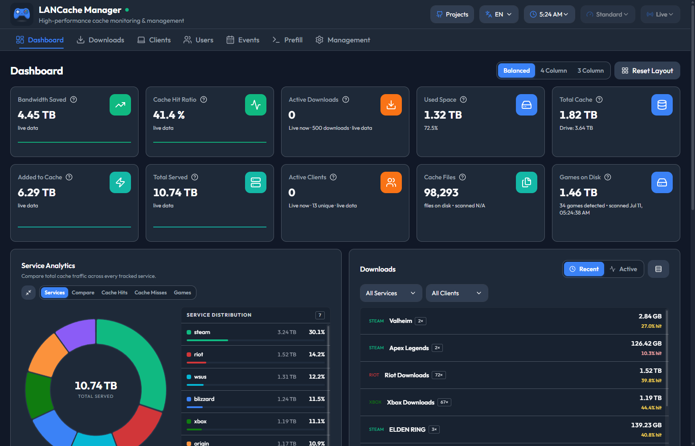
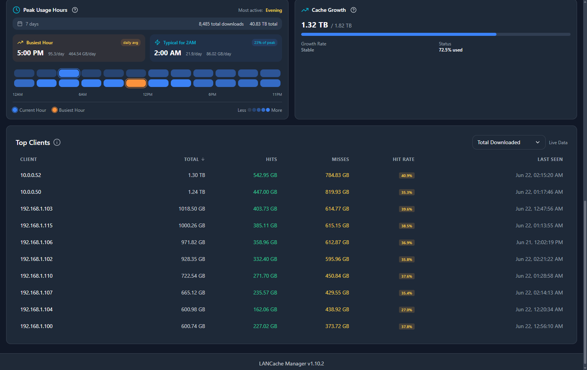

*Stats at a glance with draggable cards, service analytics, and top clients*

### Downloads

**Normal View**
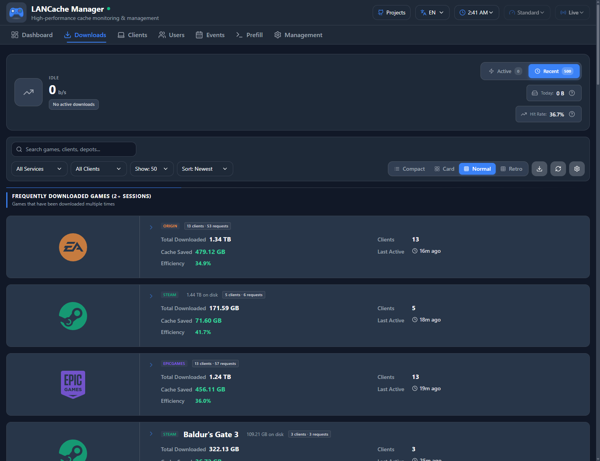
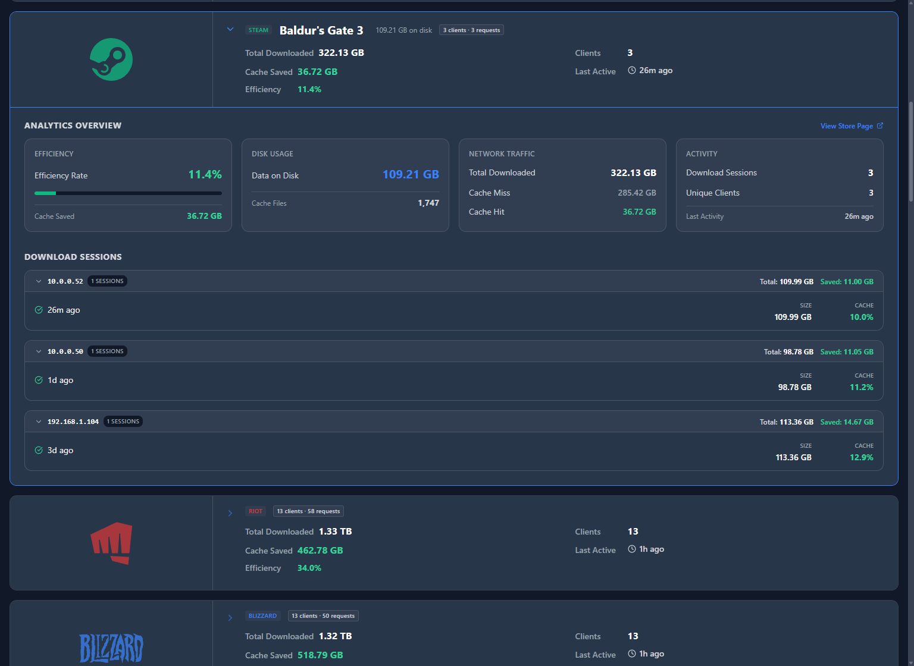

**Compact View**
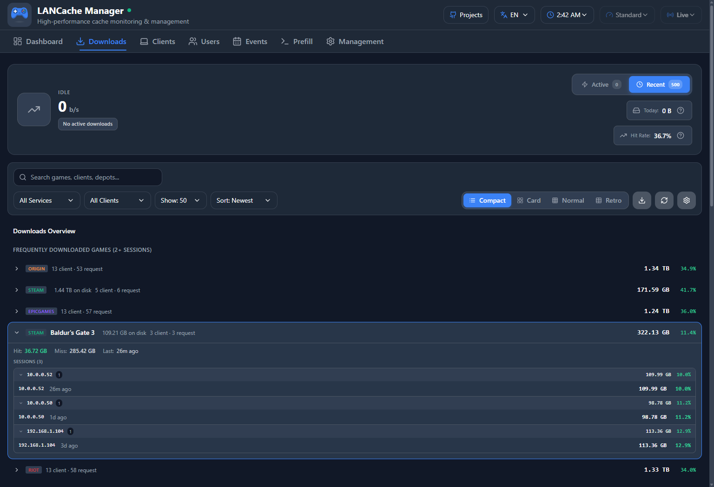

**Retro View**
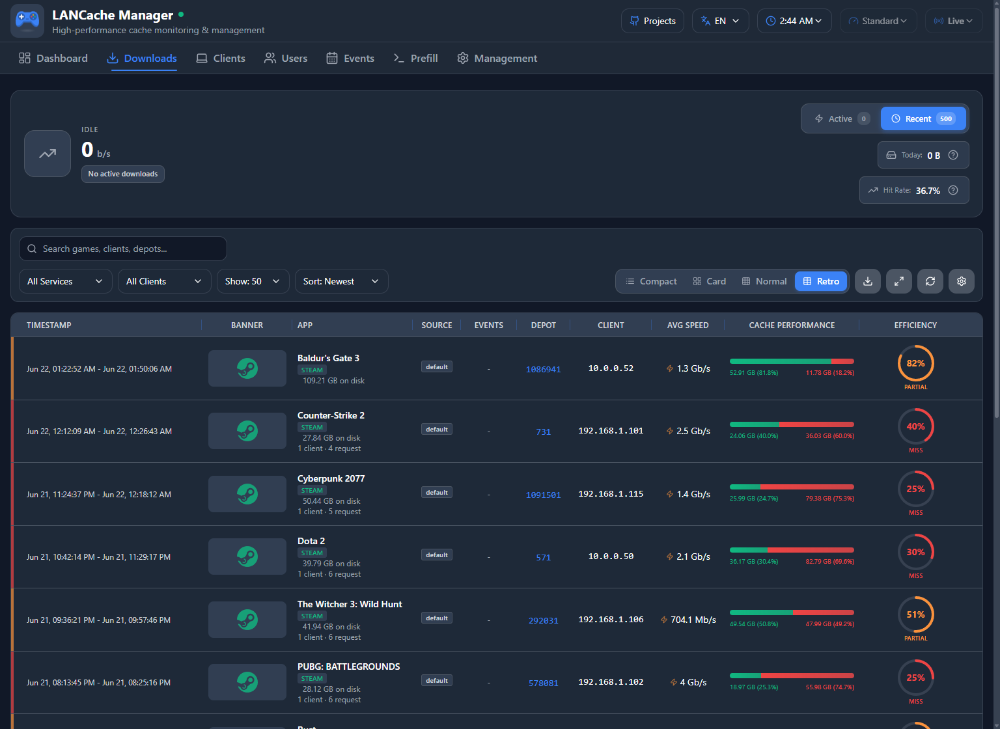

*Three view modes to browse your cached games*

### Clients
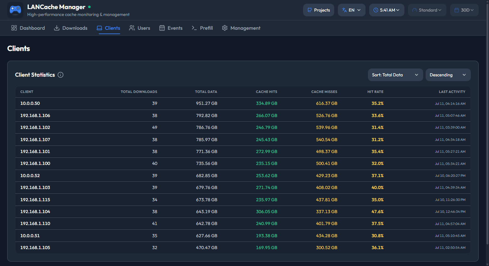

*Monitor which devices are using your cache*

### Events
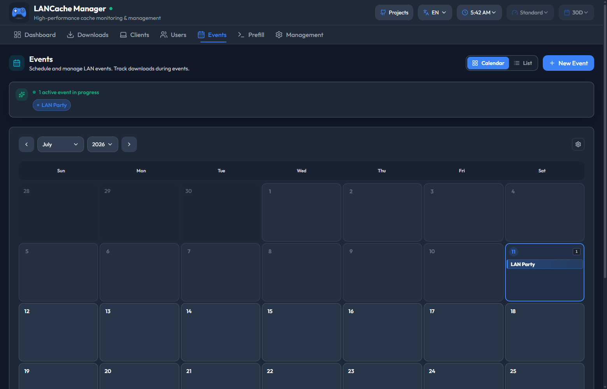

*Calendar view of download activity and LAN events*

### Prefill
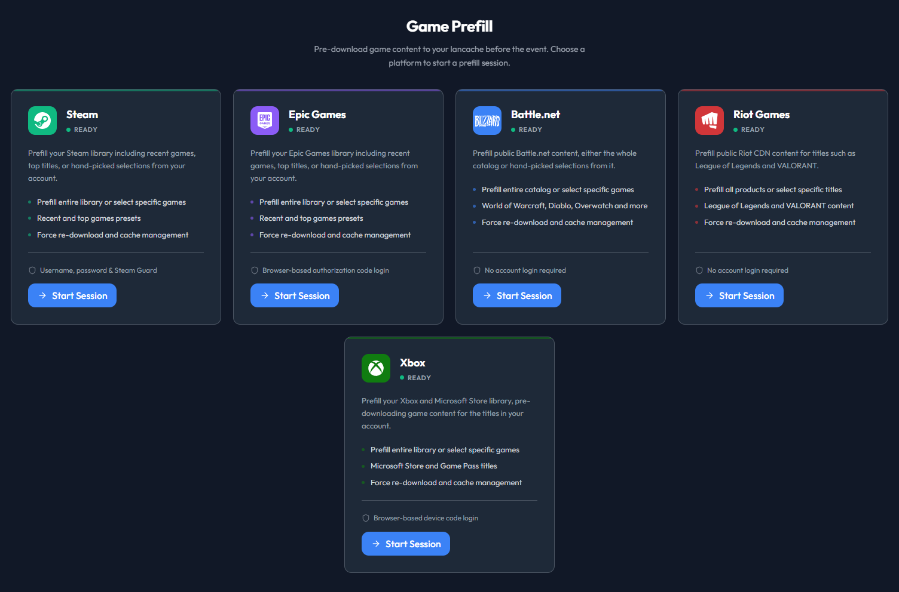

*Pick between Steam and Epic to start a prefill session*

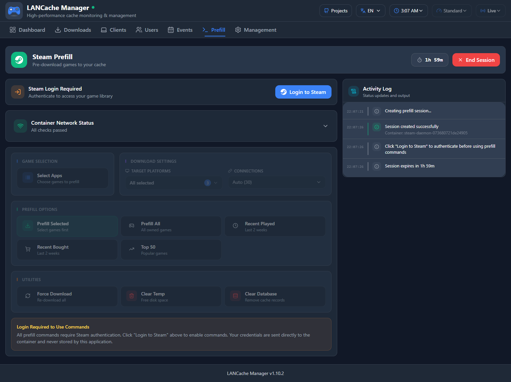

*Game selection, download settings, and real-time activity log*

### Management
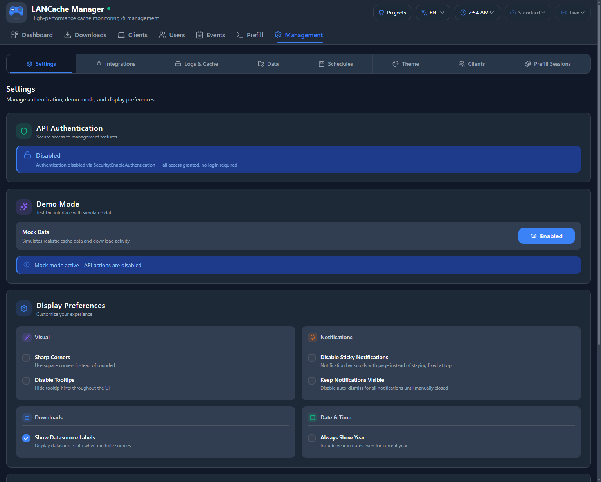

*Authentication, demo mode, and display preferences*

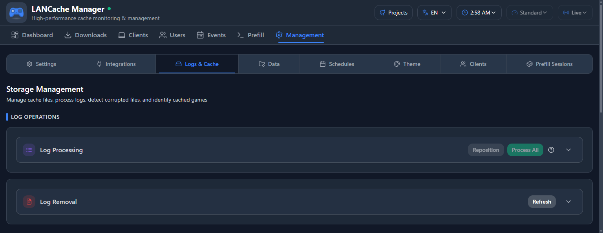
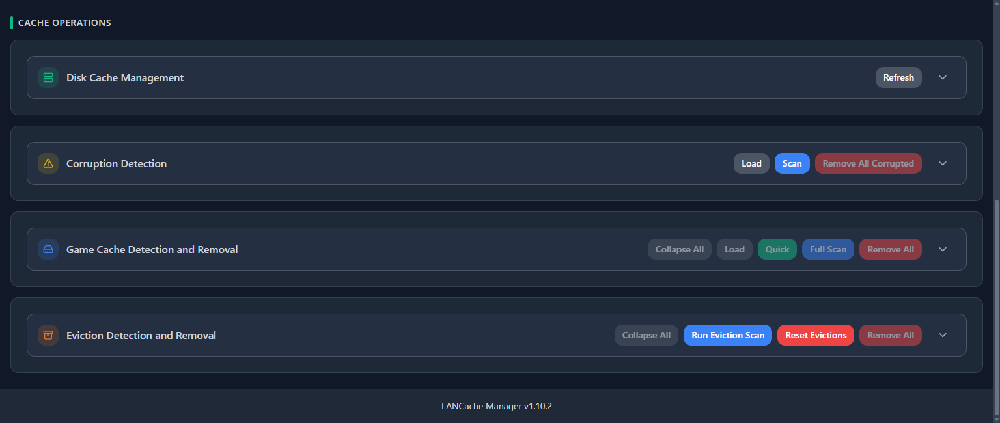

*Log processing, corruption detection, and game cache detection*

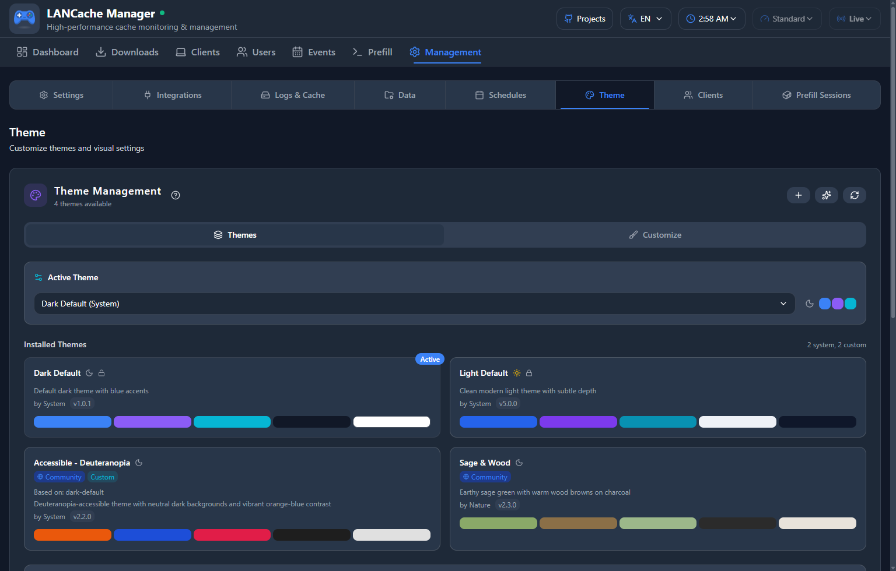
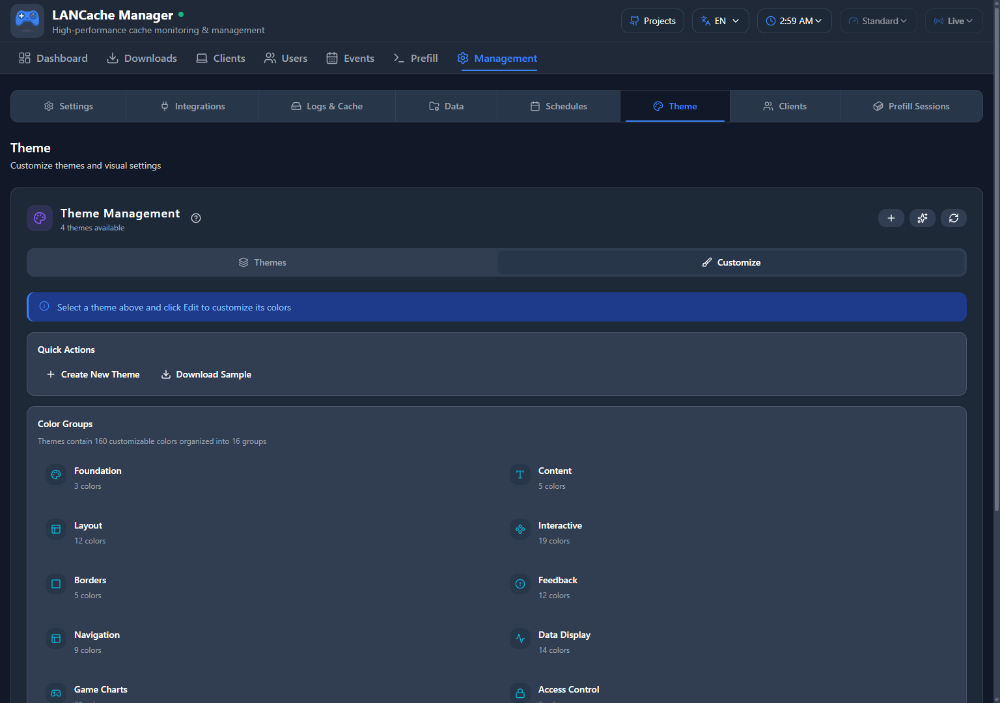

*Browse installed themes or create your own with the theme editor*

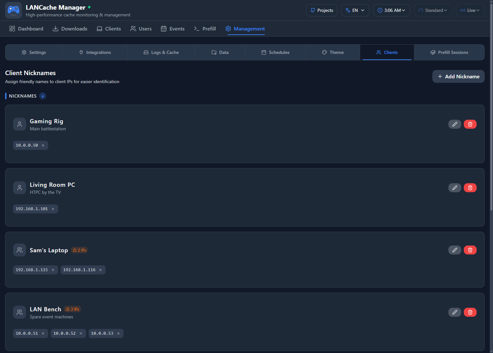

*Assign friendly names to client IPs and exclude clients from stats*

</div>

-----

<a id="quick-start"></a>
## Quick Start

```bash
docker run -d \
  --name lancache-manager \
  -p 8080:80 \
  -v ./data:/data \
  -v /path/to/lancache/logs:/logs:ro \
  -v /path/to/lancache/cache:/cache:ro \
  -e TZ=America/Chicago \
  -e LanCache__LogPath=/logs/access.log \
  -e LanCache__CachePath=/cache \
  ghcr.io/regix1/lancache-manager:latest
```

### Getting Your API Key

```bash
docker logs lancache-manager | grep "API Key"
```

The key is also saved at `/data/security/api_key.txt`.

### First Steps

1. Open `http://localhost:8080`
2. Go to Management and enter your API key
3. Click **Process Logs** to analyze existing cache data

-----

<a id="docker-compose-reference"></a>
## Docker Compose Reference

A minimal docker-compose.yml to get started:

```yaml
services:
  lancache-manager:
    image: ghcr.io/regix1/lancache-manager:latest
    container_name: lancache-manager
    restart: unless-stopped
    ports:
      - "8080:80"
    volumes:
      - ./data:/data
      - /mnt/lancache/logs:/logs:ro
      - /mnt/lancache/cache:/cache:ro
      - /var/run/docker.sock:/var/run/docker.sock  # Optional: for prefill and log rotation
    environment:
      - PUID=33
      - PGID=33
      - TZ=America/Chicago
      - LanCache__LogPath=/logs/access.log
      - LanCache__CachePath=/cache
```

> [!NOTE]
> Remove `:ro` from the cache volume if you want cache clearing and game removal. The Docker socket is optional but required for nginx log rotation and prefill (both Steam and Epic).

Full docker-compose.yml with all available options:

```yaml
services:
  lancache-manager:
    image: ghcr.io/regix1/lancache-manager:latest
    container_name: lancache-manager
    restart: unless-stopped
    ports:
      - "8080:80"
    volumes:
      - ./data:/data
      - /mnt/lancache/logs:/logs:ro
      - /mnt/lancache/cache:/cache:ro
      - /var/run/docker.sock:/var/run/docker.sock
    environment:
      # Required
      - PUID=33
      - PGID=33
      - TZ=America/Chicago
      - LanCache__LogPath=/logs/access.log
      - LanCache__CachePath=/cache
      - ASPNETCORE_URLS=http://+:80

      # Security
      # - Security__EnableAuthentication=true
      # - Security__MaxAdminDevices=3
      # - Security__GuestSessionDurationHours=6
      # - Security__RequireAuthForMetrics=false
      # - Security__ProtectSwagger=true
      # - Security__AllowedOrigins=
      # - Security__AllowedBrowsePaths=

      # Prefill (Steam & Epic)
      # - Prefill__DockerImage=ghcr.io/regix1/steam-prefill-daemon:latest
      # - Prefill__EpicDockerImage=ghcr.io/regix1/epic-prefill-daemon:latest
      # - Prefill__SessionTimeoutMinutes=120
      # - Prefill__DaemonBasePath=/data/prefill
      # - Prefill__HostDataPath=auto
      # - Prefill__NetworkMode=auto
      # - Prefill__LancacheDnsIp=auto
      # - Prefill__UseTcp=auto
      # - Prefill__TcpPort=4379
      # - Prefill__HostTcpPort=4379
      # - Prefill__TcpHost=127.0.0.1

      # Nginx Log Rotation
      # - NginxLogRotation__Enabled=true
      # - NginxLogRotation__ContainerName=auto
      # - NginxLogRotation__ScheduleHours=24

      # API Options
      # - ApiOptions__MaxClientsPerRequest=1000
      # - ApiOptions__DefaultClientsLimit=100

      # Optimization
      # - Optimizations__EnableGarbageCollectionManagement=false

      # Paths & Datasources
      # - LanCache__EnvFilePath=/lancache/.env
      # - LanCache__AutoDiscoverDatasources=true

      # Debugging
      # - Logging__LogLevel__LancacheManager.Infrastructure.Platform=Debug
```

-----

<a id="configuration-options"></a>
## Configuration Options

### Volumes

| Volume | Purpose | Notes |
|--------|---------|-------|
| `/data` | PostgreSQL database, security, state/config, themes, cached images | Required |
| `/logs` | LANCache access logs | Add `:ro` for read-only |
| `/cache` | LANCache cached files | Add `:ro` for monitoring only |
| `/var/run/docker.sock` | Docker API access | Optional. Required for nginx rotation and prefill (Steam & Epic) |

### Required Settings

| Variable | Default | Description |
|----------|---------|-------------|
| `PUID` | `33` | User ID the app runs as. Match your filesystem permissions. |
| `PGID` | `33` | Group ID the app runs as. |
| `TZ` | `UTC` | Timezone for log timestamps (e.g., `America/Chicago`). |
| `LanCache__LogPath` | — | Path to the LANCache access log file. |
| `LanCache__CachePath` | — | Path to the LANCache cache directory. |

### PostgreSQL Database

LANCache Manager uses PostgreSQL for data storage. On first launch, the app will prompt you to configure database credentials through a setup page in the web UI.

| Variable | Default | Description |
|----------|---------|-------------|
| `POSTGRES_PASSWORD` | — | PostgreSQL password. Set via environment variable or through the first-run setup page. |
| `POSTGRES_USER` | `lancache` | PostgreSQL username. |

**Configuration options:**

- **Environment variables (recommended for automation):** Set `POSTGRES_PASSWORD` and optionally `POSTGRES_USER` in your docker-compose.yml. The app will use these directly and skip the setup page.
- **Web UI setup:** If `POSTGRES_PASSWORD` is not set, the app displays a first-run setup page where you can enter credentials through the browser.

> [!NOTE]
> **Migrating from SQLite:** Existing data is automatically migrated to PostgreSQL on the first container start after updating. No manual steps are required. The migration runs once and preserves all your existing downloads, settings, and cached data.

#### Docker Compose with PostgreSQL

```yaml
services:
  lancache-manager:
    image: ghcr.io/regix1/lancache-manager:latest
    container_name: lancache-manager
    restart: unless-stopped
    ports:
      - "8080:80"
    volumes:
      - ./data:/data
      - /mnt/lancache/logs:/logs:ro
      - /mnt/lancache/cache:/cache:ro
      - /var/run/docker.sock:/var/run/docker.sock
    environment:
      - PUID=33
      - PGID=33
      - TZ=America/Chicago
      - LanCache__LogPath=/logs/access.log
      - LanCache__CachePath=/cache
      - POSTGRES_PASSWORD=your-secure-password
      # - POSTGRES_USER=lancache  # Optional, defaults to "lancache"
```

### Security

| Variable | Default | Description |
|----------|---------|-------------|
| `Security__EnableAuthentication` | `true` | Require API key for admin features. Set `false` for dev only. |
| `Security__MaxAdminDevices` | `3` | Number of devices that can share the same API key. |
| `Security__GuestSessionDurationHours` | `6` | Default guest session length (configurable in UI). |
| `Security__RequireAuthForMetrics` | `false` | Require API key for `/metrics` endpoint. |
| `Security__ProtectSwagger` | `true` | Require auth for Swagger API docs in production. |
| `Security__AllowedOrigins` | (empty) | Comma-separated CORS allow list. Empty allows all. |
| `Security__AllowedBrowsePaths` | (empty) | Comma-separated allow-list of file-browser roots. Empty disables the file browser (all requests return `403`). Example: `/data,/mnt`. |

#### File Browser (DeveLanCacheUI Import)

The DeveLanCacheUI import flow uses an admin-only file browser endpoint (`/api/filebrowser/list`) to locate a `.db` file on the server. For safety the browser is **disabled by default** — without an explicit allow-list every request returns `403` and the log shows:

```
warn: LancacheManager.Controllers.FileBrowserController[0]
      FileBrowser: Security:AllowedBrowsePaths is not configured. All file-browse requests will be rejected (403) until paths are configured.
```

To enable it, set `Security__AllowedBrowsePaths` to a comma-separated list of root directories the browser may navigate. Subdirectories of each root are allowed; everything outside the list returns `403`.

```yaml
environment:
  - Security__AllowedBrowsePaths=/data,/mnt
```

If you don't use the DeveLanCacheUI import feature you can leave this empty — the warning is informational only and nothing else in the app depends on it.

#### Access Levels

| Level | Description | Examples |
|-------|-------------|----------|
| **Admin Only** | Requires API key authentication | Cache clearing, log processing, settings changes |
| **Guest Session** | Requires admin auth or a valid guest session | Viewing downloads, stats, events, client data |

**Guest sessions** allow read-only access without sharing your API key. Guests must have a valid session created by an admin. No endpoints are public without authentication.

To grant guest access:
1. Go to the **Users** tab
2. Click **Create Guest Link**
3. Share the link with your guests

Guests can view dashboards, downloads, and events but cannot modify settings or clear cache.

### Prefill (Steam & Epic)

| Variable | Default | Description |
|----------|---------|-------------|
| `Prefill__DockerImage` | `ghcr.io/regix1/steam-prefill-daemon:latest` | Docker image for Steam prefill containers. |
| `Prefill__EpicDockerImage` | `ghcr.io/regix1/epic-prefill-daemon:latest` | Docker image for Epic Games prefill containers. |
| `Prefill__SessionTimeoutMinutes` | `120` | Inactive session cleanup timeout. |
| `Prefill__DaemonBasePath` | `/data/prefill` | Session data storage path. |
| `Prefill__HostDataPath` | `auto` | Host path mapping to `/data`. Auto-detected from container mounts. |
| `Prefill__NetworkMode` | `auto` | Network mode for prefill containers: `host`, `bridge`, a network name, or `auto`. |
| `Prefill__LancacheDnsIp` | `auto` | IP of your lancache-dns container. Auto-detected from Docker. |
| `Prefill__UseTcp` | `auto` | Use TCP for daemon communication. `auto` = `true` on Windows, `false` on Linux. |
| `Prefill__TcpPort` | `4379` | TCP port inside the prefill container. |
| `Prefill__HostTcpPort` | `4379` | TCP port exposed on the host for prefill containers. |
| `Prefill__TcpHost` | `127.0.0.1` | TCP host used by the prefill daemon. |

> [!TIP]
> Most prefill settings are auto-detected. You typically only need to set `Prefill__NetworkMode` if the default doesn't work with your Docker networking setup.

### Paths & Datasources

| Variable | Default | Description |
|----------|---------|-------------|
| `LanCache__EnvFilePath` | (auto) | Path to lancache `.env` file for reading `CACHE_DISK_SIZE`. Auto-searches common paths if not set. |
| `LanCache__AutoDiscoverDatasources` | `false` | Auto-detect datasources from matching subdirectories in `/cache` and `/logs`. |

See [Multiple Datasources](#multiple-datasources) for details on multi-instance setups.

### Nginx Log Rotation

| Variable | Default | Description |
|----------|---------|-------------|
| `NginxLogRotation__Enabled` | `true` | Signal nginx to reopen logs after manipulation. Requires Docker socket. |
| `NginxLogRotation__ContainerName` | `auto` | LANCache container name. `auto` finds containers with "lancache" in the name. |
| `NginxLogRotation__ScheduleHours` | `24` | How often to check for rotation needs. |

### API & Advanced

| Variable | Default | Description |
|----------|---------|-------------|
| `ApiOptions__MaxClientsPerRequest` | `1000` | Max clients returned in a single stats request. |
| `ApiOptions__DefaultClientsLimit` | `100` | Default client limit when none is provided. |
| `Optimizations__EnableGarbageCollectionManagement` | `false` | Show memory management controls in Management. Useful for low-memory systems. |
| `ASPNETCORE_URLS` | `http://+:80` | Internal port binding. Do not change unless you know what you are doing. |

-----

<a id="prefill-steam--epic"></a>
## Prefill (Steam & Epic)

Prefill downloads games into your cache *before* people connect. When guests show up, every install reads from your cache instead of the public internet — full LAN speed, no bandwidth bottleneck.

Steam and Epic each run in their own container, so you can prefill both at the same time without them interfering. Progress streams live to the UI.

### Running a prefill

The flow is the same for both services:

1. Open the **Prefill** tab and pick **Steam** or **Epic Games**
2. Sign in (Steam Guard for Steam, OAuth for Epic)
3. Pick games from your library
4. Hit **Start**

That's it. Leave it running — when guests arrive, everything's cached.

> [!NOTE]
> Steam prefill is built on [steam-prefill-daemon](https://github.com/regix1/steam-prefill-daemon), a fork of [steam-lancache-prefill](https://github.com/tpill90/steam-lancache-prefill) by [@tpill90](https://github.com/tpill90). Epic prefill uses [epic-prefill-daemon](https://github.com/regix1/epic-prefill-daemon).

### Importing Steam App IDs

Have a list of App IDs from `steam-lancache-prefill` or somewhere else? Skip the library browser:

1. Click **Select Apps**
2. Click **Import App IDs**
3. Paste your IDs in any of these formats:
   - Comma-separated: `730, 570, 440`
   - JSON array: `[730, 570, 440]`
   - One per line
4. Click **Import**

The dialog tells you how many games were added, how many were already selected, and how many IDs aren't in your Steam library (those are skipped at prefill time).

> [!TIP]
> **Coming from `steam-lancache-prefill`?** Open `selectedAppsToPrefill.json` and paste the contents straight into the import field — the JSON array is parsed as-is.

### Requirements

- Docker socket mounted (`/var/run/docker.sock`)
- Logged in as admin in lancache-manager
- Your cache server is reachable from the prefill container (see [Network setup](#prefill-network) below)

<a id="prefill-network"></a>
### Network setup

**Most installs need zero config.** If you run the standard `lancache` + `lancache-dns` containers, lancache-manager auto-detects them and prefill works out of the box.

If your DNS isn't a stock `lancache-dns` (you use AdGuard Home, Pi-hole, public DNS, etc.) or your routing is unusual, set one env var and you're done.

#### Quick recommendation

| Your setup | What to set |
|---|---|
| Stock `lancache` + `lancache-dns` containers | nothing |
| Single-box install (lancache on the same host as lancache-manager) | nothing |
| AdGuard Home, Pi-hole, or any DNS replacement | `Prefill__LancacheIp=<your-cache-ip>` |
| Host networking, host's DNS doesn't route CDN to your cache | `Prefill__LancacheIp=<your-cache-ip>` |
| Caddy/Squid/non-nginx cache that routes by `Host:` header | `Prefill__LancacheIp=<your-cache-ip>` |
| You want predictable behavior regardless of environment | always set `Prefill__LancacheIp` |

> [!TIP]
> **`Prefill__LancacheIp` is the universal escape hatch.** When set, prefill talks to your cache by IP and never asks DNS where the cache lives. Network mode and DNS server settings stop mattering for CDN traffic.

#### Settings

| Variable | What it does |
|---|---|
| `Prefill__NetworkMode` | `host` or `bridge`. Defaults to auto-detect from your `lancache-dns` container. |
| `Prefill__LancacheIp` | The IP (or hostname) of your lancache server. Forwarded to the daemon as `LANCACHE_IP`. Bypasses DNS for CDN traffic. Works in both `host` and `bridge` mode. |
| `Prefill__LancacheDnsIp` | The IP of your DNS server (lancache-dns, AdGuard, etc.). Used in **bridge mode only** — Docker silently drops DNS overrides on host-network containers. |

> [!IMPORTANT]
> Steam (`api.steampowered.com`) and Epic (`*.epicgames.com`) auth and manifest endpoints still use normal DNS. `LANCACHE_IP` only redirects CDN chunk traffic — the only domains lancache caches. Your login and metadata traffic is unaffected.

#### Examples

**Most reliable** — `LancacheIp` makes CDN routing DNS-independent:

```yaml
environment:
  - Prefill__NetworkMode=host
  - Prefill__LancacheIp=192.168.1.10
```

**Bridge mode with a non-standard DNS** (e.g., AdGuard Home replacing lancache-dns):

```yaml
environment:
  - Prefill__NetworkMode=bridge
  - Prefill__LancacheIp=192.168.1.10        # cache server
  - Prefill__LancacheDnsIp=192.168.1.20     # DNS server
```

**Bridge mode, stock lancache-dns, no IP override** (legacy DNS-driven path):

```yaml
environment:
  - Prefill__NetworkMode=bridge
  - Prefill__LancacheDnsIp=192.168.1.20
```

> [!TIP]
> **Prefill container has no internet?** Try `Prefill__NetworkMode=bridge`. Some Docker setups block outbound traffic in host mode.

#### Network diagnostics

Each prefill session runs a connectivity test on startup and writes the result to logs:

```
═══════════════════════════════════════════════════════════════════════
  PREFILL CONTAINER NETWORK DIAGNOSTICS - prefill-daemon-abc123
═══════════════════════════════════════════════════════════════════════
  ✓ Internet connectivity: OK (reached api.steampowered.com)
  lancache.steamcontent.com resolved to 192.168.1.10
  ✓ DNS looks correct (private IP - likely your lancache server)
═══════════════════════════════════════════════════════════════════════
```

If the resolved IP is a public address (Steam's real CDN IPs look like `162.254.x.x`), traffic is bypassing your cache. Set `Prefill__LancacheIp` and restart the session.

<a id="prefill-routing"></a>
#### How routing works (advanced)

For when you want to know exactly which path a request takes:

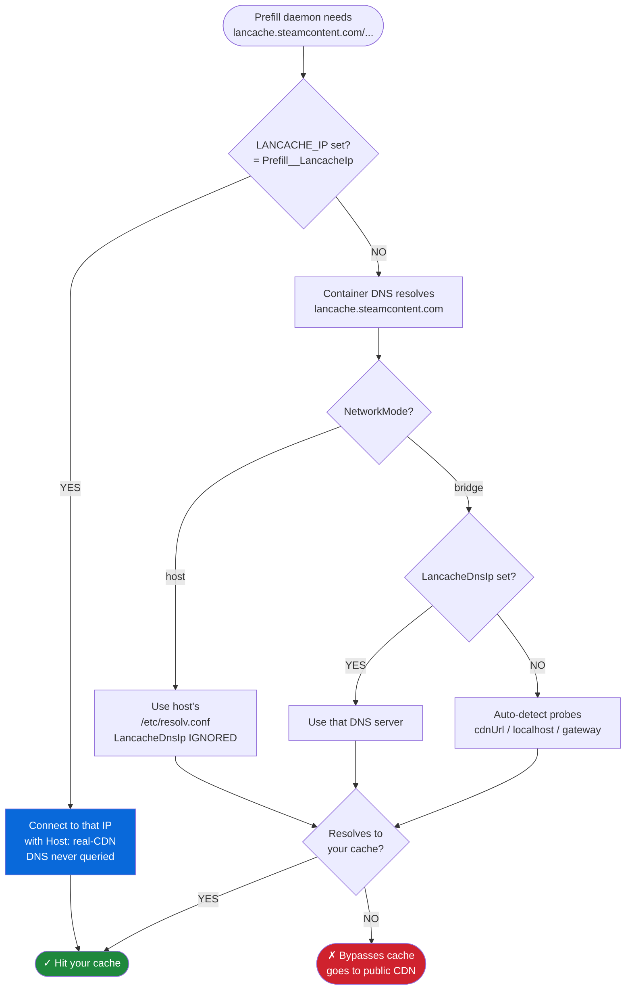
```mermaid
flowchart TD
    Start([Prefill daemon needs<br/>lancache.steamcontent.com/...])
    LIP{LANCACHE_IP set?<br/>= Prefill__LancacheIp}

    Start --> LIP

    LIP -->|YES| Direct[Connect to that IP<br/>with Host: real-CDN<br/>DNS never queried]
    Direct --> OK([✓ Hit your cache])

    LIP -->|NO| DNS[Container DNS resolves<br/>lancache.steamcontent.com]
    DNS --> Mode{NetworkMode?}

    Mode -->|host| HostDNS[Use host's<br/>/etc/resolv.conf<br/>LancacheDnsIp IGNORED]
    Mode -->|bridge| BridgeDNS{LancacheDnsIp set?}

    BridgeDNS -->|YES| ForcedDNS[Use that DNS server]
    BridgeDNS -->|NO| AutoDetect[Auto-detect probes<br/>cdnUrl / localhost / gateway]

    HostDNS --> Outcome{Resolves to<br/>your cache?}
    ForcedDNS --> Outcome
    AutoDetect --> Outcome

    Outcome -->|YES| OK
    Outcome -->|NO| Public([✗ Bypasses cache<br/>goes to public CDN])

    style OK fill:#1f883d,color:#fff
    style Public fill:#cf222e,color:#fff
    style Direct fill:#0969da,color:#fff
```

Every combination, in one table:

| `NetworkMode` | `LancacheIp` | `LancacheDnsIp` | Outcome |
|:---:|:---:|:---:|---|
| `host` | set | (any) | ✅ `LANCACHE_IP` injected. DNS irrelevant. |
| `host` | unset | (any) | ⚠️ DnsIp is silently dropped (Docker limitation). Works only if the host's DNS already resolves CDN to your cache. |
| `bridge` | set | unset | ✅ `LANCACHE_IP` injected. DNS irrelevant. |
| `bridge` | set | set | ✅ `LANCACHE_IP` for CDN, DnsIp for auth/manifest. |
| `bridge` | unset | set | ✅ Container DNS forced to DnsIp. Works if DnsIp resolves CDN to your cache. |
| `bridge` | unset | unset | 🎲 Auto-detect probes localhost/gateway. Works for some setups. |

**Why `LancacheIp` always works**: with the env var set, the daemon builds requests like `GET http://192.168.1.10/depot/123/chunk/abc` with `Host: lancache.steamcontent.com`. Your cache (nginx, Caddy, or any HTTP server that routes by `Host:`) sees the right hostname and serves from cache. DNS is never consulted for the CDN domain.

-----

<a id="custom-themes"></a>
## Custom Themes

### Theme Editor

Go to **Management > Preferences > Theme Management** to:
- Create themes from scratch with live preview
- Browse and install community themes
- Import and export themes as TOML files

### Theme Format

```toml
[meta]
name = "My Theme"
id = "my-theme"
isDark = true
version = "1.0.0"
author = "Your Name"

[colors]
primaryColor = "#3b82f6"
bgPrimary = "#111827"
textPrimary = "#ffffff"
```

Themes are stored in `/data/themes/`.

-----

<a id="grafana--prometheus"></a>
## Grafana & Prometheus

### Available Metrics

| Metric | Description |
|--------|-------------|
| `lancache_cache_capacity_bytes` | Total storage capacity |
| `lancache_cache_size_bytes` | Currently used space |
| `lancache_cache_hit_bytes_total` | Bandwidth saved (cache hits) |
| `lancache_cache_miss_bytes_total` | New data downloaded |
| `lancache_active_downloads` | Current active downloads |
| `lancache_cache_hit_ratio` | Cache effectiveness (0-1) |
| `lancache_downloads_by_service` | Downloads per service |
| `lancache_bytes_served_by_service` | Bandwidth per service |

### Prometheus Configuration

```yaml
scrape_configs:
  - job_name: 'lancache-manager'
    static_configs:
      - targets: ['lancache-manager:80']
    scrape_interval: 30s
    metrics_path: /metrics
```

For authenticated metrics, set `Security__RequireAuthForMetrics=true` and add:

```yaml
    authorization:
      type: Bearer
      credentials: 'your-api-key-here'
```

### Example Queries

```promql
# Cache hit rate as percentage
lancache_cache_hit_ratio * 100

# Bandwidth saved in last 24 hours
increase(lancache_cache_hit_bytes_total[24h])

# Cache size in GB
lancache_cache_size_bytes / 1024 / 1024 / 1024
```

-----

<a id="multiple-datasources"></a>
## Multiple Datasources

Most users run a single LANCache instance and never touch this. If you have outsourced specific services to separate cache directories or you run multiple LANCache instances, you can configure multiple datasources and view them together in one dashboard.

### When You Need This

- **Outsourced services** - LANCache stores Steam on a separate drive from other services
- **Multiple LANCache instances** - Separate cache servers for different purposes
- **Segmented storage** - Different services on different drives or partitions

### How It Works

Each datasource represents a log and cache directory pair. The app processes logs and tracks cache usage separately for each one, then combines the results in the dashboard and downloads views.

-----

### Auto-Discovery (Recommended)

The easiest approach is to let the app scan for matching subdirectories:

```yaml
environment:
  - LanCache__LogPath=/logs
  - LanCache__CachePath=/cache
  - LanCache__AutoDiscoverDatasources=true
```

**What it detects:**

1. **Root-level datasource** - If `/logs/access.log` exists and `/cache` contains LANCache hash directories (`00/`, `01/`, and so on), it creates a "Default" datasource
2. **Subdirectory datasources** - For each folder that exists in both `/cache` and `/logs`, it creates a named datasource (e.g., `/cache/steam` + `/logs/steam` -> "Steam")

**Example directory structure:**

```
/mnt/lancache/
├── cache/
│   ├── 00/, 01/, a1/, ff/    ← Default cache (hash dirs at root)
│   ├── steam/
│   │   └── 00/, 01/, ...     ← Outsourced Steam
│   └── epic/
│       └── 00/, 01/, ...     ← Outsourced Epic
└── logs/
    ├── access.log            ← Default log
    ├── steam/
    │   └── access.log        ← Steam log
    └── epic/
        └── access.log        ← Epic log
```

This creates three datasources: **Default**, **Steam**, and **Epic**.

> [!NOTE]
> Folder matching is case-insensitive. `Steam`, `steam`, and `STEAM` all match.

-----

### Manual Configuration

For precise control or when directories are on separate drives, define each datasource explicitly:

```yaml
environment:
  # Main LANCache
  - LanCache__DataSources__0__Name=Default
  - LanCache__DataSources__0__CachePath=/cache
  - LanCache__DataSources__0__LogPath=/logs
  - LanCache__DataSources__0__Enabled=true

  # Steam on a separate drive
  - LanCache__DataSources__1__Name=Steam
  - LanCache__DataSources__1__CachePath=/steam-cache
  - LanCache__DataSources__1__LogPath=/steam-logs
  - LanCache__DataSources__1__Enabled=true
```

With corresponding volume mounts:

```yaml
volumes:
  - /mnt/lancache/cache:/cache:ro
  - /mnt/lancache/logs:/logs:ro
  - /mnt/steam-drive/cache:/steam-cache:ro
  - /mnt/steam-drive/logs:/steam-logs:ro
```

> [!NOTE]
> Manual datasource configuration takes priority over auto-discovery.

-----

<a id="nginx-reverse-proxy"></a>
## Nginx Reverse Proxy

LANCache Manager works well behind Nginx. HTTPS is recommended and required for guest session cookies on cross-origin image requests.

### Single origin (recommended)

Serve the UI and API from the same origin. This keeps cookies first-party and avoids cross-origin issues.

```nginx
server {
  listen 443 ssl http2;
  server_name lancache.example.com;

  ssl_certificate     /etc/letsencrypt/live/lancache.example.com/fullchain.pem;
  ssl_certificate_key /etc/letsencrypt/live/lancache.example.com/privkey.pem;

  # Increase if you have large responses
  client_max_body_size 50m;

  location / {
    proxy_pass http://127.0.0.1:8080;
    proxy_http_version 1.1;
    proxy_set_header Host $host;
    proxy_set_header X-Real-IP $remote_addr;
    proxy_set_header X-Forwarded-For $proxy_add_x_forwarded_for;
    proxy_set_header X-Forwarded-Proto $scheme;
    proxy_set_header X-Forwarded-Host $host;

    # SignalR (WebSockets)
    proxy_set_header Upgrade $http_upgrade;
    proxy_set_header Connection "upgrade";
    proxy_read_timeout 600s;  # Must match SignalR timeout (10 min) to prevent nginx killing idle WebSocket connections
  }
}

server {
  listen 80;
  server_name lancache.example.com;
  return 301 https://$host$request_uri;
}
```

### Separate API origin (only if required)

If you split UI and API across hosts, use HTTPS and allow credentials. In that case:

- Set `VITE_API_URL=https://api.lancache.example.com` when building the Web UI.
- Keep `SameSite=None; Secure` cookies (configured by the app).
- Ensure CORS allows credentials for your UI origin.

Example API proxy:

```nginx
server {
  listen 443 ssl http2;
  server_name api.lancache.example.com;

  ssl_certificate     /etc/letsencrypt/live/api.lancache.example.com/fullchain.pem;
  ssl_certificate_key /etc/letsencrypt/live/api.lancache.example.com/privkey.pem;

  location / {
    proxy_pass http://127.0.0.1:8080;
    proxy_http_version 1.1;
    proxy_set_header Host $host;
    proxy_set_header X-Real-IP $remote_addr;
    proxy_set_header X-Forwarded-For $proxy_add_x_forwarded_for;
    proxy_set_header X-Forwarded-Proto $scheme;
    proxy_set_header X-Forwarded-Host $host;

    # SignalR (WebSockets)
    proxy_set_header Upgrade $http_upgrade;
    proxy_set_header Connection "upgrade";
    proxy_read_timeout 600s;  # Must match SignalR timeout (10 min) to prevent nginx killing idle WebSocket connections
  }
}
```

-----

<a id="troubleshooting"></a>
## Troubleshooting

### Logs Not Processing

1. Verify the log path in **Management > Settings**
2. Confirm your volume mount matches `LanCache__LogPath`
3. Click **Process Logs** in Management
4. Check container logs: `docker logs lancache-manager`

### Games Not Identified

**Steam games:**
1. Download the latest mappings from **Management > Depot Mappings**
2. Add custom mappings for private depots if needed
3. Click **Reprocess All Logs** after adding mappings

**Epic games:**
1. Go to **Management > Integrations** and run Epic game mapping
2. The mapping service connects to the Epic API to identify cached downloads
3. Game names and cover art are pulled in automatically

### Lost API Key

```bash
cat ./data/security/api_key.txt
# or
docker logs lancache-manager | grep "API Key"
```

To generate a new key, stop the container, delete `./data/security/api_key.txt`, and restart.

### Permission Issues

Verify PUID and PGID match your file ownership:
```bash
ls -n /path/to/cache
```

### Prefill Not Working

These steps apply to both Steam and Epic prefill.

1. Ensure the Docker socket is mounted
2. Confirm you are authenticated as admin
3. Check container logs for network diagnostics output (look for `═══ PREFILL CONTAINER NETWORK DIAGNOSTICS ═══`)
4. **Container has no internet access:** The prefill container cannot reach Steam or Epic servers. Common fixes:
   - Set `Prefill__NetworkMode=bridge` in your docker-compose.yml (recommended for most setups)
   - Ensure your Docker network has outbound internet access
   - Check firewall rules for outbound connections
5. **HTTP 400 errors during download:** The prefill container cannot resolve CDN domains to your cache. Try one of the following:
   - Set `Prefill__NetworkMode=host` if your lancache-dns uses host networking
   - Set `Prefill__LancacheDnsIp` to your lancache-dns IP address
   - The app auto-detects this if your lancache-dns container is running
   - **If your DNS does not point CDN domains at lancache** (AdGuard Home, public DNS, `systemd-resolved` without a lancache forwarder): set `Prefill__LancacheIp` to your lancache cache server's IP. This bypasses DNS entirely for CDN traffic and is HTTP-cache-agnostic — works with the standard nginx image or any compatible alternative. See [Lancache IP injection](#lancache-ip-injection-prefill__lancacheip) above.
6. **DNS bypassing lancache via IPv6:** If your network uses IPv6, DNS queries might bypass lancache-dns. The app automatically disables IPv6 in prefill containers to prevent this.
7. **Epic OAuth not connecting:** Make sure you complete the OAuth flow in the browser window that opens. The authentication token is stored securely and persists across sessions.

**Network Diagnostics:**
When a prefill container starts, the app runs network diagnostics that appear in the logs:
- Internet connectivity test (can reach Steam/Epic servers)
- DNS resolution for CDN domains (e.g., `lancache.steamcontent.com`, `steam.cache.lancache.net`)
- Warnings if DNS resolves to public IPs instead of your cache

**Finding your lancache-dns IP:**
```bash
docker inspect lancache-dns | grep IPAddress
```

**Example configurations:**

Bridge mode (recommended for most Docker setups):
```yaml
environment:
  - Prefill__NetworkMode=bridge
```

Host networking (when lancache-dns uses host mode):
```yaml
environment:
  - Prefill__NetworkMode=host
```

Explicit DNS IP (when auto-detection fails):
```yaml
environment:
  - Prefill__LancacheDnsIp=192.168.1.20
```

Lancache IP injection (when DNS does not point CDN domains at lancache — works in host and bridge mode):
```yaml
environment:
  - Prefill__NetworkMode=host
  - Prefill__LancacheIp=192.168.1.10        # your lancache cache server IP — bypasses DNS for CDN traffic
  - Prefill__LancacheDnsIp=192.168.1.20     # optional — only used in bridge mode
```

### Debug Logging

If you're experiencing issues with path resolution, file system detection, Docker communication, or other platform-specific operations, you can enable verbose debug logging:

```yaml
environment:
  - Logging__LogLevel__LancacheManager.Infrastructure.Platform=Debug
```

**What it logs:**
- Path resolution and validation (container vs host paths)
- File system operations and permission checks
- Docker socket communication and container detection
- Volume mount detection and mapping
- Platform-specific behavior (Linux vs Windows differences)

**How to use:**
1. Add the environment variable to your docker-compose.yml
2. Restart the container: `docker compose up -d`
3. Reproduce the issue
4. View logs: `docker logs lancache-manager`
5. Remove the variable when done (debug logging is verbose)

This is especially helpful when:
- Auto-detection of paths or Docker settings fails
- Prefill containers aren't spawning correctly
- Volume mounts don't seem to be recognized
- You're running on an unusual platform or Docker setup

-----

<a id="building-from-source"></a>
## Building from Source

**Requirements:** .NET 8 SDK, Node.js 20+, Rust 1.75+

```bash
git clone https://github.com/regix1/lancache-manager.git
cd lancache-manager

# Rust processor
cd rust-processor && cargo build --release

# Web interface
cd ../Web && npm install && npm run dev  # http://localhost:3000

# API
cd ../Api/LancacheManager && dotnet run  # http://localhost:5000
```

**Docker build:**
```bash
docker buildx build \
  --platform linux/amd64,linux/arm64 \
  -t ghcr.io/regix1/lancache-manager:latest \
  --push .
```

-----

<a id="contributing-translations"></a>
## Contributing Translations

LANCache Manager supports internationalization (i18n) and welcomes community translations. The app is ready for localization and all UI strings are already externalized.

### How to Contribute

1. **Fork the repository** on GitHub
2. Navigate to `Web/src/i18n/locales/`
3. Copy `en.json` to a new file named with your language code (e.g., `de.json`, `fr.json`, `es.json`, `pt-BR.json`)
4. Translate all the string values (keep the keys unchanged)
5. Submit a **Pull Request** with your translation

### Translation File Structure

```
Web/src/i18n/locales/
├── en.json          ← English (reference)
├── de.json          ← German (your contribution)
├── fr.json          ← French (your contribution)
└── ...
```

### Guidelines

- **Keep JSON keys unchanged** - Only translate the string values
- **Preserve placeholders** - Keep `{{variable}}` placeholders intact (e.g., `{{name}}`)
- **Maintain formatting** - Preserve any HTML tags like `<strong>` if present
- **Test your translation** - Run the app locally to verify your translations display correctly

### Example

```json
// en.json
{
  "dashboard": {
    "title": "Dashboard",
    "recentDownloads": "Recent Downloads",
    "totalCache": "Total Cache: {{size}}"
  }
}

// de.json
{
  "dashboard": {
    "title": "Übersicht",
    "recentDownloads": "Letzte Downloads",
    "totalCache": "Gesamter Cache: {{size}}"
  }
}
```

<a id="need-help"></a>
## Need Help?

If you run into issues, feel free to [open an issue](https://github.com/regix1/lancache-manager/issues) on GitHub.

You can also find the LANCache community at the [LanCache.NET Discord](https://discord.com/invite/BKnBS4u).

-----

## Support

<div align="center">

### Enjoying LANCache Manager?

If this project has been helpful, consider supporting development.

<br>

<a href="https://www.buymeacoffee.com/regix">
  
</a>

**[☕ Click to donate](https://www.buymeacoffee.com/regix)**

<br>

*Every coffee helps keep this project alive!*

</div>

-----

## License

[MIT License](https://github.com/regix1/lancache-manager/blob/main/LICENSE)
