# LANCache Manager

**English** | [中文](README.zh.md)

[](LICENSE)

A web UI for [LANCache](https://lancache.net/). Watch downloads as they happen, see what's already cached, track bandwidth saved, and prefill Steam, Epic, Battle.net, Riot, and Xbox games before your next LAN party - by hand or on a schedule. The web UI is available in English and 简体中文.

The dashboard is the live view: bandwidth saved, top clients, and per-service analytics. Behind it sits a full cache browser - every cached game with cover art, sizes, and per-client history - plus Prometheus metrics out of the box.

It also acts on the cache. Prefill games before guests arrive, by hand or on per-service schedules, and manage the whole server from the browser: process logs, clear cache, detect corruption, and run the built-in Status Check when something looks off.

> [!IMPORTANT]
> **Always pull the `latest` tag.** GitHub's package page surfaces `:dev` because dev builds publish more often, but `:dev` is for testing only and can break at any time.
>
> ```bash
> docker pull ghcr.io/regix1/lancache-manager:latest
> ```

<a id="whats-new"></a>
<!-- whats-new:start -->
## What's new in 1.10.4

- **[Scheduled Prefill](#scheduled-prefill)** - prefill Steam, Epic, Xbox, Battle.net, and Riot games automatically, each on its own schedule.
- **[Xbox prefill](#prefill-steam--epic)** - Xbox joins as the fifth prefill platform, with its own game mapping.
- **[Status Check](#status-check)** - a new diagnostics tab that verifies DNS and cache reachability end to end.
- **[Refreshed interface](#screenshots)** - redesigned Dashboard, Downloads, Schedules, and Logs & Cache pages, with a new app-wide font.
- **[AGPL-3.0](#support-and-license)** - the first release under the AGPL-3.0 license; 1.10.3 and earlier remain MIT.
<!-- whats-new:end -->

-----

## Table of Contents

- [Quick Start](#quick-start)
- [Upgrading](#upgrading)
- [What You Get](#screenshots)
- [Prefill](#prefill-steam--epic)
- [Choosing an Image and Database Mode](#image-variants)
- [Configuration Reference](#configuration)
- [Recipes](#recipes)
- [Bare-Metal LANCache](#bare-metal)
- [Troubleshooting](#troubleshooting)
- [Custom Themes](#custom-themes)
- [Building from Source](#building-from-source)
- [Contributing Translations](#contributing-translations)
- [Support and License](#support-and-license)

-----

<a id="quick-start"></a>
<a id="docker-compose"></a>
## Quick Start

You need two things: a running LANCache with its logs and cache readable from this host, and Docker with the Compose plugin (`docker compose`). Point the container at your logs and cache, and you're online. The default image includes its own PostgreSQL, so this one file is the whole install:

```yaml
services:
  lancache-manager:
    image: ghcr.io/regix1/lancache-manager:latest
    container_name: lancache-manager
    restart: unless-stopped
    ports:
      - "8080:80"
    volumes:
      - ./data:/data
      - /mnt/lancache/logs:/logs:ro
      - /mnt/lancache/cache:/cache:ro
      - /var/run/docker.sock:/var/run/docker.sock  # Optional: for prefill and log rotation
    environment:
      - PUID=33
      - PGID=33
      - TZ=America/Chicago
      - LanCache__LogPath=/logs/access.log
      - LanCache__CachePath=/cache
```

```bash
docker compose up -d
```

> [!TIP]
> **Check your cache path before starting.** `LanCache__CachePath` must point at the directory that *directly contains* the hashed cache folders (`00`, `1a`, ... `ff`). A standard monolithic LANCache nests them one level down. If your mount shows a single `cache/` folder inside, use `LanCache__CachePath=/cache/cache` instead. Details in [Troubleshooting](#troubleshooting).

Then:

1. Grab your API key from inside the container:

   ```bash
   docker exec lancache-manager cat /data/security/api_key.txt
   ```

2. Open `http://localhost:8080` and enter the API key when prompted.
3. Go to **Management → Logs & Cache** and click **Process All Logs** to import your existing cache history.

Two notes on the mounts:

- Drop `:ro` from the `/cache` mount if you want to clear cache or remove individual games from the UI.
- The Docker socket is optional - you only need it for nginx log rotation and Steam/Epic/Battle.net/Riot/Xbox prefill.

<details>
<summary><strong>Prefer <code>docker run</code> for a quick test?</strong></summary>

`docker run` needs absolute host paths for its volume mounts (relative paths like `./data` only work in Compose):

```bash
docker run -d \
  --name lancache-manager \
  -p 8080:80 \
  -v /srv/lancache-manager/data:/data \
  -v /path/to/lancache/logs:/logs:ro \
  -v /path/to/lancache/cache:/cache:ro \
  -e PUID=33 \
  -e PGID=33 \
  -e TZ=America/Chicago \
  -e LanCache__LogPath=/logs/access.log \
  -e LanCache__CachePath=/cache \
  ghcr.io/regix1/lancache-manager:latest
```

</details>

-----

<a id="upgrading"></a>
## Upgrading

Upgrading is a pull and a recreate:

```bash
docker compose pull
docker compose up -d
```

In embedded mode, everything that matters lives in the `/data` volume: the database, your API key, themes, prefill state, and settings. In external mode, keep `/data` and your PostgreSQL storage persistent. Recreating the manager container then preserves your history.

- **Tags:** `latest` always tracks the newest release. Pin a version tag (e.g. `1.10.4`) if you want to control exactly when upgrades happen, and change the tag to upgrade.
- **Coming from an old SQLite build?** The migration to PostgreSQL runs automatically on first start - downloads, settings, and cached data carry over with no manual steps. Some managed Postgres services forbid `ALTER SYSTEM` tuning; the migration skips it and continues.

-----

<a id="screenshots"></a>
## What You Get

A quick tour of the main pages. All screenshots use the default dark theme.

### Dashboard

<div align="center">


*Dashboard - bandwidth saved, hit ratio, service analytics, and top clients in one view*
</div>

### Downloads

<div align="center">


*Downloads - every cached game with cover art, sizes, and per-client history*
</div>

Three view modes cover different moods: **Normal** (cards, shown above), **Compact** (a dense list), and **Retro** (a per-depot table straight out of a 90s BBS). A Hit/Miss filter and per-client filtering narrow things down.

### Clients

<div align="center">


*Clients - which devices use the cache, and how well it serves each one*
</div>

Open it when you want to know which machines pull the most and whether their installs actually hit the cache.

### Users

<div align="center">
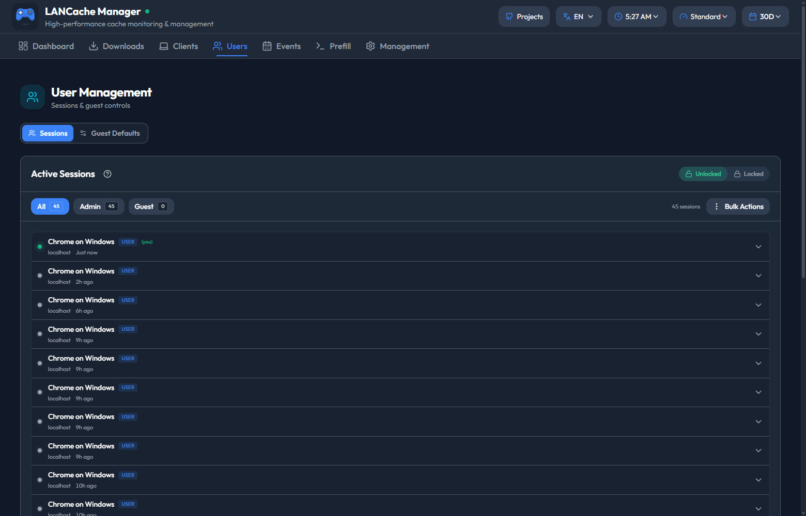

*Users - active sessions and guest access*
</div>

This is where guest access lives: watch active sessions and hand out time-limited, view-only access without sharing your API key.

### Events

<div align="center">


*Events - download activity and LAN events on a calendar*
</div>

Planning a LAN party? Put it on the calendar and see download activity in date context.

### Status Check

<a id="status-check"></a>

<div align="center">
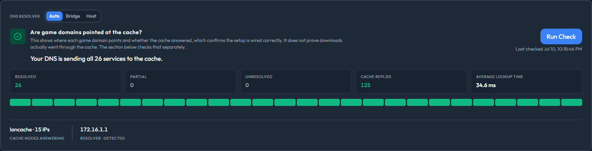

*Status Check - verify DNS, cache reachability, and recent download routing*
</div>

The Status Check tab (Management → Status Check) answers "is my LANCache actually working?" without touching a terminal. It checks that game domains resolve to your cache, that the cache answers, and that recent downloads really went through it - per domain, in plain language.

### Logs & Cache

<div align="center">
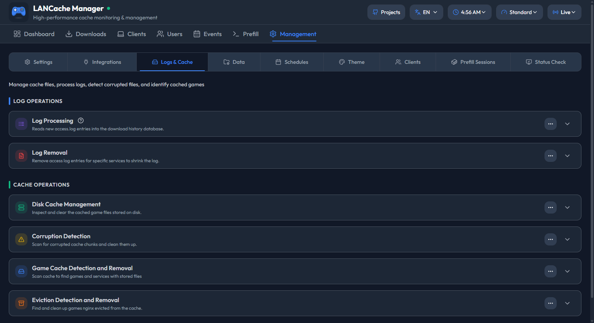

*Management → Logs & Cache - process logs, manage the disk cache, and detect corrupted or evicted files*
</div>

That covers the daily surface. Management has more tabs behind it - expand below to see all of them.

<details>
<summary><strong>See every Management page</strong></summary>

#### Settings

<div align="center">


*Settings - authentication, demo mode, and display preferences.*
</div>

#### Integrations

<div align="center">
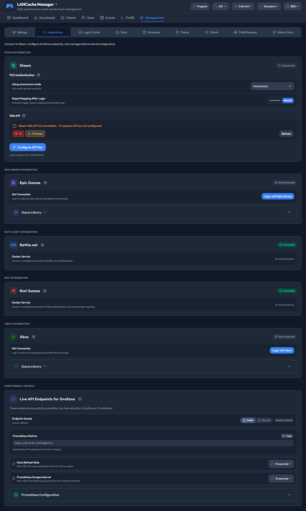

*Integrations - sign in to the game platforms and configure the Prometheus endpoint. One page shows the login state of all five prefill services.*
</div>

#### Data

<div align="center">
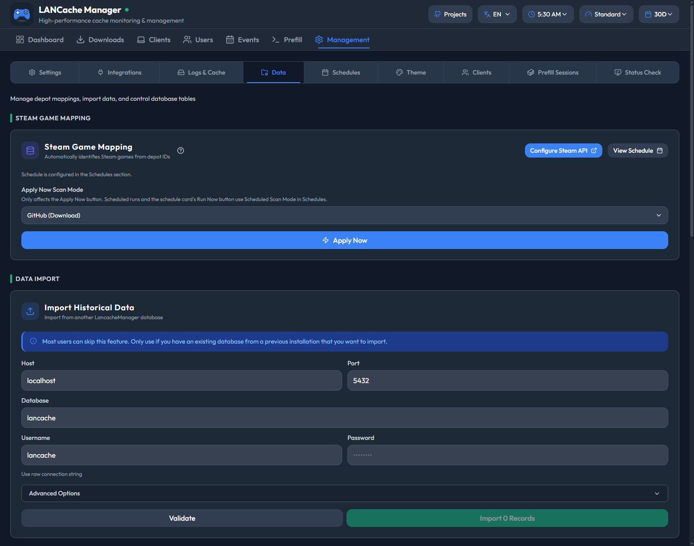

*Data - Steam game mapping and database import.*
</div>

#### Schedules

<div align="center">
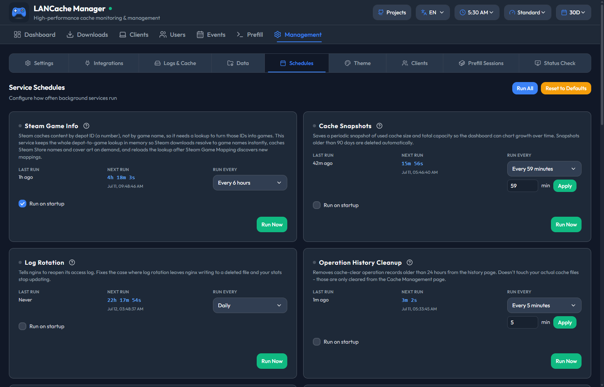

*Schedules - every background service on its own interval, each with a Run Now button. The Scheduled Prefill card lives at the bottom of this page and is shown in the Prefill section below.*
</div>

#### Theme

<div align="center">
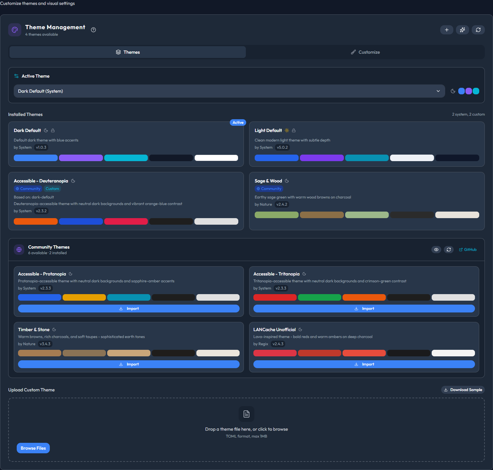

*Theme - switch between installed themes, import community themes, or upload your own.*
</div>

#### Clients (aliases and exclusions)

<div align="center">
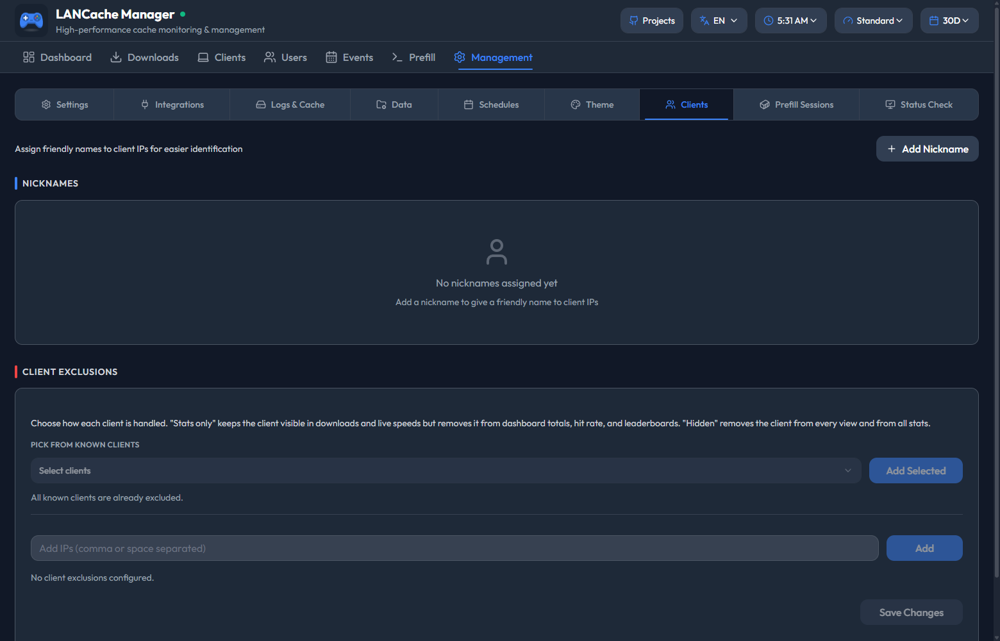

*Clients - give devices friendly names and exclude machines from the stats.*
</div>

#### Prefill Sessions

<div align="center">
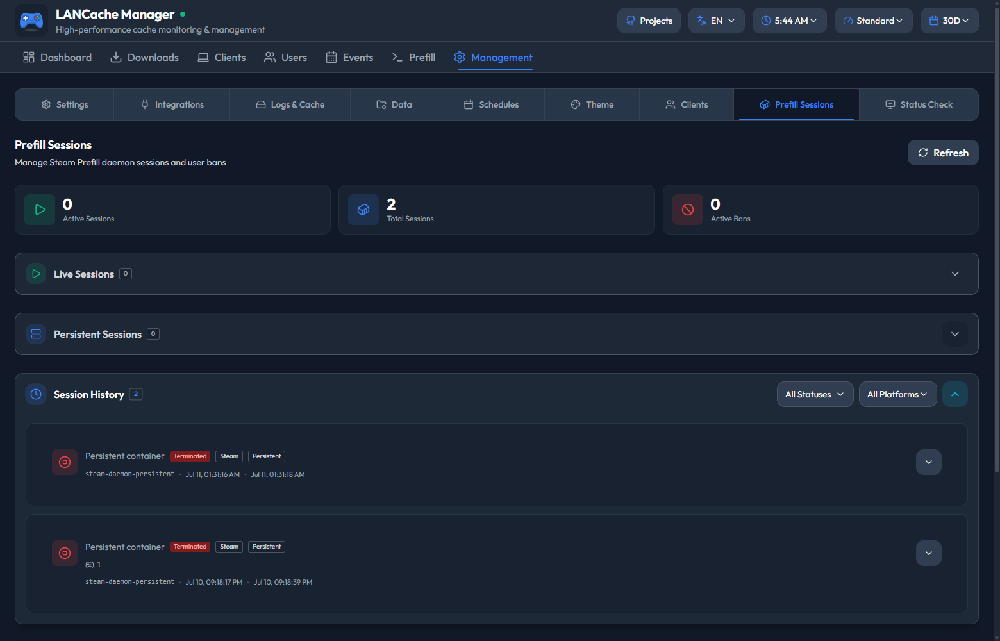

*Prefill Sessions - watch live and persistent prefill containers and review past runs.*
</div>

</details>

-----

<a id="prefill-steam--epic"></a>
## Prefill

Prefill downloads games into your cache *before* people connect. When guests show up, every install reads from your cache instead of the public internet - full LAN speed, no bandwidth bottleneck.

Steam, Epic, Battle.net, Riot, and Xbox each run in their own container, so you can prefill all of them at the same time without them interfering. Progress streams live to the UI.

<div align="center">


*Pick a platform to start a prefill session*
</div>

### Requirements

- Docker socket mounted (`/var/run/docker.sock`)
- Logged in as admin in lancache-manager
- Your cache server is reachable from the prefill container (see [Network setup](#prefill-network) below)

### Running a prefill

The flow is the same on every platform:

1. Open the **Prefill** tab and pick **Steam**, **Epic Games**, **Battle.net**, **Riot**, or **Xbox**
2. Sign in (Steam Guard for Steam, OAuth for Epic, a Microsoft device code for Xbox; Battle.net and Riot need no login)
3. Pick games from your library
4. Hit **Start**

That's it. Leave it running - when guests arrive, everything's cached.

> [!NOTE]
> Prefill builds on community daemons:
>
> - **Steam**: [steam-prefill-daemon](https://github.com/regix1/steam-prefill-daemon), a fork of [steam-lancache-prefill](https://github.com/tpill90/steam-lancache-prefill) by [@tpill90](https://github.com/tpill90)
> - **Epic**: [epic-prefill-daemon](https://github.com/regix1/epic-prefill-daemon) - account login via OAuth
> - **Battle.net**: [battlenet-prefill-daemon](https://github.com/regix1/battlenet-prefill-daemon) - fully anonymous, no account needed
> - **Riot**: [riot-prefill-daemon](https://github.com/regix1/riot-prefill-daemon), a fork of [riot-lancache-prefill](https://github.com/tpill90/riot-lancache-prefill) - fully anonymous; covers League of Legends and Valorant
> - **Xbox**: [xbox-prefill-daemon](https://github.com/regix1/xbox-prefill-daemon) - signs in with a Microsoft device code (account required, like Epic)

### Importing Steam App IDs

Have a list of App IDs from `steam-lancache-prefill` or somewhere else? Skip the library browser:

1. Click **Select Apps**
2. Click **Import App IDs**
3. Paste your IDs in any of these formats:
   - Comma-separated: `730, 570, 440`
   - JSON array: `[730, 570, 440]`
   - One per line
4. Click **Import**

The dialog tells you how many games were added, how many were already selected, and how many IDs aren't in your Steam library (those are skipped at prefill time).

> [!TIP]
> **Coming from `steam-lancache-prefill`?** Open `selectedAppsToPrefill.json` and paste the contents straight into the import field - the JSON array is parsed as-is.

<a id="scheduled-prefill"></a>
### Scheduled Prefill

New in 1.10.4: instead of prefilling by hand before every event, let the manager do it on a schedule. Each of the five platforms gets its own interval, preset, and game selection, configured from **Management → Schedules** on the Scheduled Prefill card.

<div align="center">
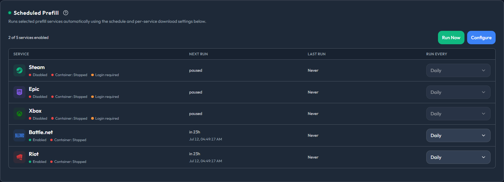

*Scheduled Prefill - per-service status, next run, and last run at a glance*
</div>

One rule governs everything here: **scheduled runs reuse your running persistent prefill container - they never start one.** A persistent container is the long-lived prefill container for a service that you start once and leave running, sign-in included.

So before scheduling a service, start its persistent container and sign in if the platform needs an account. A service that isn't ready is *skipped* as "needs login" while the others still run. A run with only skips finishes as a warning, not a failure.

How it behaves:

- **Per-service schedules.** Each service has its own "run every" interval. You can also pause a service or set it to run only on startup.
- **Presets or hand-picked games.** Presets are **All**, **Recent**, and **Top**. Not every platform supports every preset: Epic has no Recent (its API exposes no last-played data), and Battle.net and Riot are All-only. Picking specific games overrides the preset.
- **For a recurring schedule, the first run comes one interval after you save.** Saving the config never kicks off an immediate prefill. **Run Now** on the card is the only instant path.
- **"Last run: Never" means no run has happened yet.** *Next run* comes from the schedule. *Last run* counts only genuinely completed runs, so a freshly enabled service reads "Never" until its first real run finishes.
- **Stopping a persistent container signs it out.** Logins live inside the container's storage; stop it and that service needs a fresh sign-in before its next scheduled run. There's also a "Clear stored logins" control if you want that explicitly.
- **Battle.net and Riot work out of the box.** They need no account, so they're enabled by default - but their persistent containers still have to be running.
- **Target OS filter is Steam-only.** Steam can prefill Windows, Linux, or macOS depots (Windows by default); the other platforms don't support an OS filter.
- **Force download and concurrency are per service too.** Force download re-fetches games even when they look complete (off by default). Max concurrency is Auto, or a fixed 1-256 connections.
- Each service can post its run notifications normally or silently - your choice per service.

<div align="center">
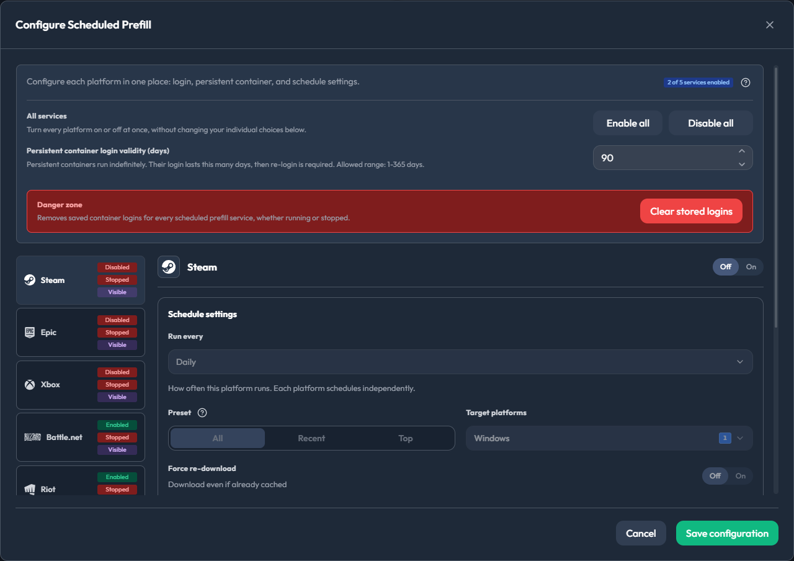

*Configure Scheduled Prefill - per-platform schedule, preset, and target-platform controls*
</div>

Defaults and limits:

| Setting | Default |
|---|---|
| Run every (per service) | 24 hours |
| Preset | All (Top uses the top 50 games) |
| Persistent login validity | 90 days |
| No-progress cutoff (per scheduled run) | 30 minutes |
| Force download | Off |
| Max concurrency | Auto (fixed: 1-256) |
| Longest single service run | 12 hours |

The rest of the Schedules page works the same way for every background service - log rotation, eviction scans, game detection, cache snapshots, and more. Each card has its own interval and a **Run Now** button. Also new in 1.10.4: an **Xbox Game Mapping** card, so the Xbox catalog can refresh on its own schedule.

<a id="prefill-network"></a>
### Network setup

**Most installs need zero config.** If you run the standard `lancache` + `lancache-dns` containers, lancache-manager auto-detects them and prefill works without further setup.

If your DNS isn't a stock `lancache-dns` (you use AdGuard Home, Pi-hole, public DNS, etc.) or your routing is unusual, set one env var and you're done:

| Your setup | What to set |
|---|---|
| Stock `lancache` + `lancache-dns` containers | nothing |
| Single-box install (lancache on the same host as lancache-manager) | nothing |
| AdGuard Home, Pi-hole, or any DNS replacement | `Prefill__LancacheIp=<your-cache-ip>` |
| Host networking, host's DNS doesn't route CDN to your cache | usually nothing - the cache is auto-detected via the bridge gateway and heartbeat-verified; set `Prefill__LancacheIp=<your-cache-ip>` if the network panel still warns |
| Caddy/Squid/non-nginx cache that routes by `Host:` header | `Prefill__LancacheIp=<your-cache-ip>` |
| You want predictable behavior regardless of environment | always set `Prefill__LancacheIp` |

> [!TIP]
> **`Prefill__LancacheIp` is the universal override.** When set, prefill talks to your cache by IP and never asks DNS where the cache lives. Network mode and DNS server settings stop mattering for CDN traffic.

Full descriptions and defaults for `Prefill__LancacheIp`, `Prefill__LancacheDnsIp`, and `Prefill__NetworkMode` live in the [Configuration → Prefill](#prefill-config) reference table.

> [!IMPORTANT]
> **`LancacheIp` and `LancacheDnsIp` are different services, even on the same machine.**
>
> | | What it is | Port | Job |
> |---|---|---|---|
> | `LancacheIp` | The **cache server** (`lancachenet/monolithic`, or any HTTP cache) | HTTP / 80 | Holds the actual cached game files |
> | `LancacheDnsIp` | The **DNS server** (`lancachenet/lancache-dns`, AdGuard Home, Pi-hole, etc.) | DNS / 53 | Translates `lancache.steamcontent.com` into the cache's IP |
>
> Think of a small town. The **cache** is the library (where the books live). The **DNS server** is the information booth (where you ask "which way to the library?"). Both can sit in the same building - same IP, different ports - but they do completely different jobs. When you set `LancacheIp`, the daemon skips the information booth entirely and walks straight to the library. That's why it's the universal override: DNS becomes irrelevant for cache traffic.

> [!IMPORTANT]
> Steam (`api.steampowered.com`) and Epic (`*.epicgames.com`) auth and manifest endpoints still use normal DNS. `LANCACHE_IP` only redirects CDN chunk traffic - the only domains lancache caches. Your login and metadata traffic is unaffected.

#### Examples

**Most reliable** - `LancacheIp` makes CDN routing DNS-independent:

```yaml
environment:
  - Prefill__NetworkMode=host
  - Prefill__LancacheIp=192.168.1.10
```

**Bridge mode with a non-standard DNS** (e.g., AdGuard Home replacing lancache-dns):

```yaml
environment:
  - Prefill__NetworkMode=bridge
  - Prefill__LancacheIp=192.168.1.10        # cache server
  - Prefill__LancacheDnsIp=192.168.1.20     # DNS server
```

**Bridge mode, stock lancache-dns, no IP override** (legacy DNS-driven path):

```yaml
environment:
  - Prefill__NetworkMode=bridge
  - Prefill__LancacheDnsIp=192.168.1.20
```

> [!TIP]
> **Prefill container has no internet?** Try `Prefill__NetworkMode=bridge`. Some Docker setups block outbound traffic in host mode.

#### Network diagnostics

Each prefill session runs a connectivity test on startup and writes the result to logs:

```
═══════════════════════════════════════════════════════════════════════
  PREFILL CONTAINER NETWORK DIAGNOSTICS - prefill-daemon-abc123
═══════════════════════════════════════════════════════════════════════
  Internet connectivity: OK (reached api.steampowered.com)
  lancache.steamcontent.com resolved to 192.168.1.10
  DNS looks correct (private IP - likely your lancache server)
═══════════════════════════════════════════════════════════════════════
```

If the resolved IP is a public address (Steam's real CDN IPs look like `162.254.x.x`), traffic is bypassing your cache. Set `Prefill__LancacheIp` and restart the session.

<a id="prefill-routing"></a>
<details>
<summary><strong>How routing works (advanced)</strong> - exactly which path a request takes</summary>

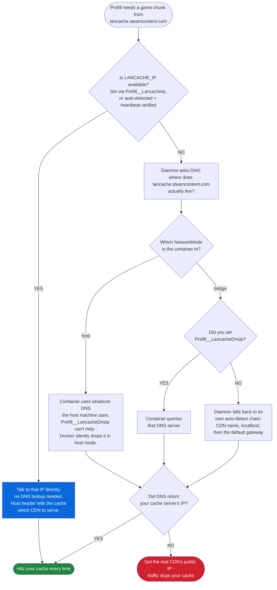

Every combination, in one table:

| `NetworkMode` | `LancacheIp` | `LancacheDnsIp` | Outcome |
|:---:|:---:|:---:|---|
| `host` | set | (any) | Reliable. `LANCACHE_IP` injected; DNS irrelevant. |
| `host` | unset | (any) | Usually fine. The manager auto-detects the cache (heartbeat-verified, including via the bridge gateway) and injects `LANCACHE_IP`; only when nothing verifies does it depend on the host's DNS. DnsIp is silently dropped either way (Docker limitation). |
| `bridge` | set | unset | Reliable. `LANCACHE_IP` injected; DNS irrelevant. |
| `bridge` | set | set | Reliable. `LANCACHE_IP` for CDN, DnsIp for auth/manifest. |
| `bridge` | unset | set | Works if DnsIp resolves CDN to your cache. Container DNS forced to DnsIp. |
| `bridge` | unset | unset | Usually fine. The manager auto-detects the cache and injects `LANCACHE_IP` (heartbeat-verified); otherwise the daemon probes localhost/gateway itself. |

**Why `LancacheIp` always works**: with the env var set, the daemon builds requests like `GET http://192.168.1.10/depot/123/chunk/abc` with `Host: lancache.steamcontent.com`. Your cache (nginx, Caddy, or any HTTP server that routes by `Host:`) sees the right hostname and serves from cache. DNS is never consulted for the CDN domain.

</details>

-----

<a id="image-variants"></a>
## Choosing an Image and Database Mode

This is one decision, not two: **where does PostgreSQL run?** LANCache Manager stores everything in PostgreSQL, and the image tag follows from your answer.

| Mode | What it means | Image tag |
|------|---------------|-----------|
| **Embedded** (default) | PostgreSQL 17 runs *inside* the lancache-manager container over a Unix socket. One container, nothing extra to configure. | `:latest` |
| **External** | You run PostgreSQL yourself - a sidecar container, a remote host, or a managed service (RDS, Azure DB, Cloud SQL). Standard Docker pattern, easier upgrades. | `:latest` works, or `:latest-slim` (~150 MB smaller, drops the unused embedded Postgres). Requires `POSTGRES_MODE=external`. |

The same pairing applies to every tag family the CI publishes (all multi-arch, amd64 + arm64):

| Tag | What it is |
|-----|------------|
| `latest` / `latest-slim` | Latest release. What you should run. |
| `1.2.0` / `1.2.0-slim` | Version-pinned releases - pin one if you want explicit control over upgrades. |
| `release` / `release-slim` | Alias of `latest`. |
| `dev` / `dev-slim` | Latest dev build. Testing only - can break at any time. |

```bash
# Full - default, supports both embedded and external Postgres
docker pull ghcr.io/regix1/lancache-manager:latest

# Slim - external Postgres only
docker pull ghcr.io/regix1/lancache-manager:latest-slim
```

### Example 1: Embedded (default)

This is the [Quick Start](#quick-start) compose file - one container, no sidecar. Optionally add a database password:

```yaml
    environment:
      # ...everything from Quick Start, plus:
      - POSTGRES_PASSWORD=your-secure-password
```

Leave `POSTGRES_PASSWORD` unset and the first-run UI will prompt for it. That's the entire embedded setup.

### Example 2: External (sidecar Postgres)

Two services: `lancache-manager` connects over TCP to `lancache-db`.

```yaml
services:
  lancache-manager:
    image: ghcr.io/regix1/lancache-manager:latest-slim
    container_name: lancache-manager
    restart: unless-stopped
    ports:
      - "8080:80"
    volumes:
      - ./data:/data
      - /mnt/lancache/logs:/logs:ro
      - /mnt/lancache/cache:/cache:ro
      - /var/run/docker.sock:/var/run/docker.sock
    environment:
      - PUID=33
      - PGID=33
      - TZ=America/Chicago
      - LanCache__LogPath=/logs/access.log
      - LanCache__CachePath=/cache
      - POSTGRES_MODE=external
      - POSTGRES_HOST=lancache-db
      - POSTGRES_PORT=5432
      - POSTGRES_DB=lancache
      - POSTGRES_USER=lancache
      - POSTGRES_PASSWORD=change-this-password
    depends_on:
      - lancache-db

  lancache-db:
    image: postgres:17-alpine
    container_name: lancache-db
    restart: unless-stopped
    environment:
      - POSTGRES_USER=lancache
      - POSTGRES_PASSWORD=change-this-password
      - POSTGRES_DB=lancache
    volumes:
      - postgres_data:/var/lib/postgresql/data

volumes:
  postgres_data:
```

`POSTGRES_PASSWORD` must match between the two services. Bring both up with `docker compose up -d`.

**Pointing at a remote or managed Postgres?** Set `POSTGRES_HOST` to its hostname, drop the `lancache-db` service, drop `depends_on`, and skip the named volume.

**Set `POSTGRES_MODE=external` but left the connection vars unset?** The app boots in setup-only mode and shows a UI form. Credentials submitted there are saved to `/data/config/postgres-credentials.json`; you'll be asked to restart the container so the new connection takes effect.

-----

<a id="configuration"></a>
## Configuration Reference

Everything in this section is a lookup table - skim the headers and dig in where you need to. The two sections with real decisions behind them have their own walkthroughs: [database mode](#image-variants) above and [prefill networking](#prefill-network) earlier.

For a normal install, start from the checked-in [`docker-compose.yml`](docker-compose.yml). For every supported variable in one place, jump to the [complete annotated Compose example](#complete-compose) at the end of this section.

<a id="volumes"></a>
### Volumes

| Volume | Purpose | Notes |
|--------|---------|-------|
| `/data` | PostgreSQL database, security, state and config, themes, cached images | Required |
| `/logs` | LANCache access logs | Add `:ro` for read-only |
| `/cache` | LANCache cached files | Add `:ro` to monitor without touching files |
| `/var/run/docker.sock` | Docker API access | Optional. Needed for nginx log rotation and Steam/Epic/Battle.net/Riot/Xbox prefill |

<a id="required-settings"></a>
### Required Settings

| Variable | Default | Description |
|----------|---------|-------------|
| `PUID` | `33` (shipped Compose file) | User ID the app runs as. Match the owner of your cache and log files. |
| `PGID` | `33` (shipped Compose file) | Group ID the app runs as. |
| `TZ` | `UTC` | Timezone for log timestamps (e.g., `America/Chicago`). `TimeZone` is also accepted as a fallback. |
| `LanCache__LogPath` | - | Path inside the container to the LANCache access log. |
| `LanCache__CachePath` | - | Path inside the container to the LANCache cache directory. |

**Which PUID/PGID?** Match the owner of your cache and log files - `ls -n /path/to/cache` shows it. The shipped Compose file uses `33:33` (www-data), which fits most stock lancache setups. Unraid uses `99:100`. Omit either variable when running the raw image and the entrypoint falls back to `1000` for that one - a fallback, not the documented default.

<a id="postgresql"></a>
### PostgreSQL

The mode decision and full compose examples live in [Choosing an Image and Database Mode](#image-variants). The variables:

| Variable | Default | Description |
|----------|---------|-------------|
| `POSTGRES_MODE` | `embedded` | `embedded` or `external`. |
| `POSTGRES_USER` | `lancache` | PostgreSQL username. Both modes. |
| `POSTGRES_PASSWORD` | - | PostgreSQL password. In embedded mode the UI shows a setup page if this is unset. In external mode it must be set (or entered via the UI fallback before the app can connect). |
| `POSTGRES_HOST` | - | **External mode only.** Hostname or IP of the Postgres server. |
| `POSTGRES_PORT` | `5432` | **External mode only.** |
| `POSTGRES_DB` | `lancache` | Database name. Both modes. |

<a id="security"></a>
### Security

| Variable | Default | Description |
|----------|---------|-------------|
| `Security__EnableAuthentication` | `true` | Require an API key for admin actions. Only turn off for local dev. |
| `Security__GuestSessionDurationHours` | `6` | Default guest session length (also configurable in the UI). |
| `Security__RequireAuthForMetrics` | `false` | Require an API key on `/metrics`. The UI toggle in Management → Integrations overrides this when set. |
| `Security__ProtectSwagger` | `true` | Require auth on Swagger docs in production. |
| `Security__AllowedOrigins` | (empty) | Comma-separated CORS allow list. Empty allows all. |
| `Security__ApiKeyPath` | `/data/security/api_key.txt` | Override the file path the admin API key is read from and written to. Useful if you bind-mount secrets from outside `/data`. |
| `Security__KnownProxyNetworks` | (empty) | Comma-separated CIDR list of trusted proxy networks for `X-Forwarded-For` (e.g. `172.16.0.0/12,10.0.0.0/8`). Set this when nginx, Traefik, or another reverse proxy fronts the manager so client IPs are reported correctly. Loopback is always trusted. |
| `Security__TrustAllProxies` | `false` | Trust every upstream proxy unconditionally. Convenient for local dev. **Never enable on an internet-exposed host** - anyone can spoof a client IP. |
| `Security__ForceSecureCookies` | `false` | Force the `Secure` flag on the session cookie even when the request isn't detected as HTTPS. Enable when running behind a TLS-terminating reverse proxy. |

#### Access Levels

| Level | What you can do | Examples |
|-------|----------------|----------|
| **Admin** | Everything. Requires the API key. | Clear cache, process logs, change settings |
| **Guest** | Read-only views. Requires admin auth or a guest session. | Browse downloads, stats, events, client data |

To give someone read-only access without sharing your API key, open the **Users** page and use **Guest Mode** (session length and other defaults live under **Guest Defaults**). Guests can browse the dashboard but can't change anything. The UI and all admin actions require admin auth or a guest session. One exception: `/metrics` is public unless you set `Security__RequireAuthForMetrics=true`.

<a id="prefill-config"></a>
### Prefill

Prefill auto-detects the right values for almost everything in this table. Three things to know before reaching for it:

- **For guaranteed-reliable prefill, set `Prefill__LancacheIp` to your cache server's IP.** Prefill then talks to the cache by IP and stops depending on DNS entirely. It matters most for Battle.net, whose CDN domains are often missing from lancache DNS and can make prefill hang, and for any non-standard DNS setup.
- Leave it unset and the manager auto-detects your cache. It probes likely candidates with a quick health check and only uses an address that answered like a real lancache.
- Reach for the other variables only when auto-detection gets them wrong. The decision table lives in [Network setup](#prefill-network).

| Variable | Default | Description |
|----------|---------|-------------|
| `Prefill__LancacheIp` | (unset) | IP or hostname of your **cache server** (the HTTP server holding cached files, port 80). Forwarded to the daemon as `LANCACHE_IP`; the daemon then connects directly with a spoofed `Host:` header and skips DNS for CDN traffic. The single most reliable override - set this whenever your DNS isn't a stock `lancache-dns`. |
| `Prefill__LancacheDnsIp` | `auto` | IP of your **DNS server** (lancache-dns, AdGuard, Pi-hole - port 53). Written into the prefill container's `/etc/resolv.conf` so the daemon resolves CDN hostnames against it. Used in `bridge` mode only - Docker silently drops DNS overrides on `host`-network containers. `auto` reuses the IP of your detected `lancache-dns` container. |
| `Prefill__NetworkMode` | `auto` | Docker network mode for prefill containers. Accepts `host`, `bridge`, or a Docker network name. `auto` infers the mode from your `lancache-dns` container. |
| `Prefill__SteamDockerImage` | `ghcr.io/regix1/steam-prefill-daemon:latest` | Docker image used for Steam prefill containers. |
| `Prefill__EpicDockerImage` | `ghcr.io/regix1/epic-prefill-daemon:latest` | Docker image used for Epic prefill containers. |
| `Prefill__BattlenetDockerImage` | `ghcr.io/regix1/battlenet-prefill-daemon:latest` | Docker image used for Battle.net prefill containers. |
| `Prefill__RiotDockerImage` | `ghcr.io/regix1/riot-prefill-daemon:latest` | Docker image used for Riot prefill containers. |
| `Prefill__XboxDockerImage` | `ghcr.io/regix1/xbox-prefill-daemon:latest` | Docker image used for Xbox prefill containers. |
| `Prefill__SessionTimeoutMinutes` | `120` | Total lifetime of a non-persistent admin prefill session. Guest and persistent sessions use their own limits. |
| `Prefill__StallTimeoutSeconds` | `180` | Advanced. No-progress time before a non-persistent session counts as stalled. Scheduled Prefill uses its own 30-minute cutoff. |
| `Prefill__DaemonBasePath` | `/data/prefill` | Container path where prefill session state is stored. |
| `Prefill__HostDataPath` | `auto` | Host path that maps to the manager's `/data` volume. Detected from the manager's mount config; set explicitly only when detection fails (unusual platforms, custom volume drivers). |
| `Prefill__UseTcp` | `auto` | Communicate with the daemon over TCP instead of a Unix domain socket. `auto` resolves to `true` on Windows, `false` on Linux. *Linux users only need to set this if they want to force TCP mode.* |
| `Prefill__TcpPort` | `45555` | TCP port the daemon listens on inside its container. *Used in TCP mode only - Windows by default, Linux only when `Prefill__UseTcp=true`.* |
| `Prefill__HostTcpPort` | (random free port) | TCP port the daemon's container publishes on the host. *TCP mode only.* |
| `Prefill__TcpHost` | `127.0.0.1` | Host the daemon binds to and the manager connects to over TCP. *TCP mode only.* |

> [!NOTE]
> **TCP mode is the platform divide.** On Windows, prefill containers communicate over TCP because Windows doesn't expose Unix domain sockets to Docker. On Linux, prefill uses a Unix domain socket by default - the four TCP variables above are ignored unless you set `Prefill__UseTcp=true`. Stock Linux installs can skip the TCP rows entirely.

<a id="paths-and-datasources"></a>
### Paths and Datasources

| Variable | Default | Description |
|----------|---------|-------------|
| `LanCache__EnvFilePath` | (auto) | Path to the lancache `.env` file (used to read `CACHE_DISK_SIZE`). Searches common locations if unset. |
| `LanCache__AutoDiscoverDatasources` | `false` | Auto-detect datasources from matching subdirectories under `/cache` and `/logs`, up to three levels deep. |

If you run more than one cache instance or split services across drives, see [Multiple Datasources](#multiple-datasources).

<a id="nginx-log-rotation"></a>
### Nginx Log Rotation

| Variable | Default | Description |
|----------|---------|-------------|
| `NginxLogRotation__Enabled` | `true` | Tell nginx to reopen its logs after the app rewrites them. Containerized nginx uses the Docker socket; nginx running directly on the host uses the host PID namespace and sufficient signal privilege. |
| `NginxLogRotation__ContainerName` | (empty = auto-detect) | LANCache container name. When empty (or set to `auto`), the app finds containers with "lancache" in the name. |
| `NginxLogRotation__ScheduleHours` | `24` | How often to check whether rotation is needed. |

<a id="api-and-advanced"></a>
### API and Advanced

| Variable | Default | Description |
|----------|---------|-------------|
| `ApiOptions__MaxClientsPerRequest` | `1000` | Max clients returned in a single stats request. |
| `ApiOptions__DefaultClientsLimit` | `100` | Default client limit when none is provided. |
| `Optimizations__EnableGarbageCollectionManagement` | `false` | Show memory management controls in Management. Helpful on low-memory hosts. |
| `ASPNETCORE_URLS` | `http://+:80` | Internal port binding. Don't change unless you know exactly why. |
| `ConnectionStrings__DefaultConnection` | (auto) | Full PostgreSQL connection string override. For power users with complex setups not covered by individual `POSTGRES_*` variables. |
| `CacheSnapshots__RetentionDays` | `90` | How long to keep cache snapshots. Older snapshots are automatically deleted. |
| `CacheSnapshots__IntervalMinutes` | `60` | Advanced. How often to record a cache-size snapshot. |

<a id="complete-compose"></a>
### Complete annotated Compose example

Prefer one file that lists everything? The example below is a complete, working compose file. The active lines match Quick Start; every optional setting is present but commented, with its default and when it matters, so copying it is safe.

<details>
<summary><strong>Complete annotated Compose example</strong> - every supported variable</summary>

```yaml
services:
  lancache-manager:
    image: ghcr.io/regix1/lancache-manager:latest
    container_name: lancache-manager
    restart: unless-stopped
    ports:
      - "8080:80"
    volumes:
      - ./data:/data                                # database, API key, themes, prefill state
      - /mnt/lancache/logs:/logs:ro                 # LANCache access logs
      - /mnt/lancache/cache:/cache:ro               # drop :ro to allow cache clearing and game removal
      - /var/run/docker.sock:/var/run/docker.sock   # optional: prefill and containerized nginx log rotation
    environment:
      # --- Required (same as Quick Start) ---
      - PUID=33                                 # user id the app runs as; 33 = shipped Compose value (www-data). Unraid: 99
      - PGID=33                                 # group id; 33 = shipped Compose value. Unraid: 100
      - TZ=America/Chicago                      # IANA timezone; default UTC
      - LanCache__LogPath=/logs/access.log      # access log inside the container
      - LanCache__CachePath=/cache              # cache dir inside the container

      # --- PostgreSQL (the defaults run embedded Postgres with no extra setup) ---
      # - POSTGRES_MODE=embedded                # embedded (default) or external; the slim image is external-only
      # - POSTGRES_USER=lancache                # default lancache
      # - POSTGRES_PASSWORD=                    # secret; leave unset and the first-run page asks for one
      # External mode only:
      # - POSTGRES_HOST=lancache-db
      # - POSTGRES_PORT=5432
      # - POSTGRES_DB=lancache

      # --- Security ---
      # - Security__EnableAuthentication=true     # false turns off ALL auth; local dev only
      # - Security__RequireAuthForMetrics=false   # true = /metrics needs a Bearer token
      # - Security__GuestSessionDurationHours=6
      # - Security__AllowedOrigins=               # CSV of CORS origins; empty allows all
      # - Security__ProtectSwagger=true
      # - Security__ForceSecureCookies=false      # set true behind a TLS-terminating proxy
      # - Security__KnownProxyNetworks=           # CSV CIDRs of trusted proxies, e.g. 172.16.0.0/12
      # - Security__TrustAllProxies=false         # never true on an internet-exposed host
      # - Security__ApiKeyPath=/data/security/api_key.txt

      # --- Prefill (auto-detected; set these only when detection fails) ---
      # - Prefill__LancacheIp=192.168.1.10        # cache server IP; the most reliable override
      # - Prefill__NetworkMode=auto               # host, bridge, a Docker network name, or auto
      # - Prefill__LancacheDnsIp=auto             # DNS server IP; bridge mode only
      # - Prefill__SteamDockerImage=ghcr.io/regix1/steam-prefill-daemon:latest
      # - Prefill__EpicDockerImage=ghcr.io/regix1/epic-prefill-daemon:latest
      # - Prefill__BattlenetDockerImage=ghcr.io/regix1/battlenet-prefill-daemon:latest
      # - Prefill__RiotDockerImage=ghcr.io/regix1/riot-prefill-daemon:latest
      # - Prefill__XboxDockerImage=ghcr.io/regix1/xbox-prefill-daemon:latest
      # - Prefill__SessionTimeoutMinutes=120      # lifetime of a non-persistent admin session
      # - Prefill__StallTimeoutSeconds=180        # advanced: stall cutoff for non-persistent sessions
      # - Prefill__DaemonBasePath=/data/prefill   # must stay under /data
      # - Prefill__HostDataPath=auto              # host path of /data; set only if detection fails
      # - Prefill__UseTcp=auto                    # auto = TCP on Windows, Unix socket on Linux
      # - Prefill__TcpPort=45555                  # TCP mode only
      # - Prefill__HostTcpPort=                   # TCP mode only; empty picks a free port
      # - Prefill__TcpHost=127.0.0.1              # TCP mode only

      # --- Nginx log rotation (docker.sock for containers; pid: host for host nginx) ---
      # - NginxLogRotation__Enabled=true
      # - NginxLogRotation__ContainerName=        # empty or "auto" finds the "lancache" container
      # - NginxLogRotation__ScheduleHours=24

      # --- API, optimization, cache snapshots ---
      # - ApiOptions__MaxClientsPerRequest=1000
      # - ApiOptions__DefaultClientsLimit=100
      # - Optimizations__EnableGarbageCollectionManagement=false   # low-memory hosts only
      # - CacheSnapshots__RetentionDays=90        # cache-size history retention
      # - CacheSnapshots__IntervalMinutes=60      # advanced: how often to record a snapshot
      # - ASPNETCORE_URLS=http://+:80             # internal bind; leave as-is

      # --- Paths and datasources ---
      # - LanCache__EnvFilePath=/lancache/.env    # unset = auto-search common locations
      # - LanCache__AutoDiscoverDatasources=false # scan /cache and /logs for matching subfolders, up to 3 levels deep
      # Multiple datasources replace LogPath/CachePath above. Keep the numbers
      # contiguous and add more the same way: __2__, __3__, ...
      # - LanCache__DataSources__0__Name=Default
      # - LanCache__DataSources__0__CachePath=/cache
      # - LanCache__DataSources__0__LogPath=/logs
      # - LanCache__DataSources__0__Enabled=true
      # - LanCache__DataSources__1__Name=Steam
      # - LanCache__DataSources__1__CachePath=/steam-cache
      # - LanCache__DataSources__1__LogPath=/steam-logs
      # - LanCache__DataSources__1__Enabled=true

      # --- Power users ---
      # - ConnectionStrings__DefaultConnection=Host=/var/run/postgresql;Database=lancache;Username=lancache;Maximum Pool Size=20;Minimum Pool Size=2   # overrides POSTGRES_*; secret if it embeds a password
      # - Logging__LogLevel__LancacheManager.Infrastructure.Platform=Debug   # any logging category; values Trace..None
```

</details>

**Coming from 1.10.3?** Two variables were added: `Prefill__XboxDockerImage` (Xbox is the fifth prefill platform) and the advanced `Prefill__StallTimeoutSeconds`. Nothing was renamed or removed, so existing Compose files keep working. One cleanup: `Security__MaxAdminDevices` is an old no-op setting that current code ignores - you can delete it.

-----

<a id="recipes"></a>
## Recipes

<a id="unraid"></a>
### Unraid

The repo ships a Docker template at [`unraid/lancache-manager.xml`](unraid/lancache-manager.xml). Save it to `/boot/config/plugins/dockerMan/templates-user/` on your Unraid box, or paste the raw-file URL into **Docker → Add Container → Template**. Then fill in the same paths and variables as the compose example. On Unraid, use `PUID=99` / `PGID=100` (the `nobody:users` default).

<a id="multiple-datasources"></a>
### Multiple Datasources

Most people run a single LANCache instance and never touch this section. You only need it if services are split across cache directories, or if several LANCache servers should combine into one dashboard.

A "datasource" is a paired log + cache directory. Each one is processed and tracked separately, then aggregated in the dashboard and downloads views.

Common reasons to use it:

- **Outsourced services** - Steam lives on a separate drive from everything else.
- **Multiple LANCache instances** - separate cache servers for different rooms or purposes.
- **Segmented storage** - different services on different partitions.

#### Auto-discovery (recommended)

Point the app at the parent directories and let it scan:

```yaml
environment:
  - LanCache__LogPath=/logs
  - LanCache__CachePath=/cache
  - LanCache__AutoDiscoverDatasources=true
```

Discovery walks the configured cache and log paths together, level by level, down to three levels of subfolders below the root - a fixed internal limit, not something you configure. A pair is recorded as a datasource whenever both sides have real content, and recording one doesn't stop its children from also being searched:

1. **Root** - if `/logs/access.log` exists and `/cache` contains LANCache hash directories (`00/`, `01/`, etc.), the root becomes "Default".
2. **Nested folders** - any matched cache/log pair below the root becomes a datasource named after its cache folder (e.g., `/cache/steam` + `/logs/steam` → "Steam"), whether it's the only pair found or one of several, at any level from 1 to 3.
3. **Level 4 and deeper is never scanned** - move the folder up, or configure it manually.

Matching is exact, then case-insensitive, then normalized (dashes, underscores, and a trailing "s" are ignored). When a cache and log folder at the same level don't share a name but each has exactly one child, that single pair is still followed, so a differently-named wrapper folder doesn't block discovery - but two folders that are already valid, differently-named datasources are never cross-paired. Hidden and system folders, LANCache's two-character hash buckets, symlinks, and unreadable branches are skipped without stopping their siblings. A name that collides with one already found is skipped and logged instead of silently shadowing it; if nothing valid turns up anywhere, the app falls back to a single `default` datasource built from the paths you configured.

Example layout with a grouping parent folder, still three datasources (Default, Steam, Epic):

```
/mnt/lancache/
├── cache/
│   ├── 00/, 01/, a1/, ff/       ← Default cache (hash dirs at root, level 0)
│   └── outsourced/
│       ├── steam/
│       │   └── 00/, 01/, ...    ← Steam, level 2
│       └── epic/
│           └── 00/, 01/, ...    ← Epic, level 2
└── logs/
    ├── access.log               ← Default log
    └── outsourced/
        ├── steam/
        │   └── access.log       ← Steam log
        └── epic/
            └── access.log       ← Epic log
```

A folder with hash directories but no matching logs folder at the same level (or vice versa) is skipped - not a valid pairing, so it never becomes a datasource, and nothing errors. For drives or layouts too asymmetric for auto-discovery to pair correctly, declare datasources explicitly - see Manual configuration below.

#### Manual configuration

For drives in totally separate locations or finer control, declare each datasource explicitly. Manual config wins over auto-discovery if both are set.

```yaml
environment:
  # Main LANCache
  - LanCache__DataSources__0__Name=Default
  - LanCache__DataSources__0__CachePath=/cache
  - LanCache__DataSources__0__LogPath=/logs
  - LanCache__DataSources__0__Enabled=true

  # Steam on a separate drive
  - LanCache__DataSources__1__Name=Steam
  - LanCache__DataSources__1__CachePath=/steam-cache
  - LanCache__DataSources__1__LogPath=/steam-logs
  - LanCache__DataSources__1__Enabled=true
```

With matching volume mounts:

```yaml
volumes:
  - /mnt/lancache/cache:/cache:ro
  - /mnt/lancache/logs:/logs:ro
  - /mnt/steam-drive/cache:/steam-cache:ro
  - /mnt/steam-drive/logs:/steam-logs:ro
```

<a id="nginx-reverse-proxy"></a>
### Reverse Proxy (Nginx)

LANCache Manager runs fine behind nginx. HTTPS is recommended, and required if you plan to use guest sessions across origins (cross-origin image cookies need `Secure`).

> [!TIP]
> Fronting the manager with a proxy? Also set `Security__KnownProxyNetworks` (see [Security](#security)) so client IPs are reported correctly.

#### Single origin (recommended)

Serve the UI and API from the same hostname. Cookies stay first-party, CORS is a non-issue.

```nginx
server {
  listen 443 ssl http2;
  server_name lancache.example.com;

  ssl_certificate     /etc/letsencrypt/live/lancache.example.com/fullchain.pem;
  ssl_certificate_key /etc/letsencrypt/live/lancache.example.com/privkey.pem;

  # Increase if you have large responses
  client_max_body_size 50m;

  location / {
    proxy_pass http://127.0.0.1:8080;
    proxy_http_version 1.1;
    proxy_set_header Host $host;
    proxy_set_header X-Real-IP $remote_addr;
    proxy_set_header X-Forwarded-For $proxy_add_x_forwarded_for;
    proxy_set_header X-Forwarded-Proto $scheme;
    proxy_set_header X-Forwarded-Host $host;

    # SignalR (WebSockets)
    proxy_set_header Upgrade $http_upgrade;
    proxy_set_header Connection "upgrade";
    proxy_read_timeout 600s;  # Keep at 600s or higher so idle SignalR WebSocket connections aren't dropped
  }
}

server {
  listen 80;
  server_name lancache.example.com;
  return 301 https://$host$request_uri;
}
```

#### Separate API origin (only if you must)

If the UI and API live on different hostnames:

- Build the UI with `VITE_API_URL=https://api.lancache.example.com`.
- Keep `SameSite=None; Secure` cookies (the app already sets this).
- Allow credentials in CORS for the UI origin.

```nginx
server {
  listen 443 ssl http2;
  server_name api.lancache.example.com;

  ssl_certificate     /etc/letsencrypt/live/api.lancache.example.com/fullchain.pem;
  ssl_certificate_key /etc/letsencrypt/live/api.lancache.example.com/privkey.pem;

  location / {
    proxy_pass http://127.0.0.1:8080;
    proxy_http_version 1.1;
    proxy_set_header Host $host;
    proxy_set_header X-Real-IP $remote_addr;
    proxy_set_header X-Forwarded-For $proxy_add_x_forwarded_for;
    proxy_set_header X-Forwarded-Proto $scheme;
    proxy_set_header X-Forwarded-Host $host;

    # SignalR (WebSockets)
    proxy_set_header Upgrade $http_upgrade;
    proxy_set_header Connection "upgrade";
    proxy_read_timeout 600s;  # Keep at 600s or higher so idle SignalR WebSocket connections aren't dropped
  }
}
```

<a id="grafana--prometheus"></a>
### Prometheus Metrics

The app exposes Prometheus metrics on `/metrics`. Scrape them, build dashboards in Grafana or any Prometheus-compatible stack, alert on cache hit ratio - whatever you need. The metrics URL and refresh settings also surface in **Management → Integrations**.

#### Available metrics

The most commonly used series:

| Metric | Description |
|--------|-------------|
| `lancache_cache_capacity_bytes` | Total storage capacity |
| `lancache_cache_used_bytes` | Currently used space |
| `lancache_cache_free_bytes` | Remaining free space |
| `lancache_cache_hit_bytes_total` | Bandwidth saved (cache hits) |
| `lancache_cache_miss_bytes_total` | New data downloaded |
| `lancache_cache_hit_ratio` | Cache effectiveness (0-1) |
| `lancache_active_downloads` | Current active downloads |
| `lancache_active_clients` | Clients seen recently |
| `lancache_service_downloads_total` | Downloads per service |
| `lancache_service_bytes_total` | Bandwidth per service |
| `lancache_service_hit_ratio` | Hit ratio per service |
| `lancache_client_bytes_total` | Bandwidth per client |

There's more where that came from - throughput, hourly breakdowns, cache growth trend, days-until-full projection, peak-hour stats, and per-service hit/miss series. Open `/metrics` in a browser to see the full set with help text.

#### Prometheus config

```yaml
scrape_configs:
  - job_name: 'lancache-manager'
    static_configs:
      - targets: ['lancache-manager:80']
    scrape_interval: 30s
    metrics_path: /metrics
```

If you've set `Security__RequireAuthForMetrics=true`, add bearer auth:

```yaml
    authorization:
      type: Bearer
      credentials: 'your-api-key-here'
```

#### Example queries

```promql
# Cache hit rate as percentage
lancache_cache_hit_ratio * 100

# Bandwidth saved in last 24 hours
increase(lancache_cache_hit_bytes_total[24h])

# Cache usage in GB
lancache_cache_used_bytes / 1024 / 1024 / 1024
```

-----

<a id="bare-metal"></a>
## Bare-Metal LANCache

[zeropingheroes/lancache-bare-metal](https://github.com/zeropingheroes/lancache-bare-metal) runs the cache's nginx directly on the host instead of in Docker. It writes per-service log files (`steam-access.log`, `blizzard-access.log`, `epicgames-access.log`, `riot-access.log`, `windows-update-access.log`, `fallback-access.log`) to `/srv/lancache/logs/http/`, in an `http-detailed` format with no service tag. LANCache Manager reads this layout natively: mount the log and cache directories and traffic appears, with no nginx changes needed.

### Full Compose example

```yaml
services:
  lancache-manager:
    image: ghcr.io/regix1/lancache-manager:latest
    container_name: lancache-manager
    restart: unless-stopped
    # Share the host PID namespace so the manager can find the host nginx and
    # ask it to reopen its logs after a removal or rewrite.
    pid: host
    # Docker grants CAP_KILL by default and the image keeps it while dropping
    # to the non-root PUID below. Uncomment only if your deployment uses
    # cap_drop to trim the default capability set.
    # cap_add:
    #   - KILL
    ports:
      - "8080:80"
    environment:
      - PUID=33          # keep your normal non-root IDs; root is not required
      - PGID=33
      - TZ=America/Chicago
      - LanCache__LogPath=/logs
      - LanCache__CachePath=/cache
    volumes:
      - ./data:/data                       # database, API key, themes, prefill state
      - /srv/lancache/logs/http:/logs:ro   # bare-metal per-service logs
      - /srv/lancache/data:/cache:ro       # drop :ro to allow cache clearing and game removal
```

With `docker run`, the matching options are `--pid=host` and, only after a `cap_drop`, `--cap-add=KILL`. Mounting the parent `/srv/lancache/logs` also works; the manager finds the `http/` folder on its own.

**Why `pid: host`:** after a removal the manager rewrites a log file, and nginx must reopen it or it keeps writing to the deleted inode. Host PID visibility plus `CAP_KILL` lets the manager signal the host nginx automatically. Without them, removals still complete, but the reopen is reported as failed so you can run `nginx -s reopen` yourself.

**Containerized nginx with bare-metal logs:** if nginx runs in a container but writes the per-service log layout, skip `pid: host` and mount the Docker socket instead (`/var/run/docker.sock:/var/run/docker.sock`).

### Log rotation

The manager never truncates or rotates bare-metal log files; its scheduled job only asks nginx to reopen the current ones. Keep log growth under the host's `logrotate`, and have the rule reopen nginx afterwards:

```text
postrotate
    nginx -s reopen
endscript
```

### What works

Everything, log-based and disk-based:

- **Monitoring:** live activity, the dashboard, download history, client and service stats, and game naming (Steam depots, Blizzard products, Riot hosts).
- **Logs:** per-service log counts, log removal, and deleting log files.
- **Disk:** game and service removal, repeated-miss corruption scanning, eviction tracking, and clearing the whole cache. Every deletion double-checks the file's own embedded cache key first.

**A note on hit rates:** Blizzard and Windows Update downloads arrive in 1 MB slices, and nginx logs the cache status of only the first slice. Their hit/miss ratio is therefore an approximation (byte counts stay exact). Container installs slice the same way, so this is not bare-metal specific.

### Alternative: switch bare-metal to the standard log format

Prefer the container-style combined log? Patch the bare-metal nginx config instead. Add the standard format to the `http {}` block of `nginx.conf`:

```nginx
log_format cachelog '[$cacheidentifier] $remote_addr / - - - [$time_local] "$request" $status $body_bytes_sent "$http_referer" "$http_user_agent" "$upstream_cache_status" "$host" "$http_range"';
```

Then in each site file under `caches-available/`, set the service name and point every site at one shared log file:

```nginx
set $cacheidentifier steam;   # blizzard / epicgames / riot / wsus per site
access_log /srv/lancache/logs/http/access.log cachelog;
```

Reload with `sudo nginx -s reopen` (or `systemctl reload nginx`) and mount `/srv/lancache/logs/http` as above. One warning: the combined log makes the manager treat the install as a standard container, while the files on disk keep the bare-metal cache keys. Disk-level actions are no longer blocked but no longer match the disk layout, so leave them alone on a patched cache.

-----

<a id="troubleshooting"></a>
## Troubleshooting

Before working through the entries below, open **Management → Status Check**. It tests DNS, cache reachability, and whether recent downloads used the cache, and it will often name the problem outright.

### Logs aren't processing

1. Check the log path under **Management → Logs & Cache → Log Processing**.
2. Confirm your volume mount lines up with `LanCache__LogPath`.
3. Click **Process All Logs** on that same page.
4. Look at the container logs: `docker logs lancache-manager`.

### The web UI says "No log file" (but the file exists)

`LanCache__LogPath` must be the **full path to the access log file inside the container**, including the filename — e.g. `/logs/access.log`, not just `/logs`. Confirm:

1. Your volume mounts the host log directory into the container (e.g. `- /host/path/lancache/logs:/logs`).
2. `LanCache__LogPath` points at the file at that *container* path (`/logs/access.log`).
3. The file is readable from inside the container: `docker exec -it lancache-manager cat /logs/access.log | head`.

Network shares (NFS/SMB) are fine. A trailing `+` in `ls -la` output (e.g. `-rw-r--r--+`) is just an NFS ACL marker — it does **not** block reads. If `cat` prints the file, permissions are not the problem and the configured path is what to check.

### Cache size / disk usage isn't showing on the dashboard

`LanCache__CachePath` must point at the directory that **directly contains the hashed cache folders** (named like `00`, `1a`, `ff`), not its parent.

A standard lancache (monolithic) layout nests the content one level down. If you mount your cache data directory to `/cache`, the actual folders usually live at `/cache/cache` — so set `LanCache__CachePath=/cache/cache`. Point it one level too high and the dashboard shows the drive but reports no cache usage. Network-mounted (NFS/SMB) caches behave the same.

Verify what's actually at the path:

```bash
docker exec -it lancache-manager ls /cache
# you should see the hashed folders (00, 1a, ... ff), not a single "cache" folder
```

### Games aren't being identified

**Steam:**

1. Refresh the mappings: **Management → Schedules → Steam Game Mapping → Run Now**.
2. Add custom mappings for any private depots you care about.
3. Re-import the history: in **Logs & Cache**, move the log read position back to the beginning and process again. Already-processed entries are skipped automatically, so reprocessing is safe.

**Epic:**

1. Sign in to Epic under **Management → Integrations**.
2. Run **Management → Schedules → Epic Game Mapping → Run Now**. The mapping service queries the Epic API to identify what's in your cache.
3. Game names and cover art come down automatically.

### Lost API key

```bash
# from the host, if /data is bind-mounted (the default docker-compose.yml)
cat ./data/security/api_key.txt

# from anywhere, reading straight from inside the container (also works with named volumes)
docker exec lancache-manager cat /data/security/api_key.txt
```

On Windows Git Bash, prefix the `docker exec` form with `MSYS_NO_PATHCONV=1` (`MSYS_NO_PATHCONV=1 docker exec lancache-manager cat /data/security/api_key.txt`) or the path gets rewritten to a local Windows path.

To rotate the key, stop the container, delete `./data/security/api_key.txt`, and start it again.

### Permission issues

Make sure `PUID` and `PGID` match the owner of your cache and log files:

```bash
ls -n /path/to/cache
```

### Prefill won't run

The checklist is the same for all five platforms. Work down the list:

1. Confirm the Docker socket is mounted.
2. Confirm you're authenticated as admin in lancache-manager.
3. Look in the container logs for the network diagnostics block (`═══ PREFILL CONTAINER NETWORK DIAGNOSTICS ═══`) - it tells you whether the container has internet and where CDN domains resolve to.
4. **No internet inside the prefill container.** The container can't reach the platform's servers. Common fixes:
   - Set `Prefill__NetworkMode=bridge` (works for most setups).
   - Confirm your Docker network has outbound internet.
   - Check firewall rules for outbound traffic.
5. **HTTP 400 errors during download.** The container can't resolve CDN domains to your cache. The most reliable fix is `Prefill__LancacheIp=<your-cache-ip>` - it bypasses DNS entirely for CDN traffic. The full decision table (and what `LancacheDnsIp`/`NetworkMode` do instead) is in [Network setup](#prefill-network).
6. **IPv6 traffic bypassing DNS.** If your network has IPv6, queries can bypass `lancache-dns`. The app already disables IPv6 in prefill containers to prevent this.
7. **Epic OAuth never connects.** Complete the OAuth flow in the browser window that pops open. The token is stored securely and persists across sessions.

To find the IP of your `lancache-dns`:

```bash
docker inspect lancache-dns | grep IPAddress
```

### A scheduled prefill "skipped" services

That's [Scheduled Prefill](#scheduled-prefill) working as designed: a scheduled run only uses a persistent container that is already running and, for Steam/Epic/Xbox, signed in. Start the container from the Scheduled Prefill card and sign in if needed; the next run will include it. Skips don't count as failures, and the schedule keeps ticking.

### Hit rate looks lower than expected after a prefill

Usually nothing is wrong - the number includes the prefill itself. The dashboard hit rate is byte-weighted across every client that touched the cache, including the prefill container (the [Prometheus](#grafana--prometheus) `lancache_service_hit_ratio` metrics blend the same way).

On an empty cache, a prefill run is close to 100% MISS and the install that follows is close to 100% HIT. Together, one game blends to roughly 50%. Each reinstall pushes the number toward 66%, 75%, and higher, because the MISS bytes are a fixed floor while every install adds more HIT bytes.

To hide the prefill traffic from view, filter out client `127.0.0.1` in the Downloads/Dashboard client filter. The daemon runs on the same host, so this hides its traffic without touching the underlying data.

For a specific install's real hit rate, turn off **group by game** in the Downloads tab and check that client's own row, or grep `access.log` for its IP. The manager only counts literal `HIT`/`MISS` from nginx's `upstream_cache_status`, so it always agrees with a manual log count.

Some real misses are normal even on a clean install:

- the prefill daemon only grabs Windows/x64/English depots by default
- an interrupted earlier run without `--force` leaves gaps
- HTTPS/IPv6 traffic that bypasses `lancache-dns` never touches the cache

### Debug logging

If you're chasing a path resolution, file system, or Docker socket issue, turn on verbose platform logging:

```yaml
environment:
  - Logging__LogLevel__LancacheManager.Infrastructure.Platform=Debug
```

You'll get extra detail on:

- Path resolution (container vs host paths)
- File system operations and permission checks
- Docker socket communication and container detection
- Volume mount detection
- Linux/Windows platform differences

To use it: add the variable, restart with `docker compose up -d`, reproduce the issue, then check `docker logs lancache-manager`. Remove the variable when you're done - it's noisy.

This is most useful when path auto-detection fails, prefill containers won't spawn, volume mounts look wrong, or you're on an unusual platform.

-----

<a id="custom-themes"></a>
## Custom Themes

Open **Management → Theme → Theme Management** to build a theme from scratch with a live preview of every color group, browse and install community themes, or import and export themes as TOML.

Themes live in `/data/themes/`. Here's the minimum format:

```toml
[meta]
name = "My Theme"
id = "my-theme"
isDark = true
version = "1.0.0"
author = "Your Name"

[colors]
primaryColor = "#3b82f6"
bgPrimary = "#111827"
textPrimary = "#ffffff"
```

-----

<a id="building-from-source"></a>
## Building from Source

You'll need the .NET 10 SDK, Node.js 22+, and Rust 1.94+ (matching what the Dockerfile builds with).

```bash
git clone https://github.com/regix1/lancache-manager.git
cd lancache-manager

# Rust processor
cd rust-processor && cargo build --release

# Web interface
cd ../Web && npm install && npm run dev  # http://localhost:3000

# API
cd ../Api/LancacheManager && dotnet run  # http://localhost:5000
```

Multi-arch Docker build:

```bash
docker buildx build \
  --platform linux/amd64,linux/arm64 \
  -t ghcr.io/regix1/lancache-manager:latest \
  --push .
```

-----

<a id="contributing-translations"></a>
## Contributing Translations

LANCache Manager supports internationalization (i18n) and welcomes community translations. Every UI string is already externalized - there's nothing to refactor before you can translate.

### How to contribute

1. **Fork the repository** on GitHub.
2. Open `Web/src/i18n/locales/`.
3. Copy `en.json` to a file named for your language (e.g., `de.json`, `fr.json`, `es.json`, `pt-BR.json`).
4. Translate the values. Leave the keys alone.
5. Submit a **pull request**.

### File layout

```
Web/src/i18n/locales/
├── en.json          ← English (reference)
├── de.json          ← German (your contribution)
├── fr.json          ← French (your contribution)
└── ...
```

### Guidelines

- **Don't change JSON keys** - only translate the string values.
- **Preserve placeholders** - keep `{{variable}}` intact (e.g., `{{name}}`).
- **Preserve formatting** - leave HTML tags like `<strong>` alone.
- **Test locally** - run the app and verify your translations render correctly.

### Example

```json
// en.json
{
  "dashboard": {
    "title": "Dashboard",
    "recentDownloads": "Recent Downloads",
    "totalCache": "Total Cache: {{size}}"
  }
}

// de.json
{
  "dashboard": {
    "title": "Übersicht",
    "recentDownloads": "Letzte Downloads",
    "totalCache": "Gesamter Cache: {{size}}"
  }
}
```

-----

<a id="support-and-license"></a>
## Support and License

Stuck on something? [Open an issue](https://github.com/regix1/lancache-manager/issues) on GitHub, or come find the LANCache community on the [LanCache.NET Discord](https://discord.com/invite/BKnBS4u).

If LANCache Manager has been useful to you and you'd like to support development, you can [buy me a coffee](https://www.buymeacoffee.com/regix). Every bit helps keep the project alive.

[](https://www.buymeacoffee.com/regix)

### License

LANCache Manager is licensed under the [GNU Affero General Public License v3.0 (AGPL-3.0)](LICENSE).

In plain terms:

- **Self-host it, modify it, use it however you like** for yourself, your LAN, your business, or your gaming cafe.
- **If you run a modified version for other people** (including as a hosted service), you must offer those users the corresponding source code of your modified version, under the same license and with the original copyright intact.
- This prevents a modified hosted version from withholding that modified program's corresponding source from its users, so the project can't be turned into a closed, proprietary reskin.

This is a plain-language summary, not legal advice - the [LICENSE](LICENSE) file is the authoritative text.

Versions up to and including `1.10.3` were released under the MIT License and stay MIT. The project name and logo are covered separately by the [Trademark Policy](TRADEMARK.md). Contributions are accepted under [these terms](CONTRIBUTING.md).
