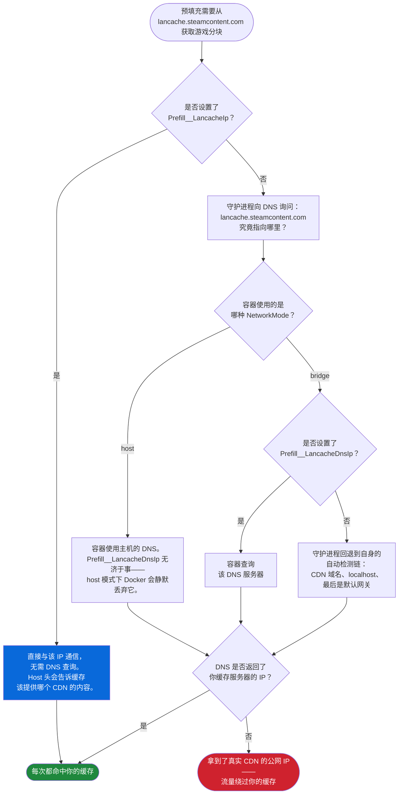

<div align="center">

[**English**](README.MD) | **中文**

</div>

> 本文档为社区贡献的中文翻译（来自 [PR #26](https://github.com/regix1/lancache-manager/pull/26)）。如与英文版有出入，以 [英文 README](README.MD) 为准。

---

# LANCache Manager

[LANCache](https://lancache.net/) 的 Web 管理界面。实时查看下载进度、查看已缓存内容、追踪节省的带宽，以及在下次 LAN 聚会前预填充 Steam、Epic、Battle.net 和 Riot 游戏。Web 界面支持英语和简体中文。

**功能一览：**

- **实时仪表盘**——实时下载、节省的带宽、热门客户端、服务分析
- **缓存浏览器**——查看每个已缓存的游戏，包括封面图、大小和按客户端的历史记录
- **预填充**——在客人到来*之前*将 Steam、Epic、Battle.net 和 Riot 游戏下载到你的缓存
- **管理**——处理日志、清除缓存、检测损坏、查找已缓存内容、管理主题
- **监控**——开箱即用的 Prometheus 指标，随时接入 Grafana

> [!IMPORTANT]
> **始终拉取 `latest` 标签。** GitHub 的包页面会展示 `:dev`，因为开发版构建更频繁，但 `:dev` 仅用于测试，随时可能出问题。
>
> ```bash
> docker pull ghcr.io/regix1/lancache-manager:latest
> ```

-----

## 目录

- [快速开始](#quick-start)
- [截图](#screenshots)
- [选择镜像与数据库模式](#image-variants)
- [配置参考](#configuration)
  - [数据卷](#volumes)
  - [必需设置](#required-settings)
  - [PostgreSQL](#postgresql)
  - [安全](#security)
  - [预填充](#prefill-config)
  - [路径与数据源](#paths-and-datasources)
  - [Nginx 日志轮转](#nginx-log-rotation)
  - [API 与高级设置](#api-and-advanced)
- [预填充（Steam、Epic、Battle.net 和 Riot）](#prefill-steam--epic)
- [自定义主题](#custom-themes)
- [多数据源](#multiple-datasources)
- [反向代理（Nginx）](#nginx-reverse-proxy)
- [监控（Grafana 和 Prometheus）](#grafana--prometheus)
- [故障排除](#troubleshooting)
- [从源码构建](#building-from-source)
- [贡献翻译](#contributing-translations)
- [支持与许可](#support-and-license)

-----

<a id="quick-start"></a>
<a id="docker-compose"></a>
## 快速开始

将容器指向你现有的 LANCache 日志和缓存，一分钟内即可上线。默认镜像自带 PostgreSQL，所以下面这些就是全部所需：

```yaml
services:
  lancache-manager:
    image: ghcr.io/regix1/lancache-manager:latest
    container_name: lancache-manager
    restart: unless-stopped
    ports:
      - "8080:80"
    volumes:
      - ./data:/data
      - /mnt/lancache/logs:/logs:ro
      - /mnt/lancache/cache:/cache:ro
      - /var/run/docker.sock:/var/run/docker.sock  # 可选：用于预填充和日志轮转
    environment:
      - PUID=33
      - PGID=33
      - TZ=America/Chicago
      - LanCache__LogPath=/logs/access.log
      - LanCache__CachePath=/cache
```

```bash
docker compose up -d
```

然后：

1. 从容器的日志中获取你的 API 密钥：

   ```bash
   docker logs lancache-manager | grep "API Key"
   ```

   它也会写入 `/data/security/api_key.txt`。

2. 打开 `http://localhost:8080`。
3. 前往**管理**，粘贴你的 API 密钥，点击**处理日志**导入现有的缓存历史。

关于挂载的两点说明：

- 如果想从 UI 清除缓存或删除单个游戏，请去掉 `/cache` 挂载的 `:ro`。
- Docker 套接字是可选的——只有 nginx 日志轮转和 Steam/Epic/Battle.net/Riot 预填充需要它。

<details>
<summary><strong>想用 <code>docker run</code> 快速测试？</strong></summary>

```bash
docker run -d \
  --name lancache-manager \
  -p 8080:80 \
  -v ./data:/data \
  -v /path/to/lancache/logs:/logs:ro \
  -v /path/to/lancache/cache:/cache:ro \
  -e TZ=America/Chicago \
  -e LanCache__LogPath=/logs/access.log \
  -e LanCache__CachePath=/cache \
  ghcr.io/regix1/lancache-manager:latest
```

</details>

-----

<a id="screenshots"></a>
## 截图

<div align="center">

### 仪表盘


*通过可拖拽卡片一览统计信息、服务分析和热门客户端*

### 下载

**普通视图**


**紧凑视图**


**复古视图**


*三种视图模式浏览已缓存的游戏。显示设置包括分组、时间戳和横幅缩放（平滑 / 锐利）。*

### 客户端


*监控哪些设备正在使用你的缓存*

### 事件


*下载活动和 LAN 事件的日历视图*

### 预填充


*选择 Steam、Epic、Battle.net 或 Riot 开始预填充会话*


*游戏选择、下载设置和实时活动日志*

### 管理


*认证、演示模式和显示偏好*


*日志处理、损坏检测和游戏缓存检测*


*浏览已安装的主题或使用主题编辑器创建自己的主题*


*为客户端 IP 分配友好名称，并将客户端从统计中排除*

</div>

-----

<a id="image-variants"></a>
## 选择镜像与数据库模式

这是一个决定，而不是两个：**PostgreSQL 在哪里运行？** LANCache Manager 将所有数据存储在 PostgreSQL 中，镜像标签由你的答案决定。

| 模式 | 含义 | 镜像标签 |
|------|------|----------|
| **内嵌**（默认） | PostgreSQL 17 在 lancache-manager 容器*内*通过 Unix 套接字运行。单容器，无需任何额外配置。 | `:latest` |
| **外部** | 你自己运行 PostgreSQL——边车容器、远程主机或托管服务（RDS、Azure DB、Cloud SQL）。标准 Docker 模式，更易于升级。 | `:latest` 可用，或 `:latest-slim`（约小 150 MB，去掉未使用的内嵌 Postgres）。需要设置 `POSTGRES_MODE=external`。 |

同样的配对适用于 CI 发布的每个标签系列（均为多架构，amd64 + arm64）：

| 标签 | 说明 |
|------|------|
| `latest` / `latest-slim` | 最新发布版。你应该运行的版本。 |
| `1.2.0` / `1.2.0-slim` | 版本固定的发布——如果你想显式控制升级，请固定一个版本。 |
| `release` / `release-slim` | `latest` 的别名。 |
| `dev` / `dev-slim` | 最新开发版构建。仅用于测试——随时可能出问题。 |

```bash
# 完整版 - 默认，支持内嵌和外部 Postgres
docker pull ghcr.io/regix1/lancache-manager:latest

# 精简版 - 仅外部 Postgres
docker pull ghcr.io/regix1/lancache-manager:latest-slim
```

### 示例 1：内嵌（默认）

这就是[快速开始](#quick-start)中的 Compose 文件——单容器，无边车。可选地添加一个数据库密码：

```yaml
    environment:
      # ...快速开始中的全部内容，外加：
      - POSTGRES_PASSWORD=your-secure-password
```

不设置 `POSTGRES_PASSWORD` 的话，首次运行的 UI 会提示输入。内嵌模式的全部设置就这么多。

### 示例 2：外部（边车 Postgres）

两个服务：`lancache-manager` 通过 TCP 连接到 `lancache-db`。

```yaml
services:
  lancache-manager:
    image: ghcr.io/regix1/lancache-manager:latest-slim
    container_name: lancache-manager
    restart: unless-stopped
    ports:
      - "8080:80"
    volumes:
      - ./data:/data
      - /mnt/lancache/logs:/logs:ro
      - /mnt/lancache/cache:/cache:ro
      - /var/run/docker.sock:/var/run/docker.sock
    environment:
      - PUID=33
      - PGID=33
      - TZ=America/Chicago
      - LanCache__LogPath=/logs/access.log
      - LanCache__CachePath=/cache
      - POSTGRES_MODE=external
      - POSTGRES_HOST=lancache-db
      - POSTGRES_PORT=5432
      - POSTGRES_DB=lancache
      - POSTGRES_USER=lancache
      - POSTGRES_PASSWORD=change-this-password
    depends_on:
      - lancache-db

  lancache-db:
    image: postgres:17-alpine
    container_name: lancache-db
    restart: unless-stopped
    environment:
      - POSTGRES_USER=lancache
      - POSTGRES_PASSWORD=change-this-password
      - POSTGRES_DB=lancache
    volumes:
      - postgres_data:/var/lib/postgresql/data

volumes:
  postgres_data:
```

`POSTGRES_PASSWORD` 必须在两个服务中保持一致。使用 `docker compose up -d` 同时启动两者。

**指向远程或托管的 Postgres？** 将 `POSTGRES_HOST` 设置为其主机名，移除 `lancache-db` 服务，移除 `depends_on`，并省略命名数据卷。

**设置了 `POSTGRES_MODE=external` 但未设置连接变量？** 应用将以仅设置模式启动并显示 UI 表单。在那里提交的凭据会保存到 `/data/config/postgres-credentials.json`；系统会要求你重启容器以使新连接生效。

### 从旧版 SQLite 构建升级

迁移会在任一模式下首次启动时自动运行——你的下载记录、设置和缓存数据无需手动操作即可迁移。在托管 Postgres 服务上，某些 `ALTER SYSTEM` 调优会被禁止；迁移会将其视为尽力而为，并在没有它的情况下继续执行。

-----

<a id="configuration"></a>
## 配置参考

本节的所有内容都是查询表——浏览标题，按需深入。真正需要做决策的两个部分有各自的详细说明：上方的[数据库模式](#image-variants)和下方的[预填充网络](#prefill-network)。

<a id="volumes"></a>
### 数据卷

| 数据卷 | 用途 | 说明 |
|--------|------|------|
| `/data` | PostgreSQL 数据库、安全、状态和配置、主题、缓存的图片 | 必需 |
| `/logs` | LANCache 访问日志 | 添加 `:ro` 可设为只读 |
| `/cache` | LANCache 缓存文件 | 添加 `:ro` 可只监控而不修改文件 |
| `/var/run/docker.sock` | Docker API 访问 | 可选。nginx 日志轮转和 Steam/Epic/Battle.net/Riot 预填充时需要 |

<a id="required-settings"></a>
### 必需设置

| 变量 | 默认值 | 描述 |
|------|--------|------|
| `PUID` | `1000` | 应用运行的用户 ID。应与缓存和日志文件的所有者匹配。 |
| `PGID` | `1000` | 应用运行的组 ID。 |
| `TZ` | `UTC` | 日志时间戳的时区（例如 `America/Chicago`）。也可使用 `TimeZone` 作为后备。 |
| `LanCache__LogPath` | - | 容器内 LANCache 访问日志的路径。 |
| `LanCache__CachePath` | - | 容器内 LANCache 缓存目录的路径。 |

**该用哪个 PUID/PGID？** 如果未设置，入口脚本会回退到 `1000:1000`。常见的约定是 `33`（www-data——本 README 中的 Compose 示例使用它，因为标准的 lancache 安装通常由 www-data 拥有）和 `99`（Unraid 默认的 `nobody`）。根据主机绑定挂载的文件所有权来选择——用 `ls -n /path/to/cache` 可以查看。

<a id="postgresql"></a>
### PostgreSQL

模式选择和完整的 Compose 示例位于[选择镜像与数据库模式](#image-variants)。变量如下：

| 变量 | 默认值 | 描述 |
|------|--------|------|
| `POSTGRES_MODE` | `embedded` | `embedded` 或 `external`。 |
| `POSTGRES_USER` | `lancache` | PostgreSQL 用户名。两种模式均适用。 |
| `POSTGRES_PASSWORD` | - | PostgreSQL 密码。内嵌模式下若未设置，UI 会显示设置页面。外部模式下必须设置（或通过 UI 后备方式输入，否则应用无法连接）。 |
| `POSTGRES_HOST` | - | **仅外部模式。** Postgres 服务器的主机名或 IP。 |
| `POSTGRES_PORT` | `5432` | **仅外部模式。** |
| `POSTGRES_DB` | `lancache` | 数据库名称。两种模式均适用。 |

<a id="security"></a>
### 安全

| 变量 | 默认值 | 描述 |
|------|--------|------|
| `Security__EnableAuthentication` | `true` | 要求 API 密钥才能执行管理操作。仅在本地开发时关闭。 |
| `Security__GuestSessionDurationHours` | `6` | 默认访客会话时长（也可在 UI 中配置）。 |
| `Security__RequireAuthForMetrics` | `false` | 在 `/metrics` 上要求 API 密钥。UI 中管理 → 安全的开关设置后会覆盖此值。 |
| `Security__ProtectSwagger` | `true` | 在生产环境中对 Swagger 文档要求认证。 |
| `Security__AllowedOrigins` | （空） | 逗号分隔的 CORS 允许列表。为空则允许所有来源。 |
| `Security__ApiKeyPath` | `/data/security/api_key.txt` | 覆盖管理员 API 密钥读写的文件路径。当从 `/data` 外部绑定挂载密钥时很有用。 |
| `Security__KnownProxyNetworks` | （空） | 逗号分隔的可信代理网络 CIDR 列表，用于 `X-Forwarded-For`（例如 `172.16.0.0/12,10.0.0.0/8`）。当 nginx、Traefik 或其他反向代理前置时设置此项，以便正确报告客户端 IP。回环地址始终受信任。 |
| `Security__TrustAllProxies` | `false` | 无条件信任所有上游代理。方便本地开发。**切勿在暴露于 Internet 的主机上启用**——任何人都可以伪造客户端 IP。 |
| `Security__ForceSecureCookies` | `false` | 即使请求未被识别为 HTTPS，也强制在会话 cookie 上设置 `Secure` 标志。在 TLS 终止反向代理后运行时启用。 |

#### 访问级别

| 级别 | 可执行操作 | 示例 |
|------|-----------|------|
| **管理员** | 所有操作。需要 API 密钥。 | 清除缓存、处理日志、更改设置 |
| **访客** | 只读视图。需要管理员认证或访客会话。 | 浏览下载、统计、事件、客户端数据 |

要分享访客链接而不泄露你的 API 密钥，打开**用户**标签页，点击**创建访客链接**。访客可以浏览仪表盘但无法更改任何内容。没有什么是公开的——每个端点都需要管理员认证或有效的访客会话。

<a id="prefill-config"></a>
### 预填充

预填充会自动检测此表中几乎所有内容的正确值。**为确保预填充可靠运行，应将 `Prefill__LancacheIp` 设置为缓存服务器的 IP**——这会让预填充通过 IP 与缓存通信，完全不再依赖 DNS。对于战网强烈建议设置此项（暴雪的 CDN 域名通常不在 lancache DNS 中，可能导致预填充挂起），对于任何非标准 DNS 设置也是如此。未设置时，管理器会尽力自动检测正在运行的 lancache 服务器，但自动检测可能失败；显式设置此项是唯一完全可靠的方式。仅在自动检测出错时才需要其他变量。

关于设置决策（何时需要哪个覆写），请参见[预填充 → 网络设置](#prefill-network)。

| 变量 | 默认值 | 描述 |
|------|--------|------|
| `Prefill__LancacheIp` | （未设置） | **缓存服务器**的 IP 或主机名（保存缓存文件的 HTTP 服务器，端口 80）。作为 `LANCACHE_IP` 传递给守护进程；守护进程随后使用伪造的 `Host:` 头直接连接，跳过 CDN 流量的 DNS。最可靠的覆写——当你的 DNS 不是标准的 `lancache-dns` 时就设置此项。 |
| `Prefill__LancacheDnsIp` | `auto` | **DNS 服务器**的 IP（lancache-dns、AdGuard、Pi-hole——端口 53）。写入预填充容器的 `/etc/resolv.conf`，使守护进程通过它解析 CDN 主机名。仅在 `bridge` 模式下使用——Docker 在 `host` 网络容器上静默丢弃 DNS 覆写。`auto` 复用检测到的 `lancache-dns` 容器的 IP。 |
| `Prefill__NetworkMode` | `auto` | 预填充容器的 Docker 网络模式。接受 `host`、`bridge` 或 Docker 网络名称。`auto` 从 `lancache-dns` 容器推断模式。 |
| `Prefill__SteamDockerImage` | `ghcr.io/regix1/steam-prefill-daemon:latest` | 用于 Steam 预填充容器的 Docker 镜像。 |
| `Prefill__EpicDockerImage` | `ghcr.io/regix1/epic-prefill-daemon:latest` | 用于 Epic 预填充容器的 Docker 镜像。 |
| `Prefill__BattlenetDockerImage` | `ghcr.io/regix1/battlenet-prefill-daemon:latest` | 用于 Battle.net 预填充容器的 Docker 镜像。 |
| `Prefill__RiotDockerImage` | `ghcr.io/regix1/riot-prefill-daemon:latest` | 用于 Riot 预填充容器的 Docker 镜像。 |
| `Prefill__SessionTimeoutMinutes` | `120` | 空闲预填充会话在清理前的不活动分钟数。 |
| `Prefill__DaemonBasePath` | `/data/prefill` | 存储预填充会话状态的容器路径。 |
| `Prefill__HostDataPath` | `auto` | 映射到管理器 `/data` 数据卷的主机路径。从管理器的挂载配置检测；仅在检测失败时显式设置（不常见的平台、自定义数据卷驱动）。 |
| `Prefill__UseTcp` | `auto` | 通过 TCP 而非 Unix 域套接字与守护进程通信。`auto` 在 Windows 上解析为 `true`，Linux 上为 `false`。*Linux 用户仅在需要强制使用 TCP 模式时设置此项。* |
| `Prefill__TcpPort` | `45555` | 守护进程在其容器内监听的 TCP 端口。*仅在 TCP 模式下使用——Windows 默认，Linux 仅在 `Prefill__UseTcp=true` 时使用。* |
| `Prefill__HostTcpPort` | （随机空闲端口） | 守护进程容器在主机上发布的 TCP 端口。*仅 TCP 模式。* |
| `Prefill__TcpHost` | `127.0.0.1` | 守护进程绑定和管理器通过 TCP 连接的主机。*仅 TCP 模式。* |

> [!NOTE]
> **TCP 模式是平台分界线。** 在 Windows 上，预填充容器通过 TCP 通信，因为 Windows 不向 Docker 暴露 Unix 域套接字。在 Linux 上，预填充默认使用 Unix 域套接字——除非设置 `Prefill__UseTcp=true`，否则上述四个 TCP 变量将被忽略。标准的 Linux 安装可以完全跳过 TCP 相关配置。

<a id="paths-and-datasources"></a>
### 路径与数据源

| 变量 | 默认值 | 描述 |
|------|--------|------|
| `LanCache__EnvFilePath` | （自动） | lancache `.env` 文件的路径（用于读取 `CACHE_DISK_SIZE`）。若未设置，会在常见位置搜索。 |
| `LanCache__AutoDiscoverDatasources` | `false` | 从 `/cache` 和 `/logs` 下的匹配子目录自动检测数据源。 |

如果你运行多个缓存实例或将服务分散到多个驱动器，请参见[多数据源](#multiple-datasources)。

<a id="nginx-log-rotation"></a>
### Nginx 日志轮转

| 变量 | 默认值 | 描述 |
|------|--------|------|
| `NginxLogRotation__Enabled` | `true` | 通知 nginx 在应用轮转日志后重新打开日志文件。需要 Docker 套接字。 |
| `NginxLogRotation__ContainerName` | `auto` | LANCache 容器名称。`auto` 会查找名称中包含 "lancache" 的容器。 |
| `NginxLogRotation__ScheduleHours` | `24` | 检查是否需要轮转的频率。 |

<a id="api-and-advanced"></a>
### API 与高级设置

| 变量 | 默认值 | 描述 |
|------|--------|------|
| `ApiOptions__MaxClientsPerRequest` | `1000` | 单个统计请求中返回的最大客户端数。 |
| `ApiOptions__DefaultClientsLimit` | `100` | 未提供时的默认客户端限制。 |
| `Optimizations__EnableGarbageCollectionManagement` | `false` | 在管理中显示内存管理控件。在低内存主机上很有帮助。 |
| `ASPNETCORE_URLS` | `http://+:80` | 内部端口绑定。除非你确切了解原因，否则不要更改。 |
| `ConnectionStrings__DefaultConnection` | （自动） | 完整的 PostgreSQL 连接字符串覆写。面向有复杂设置、单个 `POSTGRES_*` 变量无法覆盖需求的高级用户。 |
| `CacheSnapshots__RetentionDays` | `90` | 缓存快照的保留时长。更早的快照会被自动删除。 |

<details>
<summary><strong>包含所有变量的单个 Compose 文件（所有可选行均已注释）</strong></summary>

```yaml
services:
  lancache-manager:
    image: ghcr.io/regix1/lancache-manager:latest
    container_name: lancache-manager
    restart: unless-stopped
    ports:
      - "8080:80"
    volumes:
      - ./data:/data
      - /mnt/lancache/logs:/logs:ro
      - /mnt/lancache/cache:/cache:ro
      - /var/run/docker.sock:/var/run/docker.sock
    environment:
      # 必需
      - PUID=33
      - PGID=33
      - TZ=America/Chicago
      - LanCache__LogPath=/logs/access.log
      - LanCache__CachePath=/cache
      - ASPNETCORE_URLS=http://+:80

      # 安全
      # - Security__EnableAuthentication=true
      # - Security__GuestSessionDurationHours=6
      # - Security__RequireAuthForMetrics=false
      # - Security__ProtectSwagger=true
      # - Security__AllowedOrigins=

      # 预填充（Steam、Epic、Battle.net 和 Riot） - 参见 配置 > 预填充 获取完整参考
      # 大多数安装无需任何设置；自动检测已覆盖常见场景。
      # - Prefill__LancacheIp=192.168.1.10        # 缓存服务器 IP。最可靠的覆写。
      # - Prefill__LancacheDnsIp=192.168.1.20     # DNS 服务器 IP。仅 bridge 模式。
      # - Prefill__NetworkMode=bridge             # `host`、`bridge` 或 Docker 网络名称。
      # - Prefill__SteamDockerImage=ghcr.io/regix1/steam-prefill-daemon:latest
      # - Prefill__EpicDockerImage=ghcr.io/regix1/epic-prefill-daemon:latest
      # - Prefill__BattlenetDockerImage=ghcr.io/regix1/battlenet-prefill-daemon:latest
      # - Prefill__RiotDockerImage=ghcr.io/regix1/riot-prefill-daemon:latest

      # Nginx 日志轮转
      # - NginxLogRotation__Enabled=true
      # - NginxLogRotation__ContainerName=auto
      # - NginxLogRotation__ScheduleHours=24

      # API 选项
      # - ApiOptions__MaxClientsPerRequest=1000
      # - ApiOptions__DefaultClientsLimit=100

      # 优化
      # - Optimizations__EnableGarbageCollectionManagement=false

      # 路径与数据源
      # - LanCache__EnvFilePath=/lancache/.env
      # - LanCache__AutoDiscoverDatasources=true

      # 调试
      # - Logging__LogLevel__LancacheManager.Infrastructure.Platform=Debug
```

</details>

-----

<a id="prefill-steam--epic"></a>
## 预填充（Steam、Epic、Battle.net 和 Riot）

预填充会在用户连接**之前**将游戏下载到你的缓存中。当客人到来时，每个安装都从你的缓存读取，而不是公共互联网——全 LAN 速度，无带宽瓶颈。

Steam、Epic、Battle.net 和 Riot 各自在自己的容器中运行，因此你可以同时预填充它们而不会相互干扰。进度实时流式传输到 UI。

### 要求

- 已挂载 Docker 套接字（`/var/run/docker.sock`）
- 在 lancache-manager 中以管理员身份登录
- 预填充容器可访问你的缓存服务器（参见下方[网络设置](#prefill-network)）

### 运行预填充

两种服务的流程相同：

1. 打开**预填充**标签页，选择 **Steam**、**Epic Games**、**Battle.net** 或 **Riot**
2. 登录（Steam 使用 Steam Guard，Epic 使用 OAuth；Battle.net 和 Riot 无需登录）
3. 从你的库中选择游戏
4. 点击**开始**

就这样。让它运行——当客人到达时，一切已缓存。

> [!NOTE]
> Steam 预填充基于 [steam-prefill-daemon](https://github.com/regix1/steam-prefill-daemon)，它是 [steam-lancache-prefill](https://github.com/tpill90/steam-lancache-prefill) 的分支，原作者 [@tpill90](https://github.com/tpill90)。Epic 预填充使用 [epic-prefill-daemon](https://github.com/regix1/epic-prefill-daemon)。Battle.net 预填充使用 [battlenet-prefill-daemon](https://github.com/regix1/battlenet-prefill-daemon)，完全匿名——无需账号登录。Riot 预填充使用 [riot-prefill-daemon](https://github.com/regix1/riot-prefill-daemon)（[riot-lancache-prefill](https://github.com/tpill90/riot-lancache-prefill) 的分支），完全匿名——无需账号登录；支持英雄联盟和无畏契约。

### 导入 Steam App ID

有来自 `steam-lancache-prefill` 或其他地方的 App ID 列表？跳过库浏览器：

1. 点击**选择应用**
2. 点击**导入 App ID**
3. 以以下任一格式粘贴你的 ID：
   - 逗号分隔：`730, 570, 440`
   - JSON 数组：`[730, 570, 440]`
   - 每行一个
4. 点击**导入**

对话框会告知你添加了多少游戏、多少已选中、以及多少 ID 不在你的 Steam 库中（这些在预填充时会被跳过）。

> [!TIP]
> **从 `steam-lancache-prefill` 迁移？** 打开 `selectedAppsToPrefill.json`，将内容直接粘贴到导入字段中——JSON 数组会原样解析。

<a id="prefill-network"></a>
### 网络设置

**大多数安装无需任何配置。** 如果你运行标准的 `lancache` + `lancache-dns` 容器，lancache-manager 会自动检测它们，预填充无需进一步设置即可工作。

如果你的 DNS 不是标准的 `lancache-dns`（你使用 AdGuard Home、Pi-hole、公共 DNS 等）或你的路由不常见，设置一个环境变量即可：

| 你的设置 | 需设置的内容 |
|---|---|
| 标准 `lancache` + `lancache-dns` 容器 | 无需设置 |
| 单机安装（lancache 与 lancache-manager 在同一主机） | 无需设置 |
| AdGuard Home、Pi-hole 或任何 DNS 替代方案 | `Prefill__LancacheIp=<你的缓存 IP>` |
| 主机网络，主机的 DNS 未将 CDN 路由到你的缓存 | `Prefill__LancacheIp=<你的缓存 IP>` |
| Caddy/Squid/非 nginx 缓存，通过 `Host:` 头路由 | `Prefill__LancacheIp=<你的缓存 IP>` |
| 你希望无论环境如何都有可预测的行为 | 始终设置 `Prefill__LancacheIp` |

> [!TIP]
> **`Prefill__LancacheIp` 是通用覆写。** 设置后，预填充通过 IP 与缓存通信，不再询问 DNS 缓存的位置。对于 CDN 流量，网络模式和 DNS 服务器设置不再重要。

`Prefill__LancacheIp`、`Prefill__LancacheDnsIp` 和 `Prefill__NetworkMode` 的完整描述和默认值位于[配置 → 预填充](#prefill-config)参考表中。

> [!IMPORTANT]
> **`LancacheIp` 和 `LancacheDnsIp` 是不同的服务，即使在同一台机器上也是如此。**
>
> | | 是什么 | 端口 | 职责 |
> |---|---|---|---|
> | `LancacheIp` | **缓存服务器**（`lancachenet/monolithic`，或任何 HTTP 缓存） | HTTP / 80 | 保存实际的缓存游戏文件 |
> | `LancacheDnsIp` | **DNS 服务器**（`lancachenet/lancache-dns`、AdGuard Home、Pi-hole 等） | DNS / 53 | 将 `lancache.steamcontent.com` 转换为缓存的 IP |
>
> 想象一个小镇。**缓存**是图书馆（书所在的地方）。**DNS 服务器**是信息亭（你问"图书馆怎么走？"的地方）。两者可以在同一栋楼里——同一 IP，不同端口——但它们做的是完全不同的工作。当你设置 `LancacheIp` 时，守护进程完全绕过信息亭，直接走向图书馆。这就是为什么它是通用覆写：DNS 对缓存流量变得无关紧要。

> [!IMPORTANT]
> Steam（`api.steampowered.com`）和 Epic（`*.epicgames.com`）的认证和清单端点仍然使用正常的 DNS。`LANCACHE_IP` 只重定向 CDN 分块流量——这是 lancache 缓存的唯一域名。你的登录和元数据流量不受影响。

#### 示例

**最可靠**——`LancacheIp` 使 CDN 路由不依赖 DNS：

```yaml
environment:
  - Prefill__NetworkMode=host
  - Prefill__LancacheIp=192.168.1.10
```

**Bridge 模式配合非标准 DNS**（例如 AdGuard Home 替代 lancache-dns）：

```yaml
environment:
  - Prefill__NetworkMode=bridge
  - Prefill__LancacheIp=192.168.1.10        # 缓存服务器
  - Prefill__LancacheDnsIp=192.168.1.20     # DNS 服务器
```

**Bridge 模式，标准 lancache-dns，无 IP 覆写**（传统 DNS 驱动路径）：

```yaml
environment:
  - Prefill__NetworkMode=bridge
  - Prefill__LancacheDnsIp=192.168.1.20
```

> [!TIP]
> **预填充容器没有互联网？** 尝试 `Prefill__NetworkMode=bridge`。某些 Docker 设置在 host 模式下会阻止出站流量。

#### 网络诊断

每个预填充会话在启动时运行连接测试，并将结果写入日志：

```
═══════════════════════════════════════════════════════════════════════
  PREFILL CONTAINER NETWORK DIAGNOSTICS - prefill-daemon-abc123
═══════════════════════════════════════════════════════════════════════
  Internet connectivity: OK (reached api.steampowered.com)
  lancache.steamcontent.com resolved to 192.168.1.10
  DNS looks correct (private IP - likely your lancache server)
═══════════════════════════════════════════════════════════════════════
```

如果解析的 IP 是公网地址（Steam 的真实 CDN IP 形如 `162.254.x.x`），则流量正在绕过你的缓存。设置 `Prefill__LancacheIp` 并重启会话。

<a id="prefill-routing"></a>
<details>
<summary><strong>路由工作原理（高级）</strong>——请求究竟走哪条路径</summary>



所有组合，一览表：

| `NetworkMode` | `LancacheIp` | `LancacheDnsIp` | 结果 |
|:---:|:---:|:---:|---|
| `host` | 已设置 | （任意） | 可靠。注入了 `LANCACHE_IP`；DNS 无关。 |
| `host` | 未设置 | （任意） | 有风险。DnsIp 被静默丢弃（Docker 限制）。仅当主机的 DNS 已将 CDN 解析到你的缓存时才有效。 |
| `bridge` | 已设置 | 未设置 | 可靠。注入了 `LANCACHE_IP`；DNS 无关。 |
| `bridge` | 已设置 | 已设置 | 可靠。`LANCACHE_IP` 用于 CDN，DnsIp 用于认证/清单。 |
| `bridge` | 未设置 | 已设置 | 如果 DnsIp 将 CDN 解析到你的缓存则有效。容器 DNS 强制使用 DnsIp。 |
| `bridge` | 未设置 | 未设置 | 不一致。自动检测探测 localhost/网关。对某些设置有效。 |

**为什么 `LancacheIp` 始终有效**：设置了环境变量后，守护进程构建类似 `GET http://192.168.1.10/depot/123/chunk/abc` 的请求，并带有 `Host: lancache.steamcontent.com`。你的缓存（nginx、Caddy 或任何通过 `Host:` 路由的 HTTP 服务器）看到正确的主机名并从缓存提供服务。DNS 从未被询问 CDN 域名。

</details>

-----

<a id="custom-themes"></a>
## 自定义主题

打开**管理 > 偏好 > 主题管理**：

- 从零开始构建主题，实时预览
- 浏览和安装社区主题
- 以 TOML 格式导入和导出主题

主题保存在 `/data/themes/`。最低格式如下：

```toml
[meta]
name = "My Theme"
id = "my-theme"
isDark = true
version = "1.0.0"
author = "Your Name"

[colors]
primaryColor = "#3b82f6"
bgPrimary = "#111827"
textPrimary = "#ffffff"
```

-----

<a id="multiple-datasources"></a>
## 多数据源

大多数人运行单个 LANCache 实例，永远不需要接触本节。仅当服务分散在多个缓存目录或你运行多个 LANCache 服务器并希望在单个仪表盘中合并时，才需要此功能。

"数据源"是配对的日志 + 缓存目录。每个数据源被单独处理和跟踪，然后在仪表盘和下载视图中聚合。

常见使用场景：

- **外包服务**——Steam 与其他服务位于不同的驱动器上。
- **多个 LANCache 实例**——不同房间或用途的独立缓存服务器。
- **分段存储**——不同服务位于不同分区。

### 自动发现（推荐）

将应用指向父目录，让它扫描：

```yaml
environment:
  - LanCache__LogPath=/logs
  - LanCache__CachePath=/cache
  - LanCache__AutoDiscoverDatasources=true
```

会检测两项内容：

1. **根级数据源**——如果 `/logs/access.log` 存在且 `/cache` 包含 LANCache 哈希目录（`00/`、`01/` 等），则创建 "Default" 数据源。
2. **子目录数据源**——对于在 `/cache` 和 `/logs` 中都存在的每个文件夹，创建一个命名数据源（例如 `/cache/steam` + `/logs/steam` 变为 "Steam"）。

文件夹匹配不区分大小写：`Steam`、`steam` 和 `STEAM` 都匹配。

创建三个数据源（Default、Steam、Epic）的示例布局：

```
/mnt/lancache/
├── cache/
│   ├── 00/, 01/, a1/, ff/    ← 默认缓存（根目录的哈希目录）
│   ├── steam/
│   │   └── 00/, 01/, ...     ← 外包的 Steam
│   └── epic/
│       └── 00/, 01/, ...     ← 外包的 Epic
└── logs/
    ├── access.log            ← 默认日志
    ├── steam/
    │   └── access.log        ← Steam 日志
    └── epic/
        └── access.log        ← Epic 日志
```

### 手动配置

对于完全位于不同位置的驱动器或需要更精细的控制，可显式声明每个数据源。如果两者都设置，手动配置优先于自动发现。

```yaml
environment:
  # 主 LANCache
  - LanCache__DataSources__0__Name=Default
  - LanCache__DataSources__0__CachePath=/cache
  - LanCache__DataSources__0__LogPath=/logs
  - LanCache__DataSources__0__Enabled=true

  # 单独驱动器上的 Steam
  - LanCache__DataSources__1__Name=Steam
  - LanCache__DataSources__1__CachePath=/steam-cache
  - LanCache__DataSources__1__LogPath=/steam-logs
  - LanCache__DataSources__1__Enabled=true
```

配合相应的数据卷挂载：

```yaml
volumes:
  - /mnt/lancache/cache:/cache:ro
  - /mnt/lancache/logs:/logs:ro
  - /mnt/steam-drive/cache:/steam-cache:ro
  - /mnt/steam-drive/logs:/steam-logs:ro
```

-----

<a id="nginx-reverse-proxy"></a>
## 反向代理（Nginx）

LANCache Manager 可以在 nginx 后面正常运行。建议使用 HTTPS，如果计划跨域使用访客会话则必须使用 HTTPS（跨域图片 Cookie 需要 `Secure`）。

> [!TIP]
> 在管理器前面架设了代理？同时设置 `Security__KnownProxyNetworks`（参见[安全](#security)），以便正确报告客户端 IP。

### 单一来源（推荐）

从同一主机名提供 UI 和 API。Cookie 保持第一方，CORS 不成问题。

```nginx
server {
  listen 443 ssl http2;
  server_name lancache.example.com;

  ssl_certificate     /etc/letsencrypt/live/lancache.example.com/fullchain.pem;
  ssl_certificate_key /etc/letsencrypt/live/lancache.example.com/privkey.pem;

  # 如果有大型响应可增加此值
  client_max_body_size 50m;

  location / {
    proxy_pass http://127.0.0.1:8080;
    proxy_http_version 1.1;
    proxy_set_header Host $host;
    proxy_set_header X-Real-IP $remote_addr;
    proxy_set_header X-Forwarded-For $proxy_add_x_forwarded_for;
    proxy_set_header X-Forwarded-Proto $scheme;
    proxy_set_header X-Forwarded-Host $host;

    # SignalR（WebSocket）
    proxy_set_header Upgrade $http_upgrade;
    proxy_set_header Connection "upgrade";
    proxy_read_timeout 600s;  # 必须匹配 SignalR 超时（10 分钟），防止 nginx 杀死空闲的 WebSocket 连接
  }
}

server {
  listen 80;
  server_name lancache.example.com;
  return 301 https://$host$request_uri;
}
```

### 分离的 API 来源（仅在必要时）

如果 UI 和 API 位于不同的主机名：

- 使用 `VITE_API_URL=https://api.lancache.example.com` 构建 UI。
- 保留 `SameSite=None; Secure` Cookie（应用已设置此选项）。
- 在 CORS 中允许 UI 来源的凭据。

```nginx
server {
  listen 443 ssl http2;
  server_name api.lancache.example.com;

  ssl_certificate     /etc/letsencrypt/live/api.lancache.example.com/fullchain.pem;
  ssl_certificate_key /etc/letsencrypt/live/api.lancache.example.com/privkey.pem;

  location / {
    proxy_pass http://127.0.0.1:8080;
    proxy_http_version 1.1;
    proxy_set_header Host $host;
    proxy_set_header X-Real-IP $remote_addr;
    proxy_set_header X-Forwarded-For $proxy_add_x_forwarded_for;
    proxy_set_header X-Forwarded-Proto $scheme;
    proxy_set_header X-Forwarded-Host $host;

    # SignalR（WebSocket）
    proxy_set_header Upgrade $http_upgrade;
    proxy_set_header Connection "upgrade";
    proxy_read_timeout 600s;  # 必须匹配 SignalR 超时（10 分钟），防止 nginx 杀死空闲的 WebSocket 连接
  }
}
```

-----

<a id="grafana--prometheus"></a>
## 监控（Grafana 和 Prometheus）

应用在 `/metrics` 上暴露 Prometheus 指标。抓取它们，构建仪表盘，设置缓存命中率告警——按需使用。

### 可用指标

最常用的序列：

| 指标 | 描述 |
|------|------|
| `lancache_cache_capacity_bytes` | 总存储容量 |
| `lancache_cache_used_bytes` | 当前已使用空间 |
| `lancache_cache_free_bytes` | 剩余可用空间 |
| `lancache_cache_hit_bytes_total` | 节省的带宽（缓存命中） |
| `lancache_cache_miss_bytes_total` | 新下载的数据 |
| `lancache_cache_hit_ratio` | 缓存效率（0-1） |
| `lancache_active_downloads` | 当前活跃下载数 |
| `lancache_active_clients` | 最近活跃的客户端数 |
| `lancache_service_downloads_total` | 按服务统计的下载量 |
| `lancache_service_bytes_total` | 按服务统计的带宽 |
| `lancache_service_hit_ratio` | 按服务统计的命中率 |
| `lancache_client_bytes_total` | 按客户端统计的带宽 |

不止这些——还有吞吐量、按小时分解、缓存增长趋势、距离写满天数的预测、高峰时段统计，以及按服务的命中/未命中序列。在浏览器中打开 `/metrics` 可查看带帮助文本的完整集合。

### Prometheus 配置

```yaml
scrape_configs:
  - job_name: 'lancache-manager'
    static_configs:
      - targets: ['lancache-manager:80']
    scrape_interval: 30s
    metrics_path: /metrics
```

如果你设置了 `Security__RequireAuthForMetrics=true`，添加 bearer 认证：

```yaml
    authorization:
      type: Bearer
      credentials: 'your-api-key-here'
```

### 示例查询

```promql
# 缓存命中率百分比
lancache_cache_hit_ratio * 100

# 过去 24 小时节省的带宽
increase(lancache_cache_hit_bytes_total[24h])

# 缓存使用量（GB）
lancache_cache_used_bytes / 1024 / 1024 / 1024
```

-----

<a id="troubleshooting"></a>
## 故障排除

### 日志未处理

1. 在**管理 > 设置**中检查日志路径。
2. 确认你的数据卷挂载与 `LanCache__LogPath` 一致。
3. 在管理中点击**处理日志**。
4. 查看容器日志：`docker logs lancache-manager`。

### Web 界面显示“无日志文件”（但文件确实存在）

`LanCache__LogPath` 必须是**容器内访问日志文件的完整路径**，需包含文件名——例如 `/logs/access.log`，而不只是 `/logs`。请确认：

1. 你的数据卷已将宿主机日志目录挂载到容器内（例如 `- /host/path/lancache/logs:/logs`）。
2. `LanCache__LogPath` 指向该*容器*路径下的文件（`/logs/access.log`）。
3. 该文件在容器内可读：`docker exec -it lancache-manager cat /logs/access.log | head`。

网络共享（NFS/SMB）没有问题。`ls -la` 输出中末尾的 `+`（例如 `-rw-r--r--+`）只是 NFS 的 ACL 标记——它**不会**阻止读取。如果 `cat` 能打印出文件内容，那么问题就不在权限，而应检查所配置的路径。

### 仪表盘未显示缓存大小 / 磁盘占用

`LanCache__CachePath` 必须指向**直接包含哈希缓存文件夹**（名称形如 `00`、`1a`、`ff`）的目录，而不是它的上级目录。

标准的 lancache（monolithic）布局会将内容嵌套在下一层，因此如果你把缓存数据目录挂载到 `/cache`，实际的缓存文件夹通常位于 `/cache/cache`——此时应设置 `LanCache__CachePath=/cache/cache`。如果指向的层级过高（即只包含单个 `cache/` 子目录的文件夹），仪表盘会显示驱动器但报告缓存占用为零。此规则同样适用于网络挂载（NFS/SMB）的缓存目录。

确认该路径下的实际内容：

```bash
docker exec -it lancache-manager ls /cache
# 你应当看到哈希文件夹（00、1a、…… ff），而不是单个 "cache" 文件夹
```

### 游戏未被识别

**Steam：**

1. 从**管理 > Depot 映射**拉取最新映射。
2. 为你关心的任何私有 depot 添加自定义映射。
3. 添加映射后点击**重新处理所有日志**。

**Epic：**

1. 打开**管理 > 集成**，运行 Epic 游戏映射。
2. 映射服务查询 Epic API 以识别缓存中的内容。
3. 游戏名称和封面图会自动下载。

### 丢失 API 密钥

```bash
cat ./data/security/api_key.txt
# 或
docker logs lancache-manager | grep "API Key"
```

要轮换密钥，停止容器，删除 `./data/security/api_key.txt`，然后重新启动。

### 权限问题

确保 `PUID` 和 `PGID` 与缓存和日志文件的所有者匹配：

```bash
ls -n /path/to/cache
```

### 预填充无法运行

以下内容同时适用于 Steam 和 Epic。按列表逐项排查：

1. 确认 Docker 套接字已挂载。
2. 确认你已在 lancache-manager 中以管理员身份认证。
3. 查看容器日志中的网络诊断块（`═══ PREFILL CONTAINER NETWORK DIAGNOSTICS ═══`）——它会告诉你容器是否有互联网，以及 CDN 域名解析到了哪里。
4. **预填充容器内无互联网。** 容器无法访问 Steam 或 Epic。常见修复：
   - 设置 `Prefill__NetworkMode=bridge`（适用于大多数设置）。
   - 确认你的 Docker 网络有出站互联网。
   - 检查防火墙的出站流量规则。
5. **下载期间出现 HTTP 400 错误。** 容器无法将 CDN 域名解析到你的缓存。最可靠的修复是 `Prefill__LancacheIp=<你的缓存 IP>`——它完全绕过 CDN 流量的 DNS。完整的决策表（以及 `LancacheDnsIp`/`NetworkMode` 的替代作用）在[网络设置](#prefill-network)中。
6. **IPv6 流量绕过 DNS。** 如果你的网络有 IPv6，查询可能绕过 `lancache-dns`。应用已在预填充容器中禁用 IPv6 以防止此问题。
7. **Epic OAuth 无法连接。** 在弹出的浏览器窗口中完成 OAuth 流程。令牌会被安全存储并在会话之间持久保留。

查找 `lancache-dns` 的 IP：

```bash
docker inspect lancache-dns | grep IPAddress
```

### 调试日志

如果你在排查路径解析、文件系统或 Docker 套接字问题，可开启详细平台日志：

```yaml
environment:
  - Logging__LogLevel__LancacheManager.Infrastructure.Platform=Debug
```

你将获得以下方面的额外详细信息：

- 路径解析（容器路径 vs 主机路径）
- 文件系统操作和权限检查
- Docker 套接字通信和容器检测
- 数据卷挂载检测
- Linux/Windows 平台差异

使用方法：添加变量，用 `docker compose up -d` 重启，复现问题，然后检查 `docker logs lancache-manager`。完成后移除该变量——它会产生大量日志。

当路径自动检测失败、预填充容器无法生成、数据卷挂载看起来不正确或你在不常见的平台上时，此功能最为有用。

-----

<a id="building-from-source"></a>
## 从源码构建

你需要 .NET 10 SDK、Node.js 22+ 和 Rust 1.94+（与 Dockerfile 构建所用版本一致）。

```bash
git clone https://github.com/regix1/lancache-manager.git
cd lancache-manager

# Rust 处理器
cd rust-processor && cargo build --release

# Web 界面
cd ../Web && npm install && npm run dev  # http://localhost:3000

# API
cd ../Api/LancacheManager && dotnet run  # http://localhost:5000
```

多架构 Docker 构建：

```bash
docker buildx build \
  --platform linux/amd64,linux/arm64 \
  -t ghcr.io/regix1/lancache-manager:latest \
  --push .
```

-----

<a id="contributing-translations"></a>
## 贡献翻译

LANCache Manager 支持国际化（i18n），欢迎社区贡献翻译。所有 UI 字符串已外部化——你无需重构即可开始翻译。

### 如何贡献

1. 在 GitHub 上 **Fork 仓库**。
2. 打开 `Web/src/i18n/locales/`。
3. 将 `en.json` 复制为以你的语言命名的文件（例如 `de.json`、`fr.json`、`es.json`、`pt-BR.json`）。
4. 翻译值。保留键不变。
5. 提交**拉取请求**。

### 文件结构

```
Web/src/i18n/locales/
├── en.json          ← 英语（参考）
├── de.json          ← 德语（你的贡献）
├── fr.json          ← 法语（你的贡献）
└── ...
```

### 指南

- **不要更改 JSON 键**——只翻译字符串值。
- **保留占位符**——保持 `{{variable}}` 原样（例如 `{{name}}`）。
- **保留格式**——不要改动 HTML 标签，如 `<strong>`。
- **本地测试**——运行应用并验证你的翻译是否正确渲染。

### 示例

```json
// en.json
{
  "dashboard": {
    "title": "Dashboard",
    "recentDownloads": "Recent Downloads",
    "totalCache": "Total Cache: {{size}}"
  }
}

// de.json
{
  "dashboard": {
    "title": "Übersicht",
    "recentDownloads": "Letzte Downloads",
    "totalCache": "Gesamter Cache: {{size}}"
  }
}
```

-----

<a id="support-and-license"></a>
## 支持与许可

遇到问题？在 GitHub 上[提交 issue](https://github.com/regix1/lancache-manager/issues)，或在 [LanCache.NET Discord](https://discord.com/invite/BKnBS4u) 上找到 LANCache 社区。

如果 LANCache Manager 对你有所帮助且你愿意支持开发，可以[请我喝杯咖啡](https://www.buymeacoffee.com/regix)。每一点帮助都能让项目继续发展。

<div align="center">

<a href="https://www.buymeacoffee.com/regix">
  
</a>

</div>

在 [MIT 许可证](https://github.com/regix1/lancache-manager/blob/main/LICENSE) 下发布。
