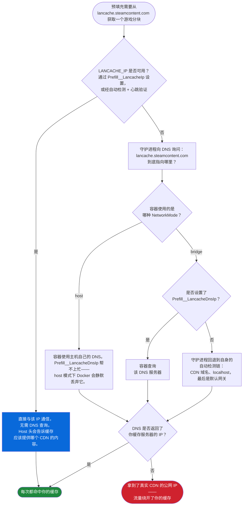

<div align="center">

[**English**](README.MD) | **中文**

</div>

> 本文档为社区贡献的中文翻译（来自 [PR #26](https://github.com/regix1/lancache-manager/pull/26)）。如与英文版有出入，以 [英文 README](README.MD) 为准。

---

# LANCache Manager

[](LICENSE)

[LANCache](https://lancache.net/) 的 Web 管理界面。实时查看下载进度、查看已缓存的内容、追踪节省的带宽，并在下次 LAN 聚会前手动或按计划预填充 Steam、Epic、Battle.net、Riot 和 Xbox 游戏。Web 界面支持英语和简体中文。

仪表板是实时视图：节省的带宽、热门客户端和分服务的分析数据。它背后是一个完整的缓存浏览器——每个已缓存游戏的封面图、大小和按客户端的历史记录，外加开箱即用的 Prometheus 指标。

它也能操作缓存：在客人到达前预填充游戏，手动或按每服务计划进行，并直接在浏览器中管理整台服务器——处理日志、清除缓存、检测损坏，出问题时运行内置的状态检查。

> [!IMPORTANT]
> **始终拉取 `latest` 标签。** GitHub 的软件包页面会展示 `:dev`，因为开发版构建更频繁，但 `:dev` 仅用于测试，随时可能出问题。
>
> ```bash
> docker pull ghcr.io/regix1/lancache-manager:latest
> ```

<a id="whats-new"></a>
<!-- whats-new:start -->
## 1.10.4 版本新增功能

- **[计划预填充](#scheduled-prefill)**——按各自的计划自动预填充 Steam、Epic、Xbox、Battle.net 和 Riot 游戏。
- **[Xbox 预填充](#prefill-steam--epic)**——Xbox 成为第五个预填充平台，拥有自己的游戏映射。
- **[状态检查](#status-check)**——全新的诊断标签页，端到端验证 DNS 和缓存可达性。
- **[全新界面](#screenshots)**——重新设计的仪表板、下载、计划任务和日志与缓存页面，并换用了全新的应用字体。
- **[AGPL-3.0](#support-and-license)**——首个采用 AGPL-3.0 许可证的版本；1.10.3 及更早版本仍为 MIT。
<!-- whats-new:end -->

-----

## 目录

- [快速开始](#quick-start)
- [升级](#upgrading)
- [功能一览](#screenshots)
- [预填充](#prefill-steam--epic)
- [选择镜像与数据库模式](#image-variants)
- [配置参考](#configuration)
- [常见场景](#recipes)
- [裸机版 LANCache](#bare-metal)
- [故障排除](#troubleshooting)
- [自定义主题](#custom-themes)
- [从源码构建](#building-from-source)
- [贡献翻译](#contributing-translations)
- [支持与许可](#support-and-license)

-----

<a id="quick-start"></a>
<a id="docker-compose"></a>
## 快速开始

你需要两样东西：一套正在运行的 LANCache，其日志和缓存可从这台主机读取；以及安装了 Compose 插件（`docker compose`）的 Docker。将容器指向你的日志和缓存，即可上线。默认镜像自带 PostgreSQL，所以这一份文件就是全部安装内容：

```yaml
services:
  lancache-manager:
    image: ghcr.io/regix1/lancache-manager:latest
    container_name: lancache-manager
    restart: unless-stopped
    ports:
      - "8080:80"
    volumes:
      - ./data:/data
      - /mnt/lancache/logs:/logs:ro
      - /mnt/lancache/cache:/cache:ro
      - /var/run/docker.sock:/var/run/docker.sock  # 可选：用于预填充和日志轮转
    environment:
      - PUID=33
      - PGID=33
      - TZ=America/Chicago
      - LanCache__LogPath=/logs/access.log
      - LanCache__CachePath=/cache
```

```bash
docker compose up -d
```

> [!TIP]
> **启动前先检查缓存路径。** `LanCache__CachePath` 必须指向*直接包含*哈希缓存文件夹（`00`、`1a`……`ff`）的目录。标准的整体式（monolithic）LANCache 会把它们嵌套在下一层。如果你的挂载目录下只显示一个 `cache/` 文件夹，请改用 `LanCache__CachePath=/cache/cache`。详见[故障排除](#troubleshooting)。

然后：

1. 从容器内部获取你的 API 密钥：

   ```bash
   docker exec lancache-manager cat /data/security/api_key.txt
   ```

2. 打开 `http://localhost:8080`，在提示时输入该 API 密钥。
3. 前往**管理 → 日志与缓存**，点击**处理所有日志**以导入现有的缓存历史记录。

关于挂载的两点说明：

- 如果想从 UI 清除缓存或移除单个游戏，请去掉 `/cache` 挂载上的 `:ro`。
- Docker 套接字是可选的——只有 nginx 日志轮转和 Steam/Epic/Battle.net/Riot/Xbox 预填充需要它。

<details>
<summary><strong>想用 <code>docker run</code> 快速测试？</strong></summary>

`docker run` 的数据卷挂载需要绝对主机路径（像 `./data` 这样的相对路径只在 Compose 中有效）：

```bash
docker run -d \
  --name lancache-manager \
  -p 8080:80 \
  -v /srv/lancache-manager/data:/data \
  -v /path/to/lancache/logs:/logs:ro \
  -v /path/to/lancache/cache:/cache:ro \
  -e PUID=33 \
  -e PGID=33 \
  -e TZ=America/Chicago \
  -e LanCache__LogPath=/logs/access.log \
  -e LanCache__CachePath=/cache \
  ghcr.io/regix1/lancache-manager:latest
```

</details>

-----

<a id="upgrading"></a>
## 升级

升级就是拉取镜像加重建容器：

```bash
docker compose pull
docker compose up -d
```

在内嵌模式下，一切重要数据都保存在 `/data` 数据卷中：数据库、API 密钥、主题、预填充状态和设置。在外部模式下，请保持 `/data` 和你的 PostgreSQL 存储持久化。重建管理器容器不会影响这些历史数据。

- **标签：** `latest` 始终跟踪最新发布版本。如果你想精确控制升级时机，可以固定一个版本标签（例如 `1.10.4`），需要升级时再修改标签。
- **从旧版 SQLite 构建升级？** 迁移到 PostgreSQL 会在首次启动时自动运行——下载记录、设置和缓存数据无需任何手动操作即可迁移。部分托管 Postgres 服务禁止 `ALTER SYSTEM` 调优；迁移会跳过该步骤并继续执行。

-----

<a id="screenshots"></a>
## 功能一览

主要页面速览。所有截图均使用默认的深色主题。

### 仪表板

<div align="center">


*仪表板——节省的带宽、命中率、服务分析和热门客户端，一屏尽览*
</div>

### 下载

<div align="center">


*下载——每个已缓存游戏的封面图、大小和按客户端的历史记录*
</div>

三种视图模式对应不同的浏览习惯：**普通**（卡片视图，如上图）、**紧凑**（密集列表）和**复古**（90 年代 BBS 风格的按 depot 表格）。命中/未命中筛选和按客户端筛选可以进一步缩小范围。

### 客户端

<div align="center">


*客户端——哪些设备在使用缓存，以及缓存为每个设备服务得如何*
</div>

想知道哪些设备下载量最大、它们的安装是否真正命中了缓存时，打开这个页面。

### 用户

<div align="center">


*用户——活跃会话与访客访问*
</div>

访客访问就在这里管理：查看活跃会话，无需分享你的 API 密钥即可授予限时的只读访问权限。

### 事件

<div align="center">


*事件——在日历上查看下载活动和 LAN 聚会*
</div>

正在筹备一场 LAN 聚会？把它加到日历上，就能在日期上下文中查看下载活动。

### 状态检查

<a id="status-check"></a>

<div align="center">


*状态检查——验证 DNS、缓存可达性和近期下载的路由情况*
</div>

状态检查标签页（管理 → 状态检查）无需打开终端，就能回答"我的 LANCache 到底有没有在工作？"。它会检查游戏域名是否解析到你的缓存、缓存是否响应、以及近期下载是否真的经过了缓存——按域名逐一给出，语言通俗易懂。

### 日志与缓存

<div align="center">


*管理 → 日志与缓存——处理日志、管理磁盘缓存，并检测损坏或已失效的文件*
</div>

以上是日常会用到的部分。管理页面背后还有更多标签——展开下方查看全部内容。

<details>
<summary><strong>查看全部管理页面</strong></summary>

#### 设置

<div align="center">


*设置——认证、演示模式和显示偏好设置。*
</div>

#### 集成

<div align="center">


*集成——登录游戏平台并配置 Prometheus 端点。一个页面即可查看全部五项预填充服务的登录状态。*
</div>

#### 数据

<div align="center">


*数据——Steam 游戏映射与数据库导入。*
</div>

#### 计划任务

<div align="center">


*计划任务——每个后台服务都有自己的运行间隔和一个"立即运行"按钮。计划预填充卡片位于本页底部，会在下方的预填充章节中展示。*
</div>

#### 主题

<div align="center">


*主题——在已安装的主题间切换、导入社区主题，或上传你自己的主题。*
</div>

#### 客户端（别名与排除）

<div align="center">


*客户端——为设备指定友好名称，并将某些设备排除在统计之外。*
</div>

#### 预填充会话

<div align="center">


*预填充会话——查看实时和持久预填充容器，并回顾历史运行记录。*
</div>

</details>

-----

<a id="prefill-steam--epic"></a>
## 预填充

预填充会在人们连接*之前*把游戏下载进你的缓存。等客人到场时，每次安装都从你的缓存读取，而不是走公共互联网——满速 LAN，没有带宽瓶颈。

Steam、Epic、Battle.net、Riot 和 Xbox 各自在独立的容器中运行，因此你可以同时预填充所有平台而互不干扰。进度会实时推送到 UI。

<div align="center">


*选择一个平台，开始一次预填充会话*
</div>

### 要求

- 已挂载 Docker 套接字（`/var/run/docker.sock`）
- 在 lancache-manager 中以管理员身份登录
- 预填充容器可以访问到你的缓存服务器（参见下方的[网络设置](#prefill-network)）

### 运行一次预填充

每个平台的流程都一样：

1. 打开**预填充**标签页，选择 **Steam**、**Epic Games**、**Battle.net**、**Riot** 或 **Xbox**
2. 登录（Steam 通过 Steam Guard 验证，Epic 通过 OAuth，Xbox 通过 Microsoft 设备代码；Battle.net 和 Riot 无需登录）
3. 从你的游戏库中选择游戏
4. 点击**开始**

就这么简单。让它继续运行——等客人到达时，一切都已经缓存好了。

> [!NOTE]
> 预填充构建在社区守护进程之上：
>
> - **Steam**：[steam-prefill-daemon](https://github.com/regix1/steam-prefill-daemon)，[steam-lancache-prefill](https://github.com/tpill90/steam-lancache-prefill) 的分支，原作者 [@tpill90](https://github.com/tpill90)
> - **Epic**：[epic-prefill-daemon](https://github.com/regix1/epic-prefill-daemon)——通过 OAuth 登录账号
> - **Battle.net**：[battlenet-prefill-daemon](https://github.com/regix1/battlenet-prefill-daemon)——完全匿名，无需账号
> - **Riot**：[riot-prefill-daemon](https://github.com/regix1/riot-prefill-daemon)，[riot-lancache-prefill](https://github.com/tpill90/riot-lancache-prefill) 的分支——完全匿名；覆盖英雄联盟和无畏契约
> - **Xbox**：[xbox-prefill-daemon](https://github.com/regix1/xbox-prefill-daemon)——使用 Microsoft 设备代码登录（与 Epic 一样需要账号）

### 导入 Steam App ID

手头有来自 `steam-lancache-prefill` 或其他地方的 App ID 列表？可以跳过库浏览器：

1. 点击**选择应用**
2. 点击**导入 App ID**
3. 以下列任一格式粘贴你的 ID：
   - 逗号分隔：`730, 570, 440`
   - JSON 数组：`[730, 570, 440]`
   - 每行一个
4. 点击**导入**

对话框会告诉你添加了多少个游戏、有多少已经在选中列表中、以及有多少 ID 不在你的 Steam 游戏库中（这些会在预填充时被跳过）。

> [!TIP]
> **从 `steam-lancache-prefill` 迁移过来？** 打开 `selectedAppsToPrefill.json`，把内容直接粘贴到导入框中——JSON 数组会按原样解析。

<a id="scheduled-prefill"></a>
### 计划预填充

1.10.4 新增：不用再在每次活动前手动预填充，现在可以让管理器按计划自动完成。五个平台各自拥有自己的间隔、预设和游戏选择，均在**管理 → 计划任务**的计划预填充卡片中配置。

<div align="center">


*计划预填充——一眼看清各服务的状态、下次运行和上次运行时间*
</div>

这里只有一条规则贯穿始终：**计划运行复用你正在运行的持久预填充容器——它们从不会自行启动一个。** 持久容器是指你为某个服务启动一次并让它持续运行（包括登录状态）的长期预填充容器。

所以在为某个服务安排计划之前，先启动它的持久容器，如果该平台需要账号就先登录。尚未就绪的服务会被*跳过*，标记为"需要登录"，其他服务照常运行。如果一次运行里只有跳过、没有真正执行的服务，会以警告结束，而不是失败。

它的具体行为：

- **按服务独立计划。** 每个服务都有自己的"运行频率"间隔。你也可以暂停某个服务，或设置为仅在启动时运行。
- **预设或手动选择游戏。** 预设有**全部**、**最近**和**热门**三种。并非每个平台都支持全部预设：Epic 没有"最近"（它的 API 不提供最近游玩数据），Battle.net 和 Riot 只支持"全部"。手动挑选具体游戏会覆盖预设。
- **对于循环计划，首次运行会在你保存后的一个间隔之后触发。** 保存配置本身不会立即触发预填充。卡片上的**立即运行**是唯一的即时触发方式。
- **"上次运行：从未"表示还没有发生过任何一次运行。** *下次运行*来自计划本身；*上次运行*只统计真正完成的运行，所以刚启用的服务在它第一次真正运行完成之前会一直显示"从未运行"。
- **停止持久容器会让它登出。** 登录状态保存在容器自身的存储中；停止容器后，该服务在下次计划运行前需要重新登录。如果想显式清空，也有一个"清除已保存的登录"控件。
- **Battle.net 和 Riot 开箱即用。** 它们不需要账号，因此默认已启用——但它们的持久容器仍然必须处于运行状态。
- **目标平台筛选仅限 Steam。** Steam 可以预填充 Windows、Linux 或 macOS 的 depot（默认 Windows）；其他平台不支持目标平台筛选。
- **强制下载和并发数同样按服务单独设置。** 强制下载会重新拉取即使看起来已经完整的游戏（默认关闭）。最大并发数可以是自动，也可以固定为 1-256 个连接。
- 每个服务都可以选择正常显示或静默发送运行通知。

<div align="center">


*配置计划预填充——各平台的计划、预设和目标平台控制*
</div>

默认值和限制：

| 设置项 | 默认值 |
|---|---|
| 运行频率（每服务） | 24 小时 |
| 预设 | 全部（"热门"预设使用排名前 50 的游戏） |
| 持久登录有效期 | 90 天 |
| 无进展超时（每次计划运行） | 30 分钟 |
| 强制下载 | 关闭 |
| 最大并发数 | 自动（固定范围：1-256） |
| 单服务最长运行时间 | 12 小时 |

计划任务页面的其余部分，对每个后台服务都采用相同的方式工作——日志轮转、失效扫描、游戏检测、缓存快照等等。每张卡片都有自己的间隔和一个**立即运行**按钮。1.10.4 同样新增了一张 **Xbox 游戏映射**卡片，让 Xbox 游戏目录也能按自己的计划刷新。

<a id="prefill-network"></a>
### 网络设置

**大多数安装无需任何配置。** 如果你运行的是标准的 `lancache` + `lancache-dns` 容器，lancache-manager 会自动检测它们，预填充无需额外设置即可工作。

如果你的 DNS 不是标准的 `lancache-dns`（比如使用 AdGuard Home、Pi-hole、公共 DNS 等）或者路由方式比较特殊，设置一个环境变量就能解决：

| 你的环境 | 需要设置什么 |
|---|---|
| 标准 `lancache` + `lancache-dns` 容器 | 无需设置 |
| 单机安装（lancache 与 lancache-manager 在同一主机） | 无需设置 |
| AdGuard Home、Pi-hole 或任何 DNS 替代方案 | `Prefill__LancacheIp=<你的缓存 IP>` |
| 主机网络模式，且主机 DNS 未将 CDN 路由到你的缓存 | 通常无需设置——缓存会通过网桥网关自动检测并经心跳验证；如果网络面板仍然警告，再设置 `Prefill__LancacheIp=<你的缓存 IP>` |
| Caddy/Squid 等按 `Host:` 头路由的非 nginx 缓存 | `Prefill__LancacheIp=<你的缓存 IP>` |
| 希望无论环境如何都有可预测的行为 | 始终设置 `Prefill__LancacheIp` |

> [!TIP]
> **`Prefill__LancacheIp` 是通用覆盖项。** 设置后，预填充会直接通过 IP 与你的缓存通信，完全不再询问 DNS 缓存在哪里。网络模式和 DNS 服务器设置对 CDN 流量不再有影响。

`Prefill__LancacheIp`、`Prefill__LancacheDnsIp` 和 `Prefill__NetworkMode` 的完整说明与默认值位于[配置 → 预填充](#prefill-config)参考表中。

> [!IMPORTANT]
> **`LancacheIp` 和 `LancacheDnsIp` 是两个不同的服务，即使在同一台机器上也是如此。**
>
> | | 是什么 | 端口 | 作用 |
> |---|---|---|---|
> | `LancacheIp` | **缓存服务器**（`lancachenet/monolithic`，或任何 HTTP 缓存） | HTTP / 80 | 保存实际的缓存游戏文件 |
> | `LancacheDnsIp` | **DNS 服务器**（`lancachenet/lancache-dns`、AdGuard Home、Pi-hole 等） | DNS / 53 | 把 `lancache.steamcontent.com` 转换成缓存的 IP |
>
> 想象一座小镇。**缓存**是图书馆（书在那里）。**DNS 服务器**是问讯处（你在那里问"去图书馆怎么走？"）。两者可以在同一栋楼里——同一个 IP，不同端口——但做的是完全不同的工作。设置 `LancacheIp` 后，守护进程会完全跳过问讯处，径直走向图书馆。这就是为什么它是通用覆盖项：对缓存流量而言，DNS 变得无关紧要。

> [!IMPORTANT]
> Steam（`api.steampowered.com`）和 Epic（`*.epicgames.com`）的认证与清单端点仍然使用正常 DNS。`LANCACHE_IP` 只重定向 CDN 分块流量——也就是 lancache 缓存的那些域名。你的登录和元数据流量不受影响。

#### 示例

**最可靠**——`LancacheIp` 让 CDN 路由不再依赖 DNS：

```yaml
environment:
  - Prefill__NetworkMode=host
  - Prefill__LancacheIp=192.168.1.10
```

**Bridge 模式配合非标准 DNS**（例如用 AdGuard Home 替代 lancache-dns）：

```yaml
environment:
  - Prefill__NetworkMode=bridge
  - Prefill__LancacheIp=192.168.1.10        # 缓存服务器
  - Prefill__LancacheDnsIp=192.168.1.20     # DNS 服务器
```

**Bridge 模式，标准 lancache-dns，无 IP 覆盖**（传统的 DNS 驱动路径）：

```yaml
environment:
  - Prefill__NetworkMode=bridge
  - Prefill__LancacheDnsIp=192.168.1.20
```

> [!TIP]
> **预填充容器没有互联网？** 试试 `Prefill__NetworkMode=bridge`。有些 Docker 环境会在 host 模式下阻断出站流量。

#### 网络诊断

每次预填充会话启动时都会运行一次连通性测试，并把结果写入日志：

```
═══════════════════════════════════════════════════════════════════════
  PREFILL CONTAINER NETWORK DIAGNOSTICS - prefill-daemon-abc123
═══════════════════════════════════════════════════════════════════════
  Internet connectivity: OK (reached api.steampowered.com)
  lancache.steamcontent.com resolved to 192.168.1.10
  DNS looks correct (private IP - likely your lancache server)
═══════════════════════════════════════════════════════════════════════
```

如果解析出的 IP 是公网地址（Steam 真实 CDN 的 IP 形如 `162.254.x.x`），说明流量绕过了你的缓存。设置 `Prefill__LancacheIp` 并重启会话。

<a id="prefill-routing"></a>
<details>
<summary><strong>路由工作原理（高级）</strong>——请求究竟走哪条路径</summary>



所有组合，一张表说清楚：

| `NetworkMode` | `LancacheIp` | `LancacheDnsIp` | 结果 |
|:---:|:---:|:---:|---|
| `host` | 已设置 | （任意） | 可靠。已注入 `LANCACHE_IP`；DNS 无关紧要。 |
| `host` | 未设置 | （任意） | 通常没问题。管理器会自动检测缓存（经心跳验证，包括通过网桥网关）并注入 `LANCACHE_IP`；只有在没有候选通过验证时才依赖主机的 DNS。无论如何，DnsIp 都会被静默丢弃（Docker 的限制）。 |
| `bridge` | 已设置 | 未设置 | 可靠。已注入 `LANCACHE_IP`；DNS 无关紧要。 |
| `bridge` | 已设置 | 已设置 | 可靠。`LANCACHE_IP` 用于 CDN，DnsIp 用于认证/清单。 |
| `bridge` | 未设置 | 已设置 | 如果 DnsIp 能把 CDN 解析到你的缓存则有效。容器 DNS 被强制指向 DnsIp。 |
| `bridge` | 未设置 | 未设置 | 通常没问题。管理器会自动检测缓存并注入 `LANCACHE_IP`（经心跳验证）；否则守护进程会自行探测 localhost/网关。 |

**为什么 `LancacheIp` 总是有效**：设置该环境变量后，守护进程会构造类似 `GET http://192.168.1.10/depot/123/chunk/abc` 的请求，并带上 `Host: lancache.steamcontent.com`。你的缓存（nginx、Caddy，或任何按 `Host:` 路由的 HTTP 服务器）会看到正确的主机名并从缓存提供服务。DNS 从始至终都不会被问及 CDN 域名。

</details>

-----

<a id="image-variants"></a>
## 选择镜像与数据库模式

这是一个决定，而不是两个：**PostgreSQL 在哪里运行？** LANCache Manager 把所有数据存储在 PostgreSQL 中，镜像标签由你的答案决定。

| 模式 | 含义 | 镜像标签 |
|------|------|----------|
| **内嵌**（默认） | PostgreSQL 17 在 lancache-manager 容器*内部*通过 Unix 套接字运行。单容器，无需额外配置。 | `:latest` |
| **外部** | 你自己运行 PostgreSQL——边车容器、远程主机，或托管服务（RDS、Azure DB、Cloud SQL）。标准的 Docker 模式，升级也更省心。 | `:latest` 可用，也可用 `:latest-slim`（体积小约 150 MB，去掉了未使用的内嵌 Postgres）。需要设置 `POSTGRES_MODE=external`。 |

CI 发布的每个标签系列都遵循相同的配对（均为多架构镜像，amd64 + arm64）：

| 标签 | 说明 |
|-----|------|
| `latest` / `latest-slim` | 最新发布版本。你应该运行的版本。 |
| `1.2.0` / `1.2.0-slim` | 固定版本的发布——如果你想显式控制升级时机，就固定一个版本。 |
| `release` / `release-slim` | `latest` 的别名。 |
| `dev` / `dev-slim` | 最新开发版构建。仅用于测试——随时可能出问题。 |

```bash
# 完整版——默认，同时支持内嵌和外部 Postgres
docker pull ghcr.io/regix1/lancache-manager:latest

# 精简版——仅支持外部 Postgres
docker pull ghcr.io/regix1/lancache-manager:latest-slim
```

### 示例 1：内嵌（默认）

这就是[快速开始](#quick-start)中的 Compose 文件——单容器，无边车服务。可以选择性地加上一个数据库密码：

```yaml
    environment:
      # ...快速开始中的全部内容，外加：
      - POSTGRES_PASSWORD=your-secure-password
```

不设置 `POSTGRES_PASSWORD` 的话，首次运行的 UI 会提示输入。内嵌模式的全部设置就是这些。

### 示例 2：外部（边车 Postgres）

两个服务：`lancache-manager` 通过 TCP 连接到 `lancache-db`。

```yaml
services:
  lancache-manager:
    image: ghcr.io/regix1/lancache-manager:latest-slim
    container_name: lancache-manager
    restart: unless-stopped
    ports:
      - "8080:80"
    volumes:
      - ./data:/data
      - /mnt/lancache/logs:/logs:ro
      - /mnt/lancache/cache:/cache:ro
      - /var/run/docker.sock:/var/run/docker.sock
    environment:
      - PUID=33
      - PGID=33
      - TZ=America/Chicago
      - LanCache__LogPath=/logs/access.log
      - LanCache__CachePath=/cache
      - POSTGRES_MODE=external
      - POSTGRES_HOST=lancache-db
      - POSTGRES_PORT=5432
      - POSTGRES_DB=lancache
      - POSTGRES_USER=lancache
      - POSTGRES_PASSWORD=change-this-password
    depends_on:
      - lancache-db

  lancache-db:
    image: postgres:17-alpine
    container_name: lancache-db
    restart: unless-stopped
    environment:
      - POSTGRES_USER=lancache
      - POSTGRES_PASSWORD=change-this-password
      - POSTGRES_DB=lancache
    volumes:
      - postgres_data:/var/lib/postgresql/data

volumes:
  postgres_data:
```

`POSTGRES_PASSWORD` 必须在两个服务中保持一致。用 `docker compose up -d` 同时启动两者。

**要连接远程或托管的 Postgres？** 把 `POSTGRES_HOST` 设置为它的主机名，删除 `lancache-db` 服务，删除 `depends_on`，并省略命名数据卷。

**设置了 `POSTGRES_MODE=external` 但没设置连接变量？** 应用会以仅设置模式启动，并显示一个 UI 表单。在那里提交的凭据会保存到 `/data/config/postgres-credentials.json`；系统会提示你重启容器以让新连接生效。

-----

<a id="configuration"></a>
## 配置参考

本节的内容都是查询表——浏览标题，按需深入。真正涉及决策的两处内容有各自的详细说明：上方的[数据库模式](#image-variants)和前面的[预填充网络](#prefill-network)。

如果是常规安装，从代码仓库中的 [`docker-compose.yml`](docker-compose.yml) 开始即可。想一次看到全部支持的变量，跳转到本节末尾的[完整带注释 Compose 示例](#complete-compose)。

<a id="volumes"></a>
### 数据卷

| 数据卷 | 用途 | 说明 |
|--------|------|------|
| `/data` | PostgreSQL 数据库、安全信息、状态与配置、主题、已缓存的图片 | 必需 |
| `/logs` | LANCache 访问日志 | 添加 `:ro` 可设为只读 |
| `/cache` | LANCache 缓存文件 | 添加 `:ro` 可只监控而不修改文件 |
| `/var/run/docker.sock` | Docker API 访问 | 可选。nginx 日志轮转以及 Steam/Epic/Battle.net/Riot/Xbox 预填充需要它 |

<a id="required-settings"></a>
### 必需设置

| 变量 | 默认值 | 描述 |
|----------|---------|-------------|
| `PUID` | `33`（随附的 Compose 文件） | 应用运行所用的用户 ID。应与你的缓存和日志文件的所有者一致。 |
| `PGID` | `33`（随附的 Compose 文件） | 应用运行所用的组 ID。 |
| `TZ` | `UTC` | 日志时间戳所用的时区（例如 `America/Chicago`）。也接受 `TimeZone` 作为后备写法。 |
| `LanCache__LogPath` | - | 容器内 LANCache 访问日志的路径。 |
| `LanCache__CachePath` | - | 容器内 LANCache 缓存目录的路径。 |

**该用哪个 PUID/PGID？** 与你的缓存和日志文件所有者保持一致——用 `ls -n /path/to/cache` 就能看到。随附的 Compose 文件使用 `33:33`（www-data），适合大多数标准的 lancache 安装。Unraid 使用 `99:100`。如果运行原始镜像时省略了其中任意一个变量，入口脚本会把那一个回退为 `1000`——这只是一个兜底值，不是文档化的默认值。

<a id="postgresql"></a>
### PostgreSQL

模式选择和完整的 Compose 示例见[选择镜像与数据库模式](#image-variants)。变量如下：

| 变量 | 默认值 | 描述 |
|----------|---------|-------------|
| `POSTGRES_MODE` | `embedded` | `embedded` 或 `external`。 |
| `POSTGRES_USER` | `lancache` | PostgreSQL 用户名。两种模式均适用。 |
| `POSTGRES_PASSWORD` | - | PostgreSQL 密码。内嵌模式下若未设置，UI 会显示设置页面；外部模式下必须设置（或在应用连接前通过 UI 后备表单输入）。 |
| `POSTGRES_HOST` | - | **仅外部模式。** Postgres 服务器的主机名或 IP。 |
| `POSTGRES_PORT` | `5432` | **仅外部模式。** |
| `POSTGRES_DB` | `lancache` | 数据库名称。两种模式均适用。 |

<a id="security"></a>
### 安全

| 变量 | 默认值 | 描述 |
|----------|---------|-------------|
| `Security__EnableAuthentication` | `true` | 管理操作需要 API 密钥。仅在本地开发时关闭。 |
| `Security__GuestSessionDurationHours` | `6` | 默认访客会话时长（也可在 UI 中配置）。 |
| `Security__RequireAuthForMetrics` | `false` | `/metrics` 端点是否需要 API 密钥。管理 → 集成中的 UI 开关设置后会覆盖此值。 |
| `Security__ProtectSwagger` | `true` | 生产环境下 Swagger 文档需要认证。 |
| `Security__AllowedOrigins` | （空） | 逗号分隔的 CORS 允许列表。为空则允许所有来源。 |
| `Security__ApiKeyPath` | `/data/security/api_key.txt` | 覆盖管理员 API 密钥的读写文件路径。当你从 `/data` 之外绑定挂载密钥时很有用。 |
| `Security__KnownProxyNetworks` | （空） | 用于 `X-Forwarded-For` 的可信代理网络 CIDR 列表，逗号分隔（例如 `172.16.0.0/12,10.0.0.0/8`）。当 nginx、Traefik 或其他反向代理位于管理器前面时设置此项，客户端 IP 才能被正确报告。回环地址始终受信任。 |
| `Security__TrustAllProxies` | `false` | 无条件信任每一个上游代理。方便本地开发使用。**切勿在暴露于公网的主机上启用**——任何人都能伪造客户端 IP。 |
| `Security__ForceSecureCookies` | `false` | 即使请求未被识别为 HTTPS，也强制在会话 Cookie 上加 `Secure` 标志。在 TLS 终止型反向代理后运行时启用。 |

#### 访问级别

| 级别 | 可执行的操作 | 示例 |
|-------|----------------|----------|
| **管理员** | 全部操作。需要 API 密钥。 | 清除缓存、处理日志、更改设置 |
| **访客** | 只读视图。需要管理员认证或访客会话。 | 浏览下载、统计、事件、客户端数据 |

要在不分享 API 密钥的情况下让别人获得只读访问权限，打开**用户**页面并使用**访客模式**（会话时长等其他默认值在**访客默认设置**中）。访客可以浏览仪表板，但不能更改任何内容。UI 和所有管理操作都需要管理员认证或一个访客会话。唯一的例外是 `/metrics`——除非你设置 `Security__RequireAuthForMetrics=true`，否则它是公开的。

<a id="prefill-config"></a>
### 预填充

预填充会为本表中几乎所有内容自动检测出合适的值。使用前需要了解三点：

- **要获得有保证的可靠预填充，把 `Prefill__LancacheIp` 设置为你缓存服务器的 IP。** 设置后，预填充会直接通过 IP 与缓存通信，完全不再依赖 DNS。这一点对 Battle.net 尤为重要，它的 CDN 域名经常不在 lancache DNS 中，可能导致预填充挂起；对任何非标准 DNS 设置也同样重要。
- 不设置的话，管理器会自动检测你的缓存。它会对几个候选地址做一次快速的健康检查，只会使用真正像 lancache 一样应答的地址。
- 只有在自动检测出错时才需要用到其他变量。决策表见[网络设置](#prefill-network)。

| 变量 | 默认值 | 描述 |
|----------|---------|-------------|
| `Prefill__LancacheIp` | （未设置） | 你**缓存服务器**（保存缓存文件的 HTTP 服务器，端口 80）的 IP 或主机名。会作为 `LANCACHE_IP` 转发给守护进程；随后守护进程使用伪造的 `Host:` 头直接连接，跳过 CDN 流量的 DNS 查询。最可靠的覆盖项——只要你的 DNS 不是标准的 `lancache-dns`，就应该设置它。 |
| `Prefill__LancacheDnsIp` | `auto` | 你**DNS 服务器**（lancache-dns、AdGuard、Pi-hole——端口 53）的 IP。会写入预填充容器的 `/etc/resolv.conf`，让守护进程用它解析 CDN 主机名。仅在 `bridge` 模式下使用——Docker 会在 `host` 网络容器上静默丢弃 DNS 覆盖。`auto` 会复用检测到的 `lancache-dns` 容器的 IP。 |
| `Prefill__NetworkMode` | `auto` | 预填充容器的 Docker 网络模式。接受 `host`、`bridge` 或某个 Docker 网络名称。`auto` 会根据你的 `lancache-dns` 容器推断模式。 |
| `Prefill__SteamDockerImage` | `ghcr.io/regix1/steam-prefill-daemon:latest` | Steam 预填充容器所用的 Docker 镜像。 |
| `Prefill__EpicDockerImage` | `ghcr.io/regix1/epic-prefill-daemon:latest` | Epic 预填充容器所用的 Docker 镜像。 |
| `Prefill__BattlenetDockerImage` | `ghcr.io/regix1/battlenet-prefill-daemon:latest` | Battle.net 预填充容器所用的 Docker 镜像。 |
| `Prefill__RiotDockerImage` | `ghcr.io/regix1/riot-prefill-daemon:latest` | Riot 预填充容器所用的 Docker 镜像。 |
| `Prefill__XboxDockerImage` | `ghcr.io/regix1/xbox-prefill-daemon:latest` | Xbox 预填充容器所用的 Docker 镜像。 |
| `Prefill__SessionTimeoutMinutes` | `120` | 非持久管理员预填充会话的总生命周期。访客会话和持久会话使用各自独立的限制。 |
| `Prefill__StallTimeoutSeconds` | `180` | 高级设置。非持久会话被判定为停滞前的无进展时长。计划预填充使用自己独立的 30 分钟超时。 |
| `Prefill__DaemonBasePath` | `/data/prefill` | 存储预填充会话状态的容器内路径。 |
| `Prefill__HostDataPath` | `auto` | 映射到管理器 `/data` 数据卷的主机路径。从管理器的挂载配置中检测；仅在检测失败时（不常见的平台、自定义数据卷驱动）才需要显式设置。 |
| `Prefill__UseTcp` | `auto` | 使用 TCP 而非 Unix 域套接字与守护进程通信。`auto` 在 Windows 上解析为 `true`，在 Linux 上为 `false`。*Linux 用户只有在想强制使用 TCP 模式时才需要设置此项。* |
| `Prefill__TcpPort` | `45555` | 守护进程在其容器内监听的 TCP 端口。*仅用于 TCP 模式——Windows 默认如此，Linux 仅在 `Prefill__UseTcp=true` 时如此。* |
| `Prefill__HostTcpPort` | （随机空闲端口） | 守护进程容器在主机上发布的 TCP 端口。*仅 TCP 模式。* |
| `Prefill__TcpHost` | `127.0.0.1` | 守护进程绑定、管理器通过 TCP 连接的主机。*仅 TCP 模式。* |

> [!NOTE]
> **TCP 模式是平台分界线。** 在 Windows 上，预填充容器通过 TCP 通信，因为 Windows 不向 Docker 暴露 Unix 域套接字。在 Linux 上，预填充默认使用 Unix 域套接字——除非你设置 `Prefill__UseTcp=true`，否则上面四个 TCP 变量都会被忽略。标准的 Linux 安装可以完全跳过 TCP 相关的行。

<a id="paths-and-datasources"></a>
### 路径与数据源

| 变量 | 默认值 | 描述 |
|----------|---------|-------------|
| `LanCache__EnvFilePath` | （自动） | lancache `.env` 文件的路径（用于读取 `CACHE_DISK_SIZE`）。未设置时会在常见位置搜索。 |
| `LanCache__AutoDiscoverDatasources` | `false` | 从 `/cache` 和 `/logs` 下匹配的子目录自动检测数据源，最多向下三层。 |

如果你运行多个缓存实例，或者把不同服务分散在多个驱动器上，请参见[多数据源](#multiple-datasources)。

<a id="nginx-log-rotation"></a>
### Nginx 日志轮转

| 变量 | 默认值 | 描述 |
|----------|---------|-------------|
| `NginxLogRotation__Enabled` | `true` | 通知 nginx 在应用轮转日志后重新打开日志文件。需要 Docker 套接字。 |
| `NginxLogRotation__ContainerName` | （空 = 自动检测） | LANCache 容器名称。留空（或设为 `auto`）时，应用会查找名称中包含 "lancache" 的容器。 |
| `NginxLogRotation__ScheduleHours` | `24` | 检查是否需要轮转的频率。 |

<a id="api-and-advanced"></a>
### API 与高级设置

| 变量 | 默认值 | 描述 |
|----------|---------|-------------|
| `ApiOptions__MaxClientsPerRequest` | `1000` | 单次统计请求最多返回的客户端数量。 |
| `ApiOptions__DefaultClientsLimit` | `100` | 未指定限制时的默认客户端数量。 |
| `Optimizations__EnableGarbageCollectionManagement` | `false` | 在管理页面显示内存管理控件。适合低内存主机。 |
| `ASPNETCORE_URLS` | `http://+:80` | 内部端口绑定。除非你清楚为什么要改，否则不要改动。 |
| `ConnectionStrings__DefaultConnection` | （自动） | 完整的 PostgreSQL 连接字符串覆盖项。面向单个 `POSTGRES_*` 变量无法满足的复杂配置的高级用户。 |
| `CacheSnapshots__RetentionDays` | `90` | 缓存快照的保留时长。更早的快照会被自动删除。 |
| `CacheSnapshots__IntervalMinutes` | `60` | 高级设置。记录一次缓存大小快照的频率。 |

<a id="complete-compose"></a>
### 完整带注释的 Compose 示例

想要一份列出全部内容的文件？下面这个例子是一份完整、可直接使用的 Compose 文件。生效的几行与快速开始一致；每一项可选设置都已列出但被注释掉，并注明了默认值和适用场景，因此可以放心复制使用。

<details>
<summary><strong>完整带注释的 Compose 示例</strong>——全部支持的变量</summary>

```yaml
services:
  lancache-manager:
    image: ghcr.io/regix1/lancache-manager:latest
    container_name: lancache-manager
    restart: unless-stopped
    ports:
      - "8080:80"
    volumes:
      - ./data:/data                                # 数据库、API 密钥、主题、预填充状态
      - /mnt/lancache/logs:/logs:ro                 # LANCache 访问日志
      - /mnt/lancache/cache:/cache:ro               # 去掉 :ro 可允许清除缓存和移除游戏
      - /var/run/docker.sock:/var/run/docker.sock   # 可选：预填充和 nginx 日志轮转需要
    environment:
      # --- 必需（与快速开始相同） ---
      - PUID=33                                 # 应用运行所用的用户 ID；33 = 随附 Compose 文件的值（www-data）。Unraid：99
      - PGID=33                                 # 组 ID；33 = 随附 Compose 文件的值。Unraid：100
      - TZ=America/Chicago                      # IANA 时区；默认 UTC
      - LanCache__LogPath=/logs/access.log      # 容器内的访问日志
      - LanCache__CachePath=/cache              # 容器内的缓存目录

      # --- PostgreSQL（默认以内嵌 Postgres 运行，无需额外设置） ---
      # - POSTGRES_MODE=embedded                # embedded（默认）或 external；精简镜像仅支持 external
      # - POSTGRES_USER=lancache                # 默认 lancache
      # - POSTGRES_PASSWORD=                    # 密钥；留空则首次运行页面会要求输入
      # 仅外部模式：
      # - POSTGRES_HOST=lancache-db
      # - POSTGRES_PORT=5432
      # - POSTGRES_DB=lancache

      # --- 安全 ---
      # - Security__EnableAuthentication=true     # false 会关闭全部认证；仅限本地开发
      # - Security__RequireAuthForMetrics=false   # true = /metrics 需要 Bearer 令牌
      # - Security__GuestSessionDurationHours=6
      # - Security__AllowedOrigins=               # CORS 来源列表，逗号分隔；为空表示全部允许
      # - Security__ProtectSwagger=true
      # - Security__ForceSecureCookies=false      # 在 TLS 终止型代理之后运行时设为 true
      # - Security__KnownProxyNetworks=           # 可信代理的 CIDR 列表，逗号分隔，例如 172.16.0.0/12
      # - Security__TrustAllProxies=false         # 暴露于公网的主机上永远不要设为 true
      # - Security__ApiKeyPath=/data/security/api_key.txt

      # --- 预填充（自动检测；仅在检测失败时才需要设置这些） ---
      # - Prefill__LancacheIp=192.168.1.10        # 缓存服务器 IP；最可靠的覆盖项
      # - Prefill__NetworkMode=auto               # host、bridge、某个 Docker 网络名称，或 auto
      # - Prefill__LancacheDnsIp=auto             # DNS 服务器 IP；仅 bridge 模式
      # - Prefill__SteamDockerImage=ghcr.io/regix1/steam-prefill-daemon:latest
      # - Prefill__EpicDockerImage=ghcr.io/regix1/epic-prefill-daemon:latest
      # - Prefill__BattlenetDockerImage=ghcr.io/regix1/battlenet-prefill-daemon:latest
      # - Prefill__RiotDockerImage=ghcr.io/regix1/riot-prefill-daemon:latest
      # - Prefill__XboxDockerImage=ghcr.io/regix1/xbox-prefill-daemon:latest
      # - Prefill__SessionTimeoutMinutes=120      # 非持久管理员会话的生命周期
      # - Prefill__StallTimeoutSeconds=180        # 高级设置：非持久会话的停滞超时
      # - Prefill__DaemonBasePath=/data/prefill   # 必须位于 /data 之下
      # - Prefill__HostDataPath=auto              # /data 对应的主机路径；仅检测失败时设置
      # - Prefill__UseTcp=auto                    # auto = Windows 用 TCP，Linux 用 Unix 套接字
      # - Prefill__TcpPort=45555                  # 仅 TCP 模式
      # - Prefill__HostTcpPort=                   # 仅 TCP 模式；留空会随机选择一个空闲端口
      # - Prefill__TcpHost=127.0.0.1              # 仅 TCP 模式

      # --- Nginx 日志轮转（需要挂载 docker.sock） ---
      # - NginxLogRotation__Enabled=true
      # - NginxLogRotation__ContainerName=        # 留空或设为 "auto" 会查找 "lancache" 容器
      # - NginxLogRotation__ScheduleHours=24

      # --- API、优化、缓存快照 ---
      # - ApiOptions__MaxClientsPerRequest=1000
      # - ApiOptions__DefaultClientsLimit=100
      # - Optimizations__EnableGarbageCollectionManagement=false   # 仅低内存主机需要
      # - CacheSnapshots__RetentionDays=90        # 缓存大小历史保留时长
      # - CacheSnapshots__IntervalMinutes=60      # 高级设置：记录快照的频率
      # - ASPNETCORE_URLS=http://+:80             # 内部绑定；保持默认即可

      # --- 路径与数据源 ---
      # - LanCache__EnvFilePath=/lancache/.env    # 未设置 = 自动搜索常见位置
      # - LanCache__AutoDiscoverDatasources=false # 扫描 /cache 和 /logs 下的匹配子目录，最多三层
      # 多数据源会替代上面的 LogPath/CachePath。保持编号连续，
      # 并按同样的方式添加更多：__2__、__3__……
      # - LanCache__DataSources__0__Name=Default
      # - LanCache__DataSources__0__CachePath=/cache
      # - LanCache__DataSources__0__LogPath=/logs
      # - LanCache__DataSources__0__Enabled=true
      # - LanCache__DataSources__1__Name=Steam
      # - LanCache__DataSources__1__CachePath=/steam-cache
      # - LanCache__DataSources__1__LogPath=/steam-logs
      # - LanCache__DataSources__1__Enabled=true

      # --- 高级用户 ---
      # - ConnectionStrings__DefaultConnection=Host=/var/run/postgresql;Database=lancache;Username=lancache;Maximum Pool Size=20;Minimum Pool Size=2   # 覆盖 POSTGRES_*；若内嵌了密码则属于密钥
      # - Logging__LogLevel__LancacheManager.Infrastructure.Platform=Debug   # 任意日志分类；取值 Trace..None
```

</details>

**从 1.10.3 升级？** 新增了两个变量：`Prefill__XboxDockerImage`（Xbox 成为第五个预填充平台）和高级选项 `Prefill__StallTimeoutSeconds`。没有变量被重命名或移除，所以现有的 Compose 文件可以照常使用。一处清理：`Security__MaxAdminDevices` 是一个旧的无效设置，当前代码不会读取它——可以删除。

-----

<a id="recipes"></a>
## 常见场景

<a id="unraid"></a>
### Unraid

代码仓库中提供了一个 Docker 模板：[`unraid/lancache-manager.xml`](unraid/lancache-manager.xml)。把它保存到 Unraid 主机的 `/boot/config/plugins/dockerMan/templates-user/` 目录下，或者把原始文件的 URL 粘贴到 **Docker → 添加容器 → 模板**中。然后按照与 Compose 示例相同的方式填写路径和变量。在 Unraid 上使用 `PUID=99` / `PGID=100`（也就是 `nobody:users` 的默认值）。

<a id="multiple-datasources"></a>
### 多数据源

大多数人只运行单个 LANCache 实例，永远用不到这一节。只有当服务分散在不同的缓存目录，或者需要把多台 LANCache 服务器合并到一个仪表板中时，才需要它。

"数据源"是一对成组的日志 + 缓存目录。每个数据源被单独处理和跟踪，然后在仪表板和下载视图中汇总。

常见的使用场景：

- **服务外包到独立存储**——Steam 与其他服务位于不同的驱动器上。
- **多个 LANCache 实例**——为不同房间或不同用途分别部署缓存服务器。
- **分区存储**——不同服务位于不同的分区。

#### 自动发现（推荐）

把应用指向父目录，让它自己扫描：

```yaml
environment:
  - LanCache__LogPath=/logs
  - LanCache__CachePath=/cache
  - LanCache__AutoDiscoverDatasources=true
```

自动发现会同时遍历你配置的缓存路径和日志路径，逐层向下最多搜索三层子目录——这是一个固定的内部上限，不能配置。只要某一层的缓存和日志两侧都有实际内容，这一对就会被记录为一个数据源；记录之后并不会阻止继续搜索它的子目录：

1. **根目录**——如果 `/logs/access.log` 存在，且 `/cache` 中包含 LANCache 的哈希目录（`00/`、`01/` 等），根目录会成为 "Default"。
2. **嵌套文件夹**——根目录下任何匹配成功的缓存/日志文件夹对，都会创建一个以该缓存文件夹命名的数据源（例如 `/cache/steam` + `/logs/steam` → "Steam"），无论它是唯一被发现的一个还是其中之一，也无论它位于第 1 到第 3 层的哪一层。
3. **第 4 层及更深处永远不会被扫描**——请把文件夹上移一层，或改用手动配置。

匹配顺序是先精确匹配，再忽略大小写，最后做归一化匹配（会忽略短横线、下划线以及末尾的 "s"）。如果同一层的缓存和日志文件夹名称不一致，但两侧都恰好只有一个子文件夹，这一对仍会被匹配上——这样命名不同的中间包装文件夹就不会阻断发现；但两个各自已经是有效、且命名不同的数据源文件夹永远不会被交叉配对。隐藏/系统文件夹、LANCache 的两字符哈希桶、符号链接以及无法读取的分支都会被跳过，且不会影响其他同级目录继续搜索。如果某个名称与已发现的数据源重名，会被跳过并记录日志，而不是悄悄覆盖已有的数据源；如果任何地方都没有发现有效结构，应用会回退到使用你配置的路径构建单个 `default` 数据源。

带分组父目录的示例布局，仍然只创建三个数据源（Default、Steam、Epic）：

```
/mnt/lancache/
├── cache/
│   ├── 00/, 01/, a1/, ff/       ← 默认缓存（哈希目录在根级，第 0 层）
│   └── outsourced/
│       ├── steam/
│       │   └── 00/, 01/, ...    ← Steam，第 2 层
│       └── epic/
│           └── 00/, 01/, ...    ← Epic，第 2 层
└── logs/
    ├── access.log               ← 默认日志
    └── outsourced/
        ├── steam/
        │   └── access.log       ← Steam 日志
        └── epic/
            └── access.log       ← Epic 日志
```

如果一个文件夹有哈希目录，但同一层级下没有对应的日志文件夹（反之亦然），会被跳过——这不是一个有效的配对，因此它不会成为数据源，也不会报错。如果驱动器或目录结构过于不对称，自动发现无法正确配对，请改用下面的手动配置显式声明数据源。

#### 手动配置

如果驱动器完全位于不同位置，或者需要更精细的控制，可以显式声明每个数据源。若两者都设置了，手动配置优先于自动发现。

```yaml
environment:
  # 主 LANCache
  - LanCache__DataSources__0__Name=Default
  - LanCache__DataSources__0__CachePath=/cache
  - LanCache__DataSources__0__LogPath=/logs
  - LanCache__DataSources__0__Enabled=true

  # 独立驱动器上的 Steam
  - LanCache__DataSources__1__Name=Steam
  - LanCache__DataSources__1__CachePath=/steam-cache
  - LanCache__DataSources__1__LogPath=/steam-logs
  - LanCache__DataSources__1__Enabled=true
```

配合相应的数据卷挂载：

```yaml
volumes:
  - /mnt/lancache/cache:/cache:ro
  - /mnt/lancache/logs:/logs:ro
  - /mnt/steam-drive/cache:/steam-cache:ro
  - /mnt/steam-drive/logs:/steam-logs:ro
```

<a id="nginx-reverse-proxy"></a>
### 反向代理（Nginx）

LANCache Manager 可以在 nginx 后面正常运行。建议使用 HTTPS，如果计划跨域使用访客会话则是必需的（跨域图片 Cookie 需要 `Secure`）。

> [!TIP]
> 在管理器前面架设了代理？记得同时设置 `Security__KnownProxyNetworks`（见[安全](#security)），这样客户端 IP 才能被正确报告。

#### 单一来源（推荐）

从同一个主机名同时提供 UI 和 API。Cookie 保持第一方，CORS 也就不成问题。

```nginx
server {
  listen 443 ssl http2;
  server_name lancache.example.com;

  ssl_certificate     /etc/letsencrypt/live/lancache.example.com/fullchain.pem;
  ssl_certificate_key /etc/letsencrypt/live/lancache.example.com/privkey.pem;

  # 如果响应体较大可以调高此值
  client_max_body_size 50m;

  location / {
    proxy_pass http://127.0.0.1:8080;
    proxy_http_version 1.1;
    proxy_set_header Host $host;
    proxy_set_header X-Real-IP $remote_addr;
    proxy_set_header X-Forwarded-For $proxy_add_x_forwarded_for;
    proxy_set_header X-Forwarded-Proto $scheme;
    proxy_set_header X-Forwarded-Host $host;

    # SignalR（WebSocket）
    proxy_set_header Upgrade $http_upgrade;
    proxy_set_header Connection "upgrade";
    proxy_read_timeout 600s;  # 保持在 600 秒或以上，避免空闲的 SignalR WebSocket 连接被断开
  }
}

server {
  listen 80;
  server_name lancache.example.com;
  return 301 https://$host$request_uri;
}
```

#### 分离的 API 来源（仅在必要时使用）

如果 UI 和 API 位于不同的主机名：

- 用 `VITE_API_URL=https://api.lancache.example.com` 构建 UI。
- 保留 `SameSite=None; Secure` Cookie（应用已经这样设置）。
- 在 CORS 中为 UI 来源允许携带凭据。

```nginx
server {
  listen 443 ssl http2;
  server_name api.lancache.example.com;

  ssl_certificate     /etc/letsencrypt/live/api.lancache.example.com/fullchain.pem;
  ssl_certificate_key /etc/letsencrypt/live/api.lancache.example.com/privkey.pem;

  location / {
    proxy_pass http://127.0.0.1:8080;
    proxy_http_version 1.1;
    proxy_set_header Host $host;
    proxy_set_header X-Real-IP $remote_addr;
    proxy_set_header X-Forwarded-For $proxy_add_x_forwarded_for;
    proxy_set_header X-Forwarded-Proto $scheme;
    proxy_set_header X-Forwarded-Host $host;

    # SignalR（WebSocket）
    proxy_set_header Upgrade $http_upgrade;
    proxy_set_header Connection "upgrade";
    proxy_read_timeout 600s;  # 保持在 600 秒或以上，避免空闲的 SignalR WebSocket 连接被断开
  }
}
```

<a id="grafana--prometheus"></a>
### Prometheus 指标

应用在 `/metrics` 上暴露 Prometheus 指标。可以抓取它们，在 Grafana 或任何兼容 Prometheus 的系统中构建仪表板，对缓存命中率设置告警——按你的需要使用。指标地址和刷新设置同样可以在**管理 → 集成**中查看。

#### 可用指标

最常用的几个序列：

| 指标 | 描述 |
|--------|-------------|
| `lancache_cache_capacity_bytes` | 总存储容量 |
| `lancache_cache_used_bytes` | 当前已用空间 |
| `lancache_cache_free_bytes` | 剩余可用空间 |
| `lancache_cache_hit_bytes_total` | 节省的带宽（缓存命中） |
| `lancache_cache_miss_bytes_total` | 新下载的数据 |
| `lancache_cache_hit_ratio` | 缓存命中率（0-1） |
| `lancache_active_downloads` | 当前活跃下载数 |
| `lancache_active_clients` | 近期活跃客户端数 |
| `lancache_service_downloads_total` | 按服务统计的下载量 |
| `lancache_service_bytes_total` | 按服务统计的带宽 |
| `lancache_service_hit_ratio` | 按服务统计的命中率 |
| `lancache_client_bytes_total` | 按客户端统计的带宽 |

还有更多——吞吐量、按小时的分解统计、缓存增长趋势、距离写满的预计天数、高峰时段统计，以及按服务的命中/未命中序列。在浏览器中打开 `/metrics` 即可看到带说明文字的完整指标集。

#### Prometheus 配置

```yaml
scrape_configs:
  - job_name: 'lancache-manager'
    static_configs:
      - targets: ['lancache-manager:80']
    scrape_interval: 30s
    metrics_path: /metrics
```

如果你设置了 `Security__RequireAuthForMetrics=true`，加上 Bearer 认证：

```yaml
    authorization:
      type: Bearer
      credentials: 'your-api-key-here'
```

#### 查询示例

```promql
# 缓存命中率百分比
lancache_cache_hit_ratio * 100

# 过去 24 小时节省的带宽
increase(lancache_cache_hit_bytes_total[24h])

# 缓存使用量（GB）
lancache_cache_used_bytes / 1024 / 1024 / 1024
```

-----

<a id="bare-metal"></a>
## 裸机版 LANCache

[zeropingheroes/lancache-bare-metal](https://github.com/zeropingheroes/lancache-bare-metal) 直接在宿主机上运行缓存（不使用 Docker），其日志方式与标准容器不同：在 `/srv/lancache/logs/http/` 下按服务分文件记录（`steam-access.log`、`blizzard-access.log`、`epicgames-access.log`、`riot-access.log`、`windows-update-access.log`，以及 `fallback-access.log`），使用不带服务标签的 `http-detailed` 格式。LANCache Manager 原生支持这种布局 —— 只需挂载日志目录，无需改动 nginx 配置：

```yaml
    volumes:
      - ./data:/data
      # 裸机版的日志与缓存位置
      - /srv/lancache/logs/http:/logs:ro
      - /srv/lancache/data:/cache:ro
```

挂载上一级目录 `/srv/lancache/logs` 也可以 —— 管理器会自动找到其中的 `http/` 文件夹。

**可用功能：** 实时活动、仪表盘、下载历史、游戏识别（Steam depot、暴雪产品、Riot 域名）、客户端与服务统计、按服务统计和删除日志、删除日志文件、磁盘级按游戏和按服务删除缓存、重复未命中损坏扫描、逐出跟踪，以及清空整个缓存。在裸机缓存上，每次删除文件前都会再次核对文件自身嵌入的缓存键。

**关于命中率：** 暴雪与 Windows 更新站点按 1 MB 分片提供文件，而 nginx 只记录每次下载第一个分片的缓存状态。因此这两个服务显示的命中率是近似值；下载字节数始终是精确的。这是 nginx 分片机制的固有特性，与裸机无关，标准容器版对这两个服务同样分片，也会显示相同的近似值。

### 备选方案：把裸机版切换到标准日志格式

如果你希望使用容器风格的合并日志，也可以修改裸机版 nginx 配置。在 `nginx.conf` 的 `http {}` 块中添加标准格式：

```nginx
log_format cachelog '[$cacheidentifier] $remote_addr / - - - [$time_local] "$request" $status $body_bytes_sent "$http_referer" "$http_user_agent" "$upstream_cache_status" "$host" "$http_range"';
```

然后在 `caches-available/` 下的每个站点文件中设置服务名并切换访问日志（所有站点共用一个文件）：

```nginx
set $cacheidentifier steam;   # 各站点分别为 blizzard / epicgames / riot / wsus
access_log /srv/lancache/logs/http/access.log cachelog;
```

执行 `sudo nginx -s reopen`（或 `systemctl reload nginx`）重新加载，并按上文挂载 `/srv/lancache/logs/http`。这样即可恢复全部基于日志的功能。应用这个兼容性补丁后，请勿使用磁盘级功能：磁盘缓存键仍采用裸机布局，但合并日志会让管理器把该环境识别为容器安装，因此不会再拦截这些磁盘级操作。请不要在打过补丁的裸机缓存上使用它们。

-----

<a id="troubleshooting"></a>
## 故障排除

在查看下面的条目之前，先打开**管理 → 状态检查**。它会测试 DNS、缓存可达性，以及近期下载是否用到了缓存，通常能直接指出问题所在。

### 日志没有被处理

1. 在**管理 → 日志与缓存 → 日志处理**中检查日志路径。
2. 确认你的数据卷挂载与 `LanCache__LogPath` 一致。
3. 在同一页面点击**处理所有日志**。
4. 查看容器日志：`docker logs lancache-manager`。

### Web 界面显示"无日志文件"（但文件确实存在）

`LanCache__LogPath` 必须是**容器内访问日志文件的完整路径**，需要包含文件名——例如 `/logs/access.log`，而不只是 `/logs`。请确认：

1. 你的数据卷已把宿主机的日志目录挂载进容器（例如 `- /host/path/lancache/logs:/logs`）。
2. `LanCache__LogPath` 指向该*容器内*路径下的文件（`/logs/access.log`）。
3. 该文件在容器内可读：`docker exec -it lancache-manager cat /logs/access.log | head`。

网络共享（NFS/SMB）没有问题。`ls -la` 输出末尾的 `+`（例如 `-rw-r--r--+`）只是 NFS 的 ACL 标记——它**不会**阻止读取。如果 `cat` 能打印出文件内容，那问题就不在权限，应该检查的是所配置的路径。

### 仪表板没有显示缓存大小 / 磁盘占用

`LanCache__CachePath` 必须指向**直接包含哈希缓存文件夹**（名称形如 `00`、`1a`、`ff`）的目录，而不是它的上一级。

标准的 lancache（monolithic）布局会把内容嵌套在下一层。如果你把缓存数据目录挂载到 `/cache`，实际的哈希文件夹通常位于 `/cache/cache`——这时应设置 `LanCache__CachePath=/cache/cache`。如果指向的层级过高，仪表板会显示这个驱动器，但报告的缓存用量为零。网络挂载（NFS/SMB）的缓存行为相同。

确认该路径下实际存在什么：

```bash
docker exec -it lancache-manager ls /cache
# 你应该看到哈希文件夹（00、1a……ff），而不是单个 "cache" 文件夹
```

### 游戏没有被识别

**Steam：**

1. 刷新映射：**管理 → 计划任务 → Steam 游戏映射 → 立即运行**。
2. 为你关心的任何私有 depot 添加自定义映射。
3. 重新导入历史记录：在**日志与缓存**中，把日志读取位置移回起点，再次处理。已处理过的条目会自动跳过，所以重新处理是安全的。

**Epic：**

1. 在**管理 → 集成**中登录 Epic。
2. 运行**管理 → 计划任务 → Epic 游戏映射 → 立即运行**。映射服务会查询 Epic API，识别你缓存中的内容。
3. 游戏名称和封面图会自动下载。

### 丢失 API 密钥

```bash
# 如果 /data 是绑定挂载（默认的 docker-compose.yml 就是这样），可以直接在主机上读取
cat ./data/security/api_key.txt

# 在任何地方都可用：直接从容器内部读取（命名卷同样适用）
docker exec lancache-manager cat /data/security/api_key.txt
```

在 Windows 的 Git Bash 中，请在 `docker exec` 命令前加上 `MSYS_NO_PATHCONV=1`（即 `MSYS_NO_PATHCONV=1 docker exec lancache-manager cat /data/security/api_key.txt`），否则路径会被改写成本地 Windows 路径。

要轮换密钥，停止容器，删除 `./data/security/api_key.txt`，然后重新启动。

### 权限问题

确保 `PUID` 和 `PGID` 与你的缓存和日志文件所有者一致：

```bash
ls -n /path/to/cache
```

### 预填充无法运行

五个平台的排查清单是一样的。按顺序检查：

1. 确认 Docker 套接字已挂载。
2. 确认你已在 lancache-manager 中以管理员身份完成认证。
3. 查看容器日志中的网络诊断块（`═══ PREFILL CONTAINER NETWORK DIAGNOSTICS ═══`）——它会告诉你容器是否有网络，以及 CDN 域名解析到了哪里。
4. **预填充容器内没有互联网。** 容器无法连接到平台服务器。常见修复方法：
   - 设置 `Prefill__NetworkMode=bridge`（适用于大多数环境）。
   - 确认你的 Docker 网络有出站互联网。
   - 检查防火墙的出站流量规则。
5. **下载过程中出现 HTTP 400 错误。** 容器无法把 CDN 域名解析到你的缓存。最可靠的修复是设置 `Prefill__LancacheIp=<你的缓存 IP>`——它会为 CDN 流量完全绕开 DNS。完整决策表（以及 `LancacheDnsIp`/`NetworkMode` 各自的作用）见[网络设置](#prefill-network)。
6. **IPv6 流量绕过了 DNS。** 如果你的网络启用了 IPv6，查询可能会绕过 `lancache-dns`。应用已经在预填充容器中禁用了 IPv6 以防止这种情况。
7. **Epic OAuth 始终无法连接。** 在弹出的浏览器窗口中完成 OAuth 流程。令牌会被安全存储，并在会话之间保持有效。

查找 `lancache-dns` 的 IP：

```bash
docker inspect lancache-dns | grep IPAddress
```

### 计划预填充"跳过"了某些服务

这是[计划预填充](#scheduled-prefill)的正常设计行为：计划运行只会使用已经在运行、且对 Steam/Epic/Xbox 而言已登录的持久容器。从计划预填充卡片启动该容器，如有需要就登录；下一次运行就会包含它。跳过不算失败，计划仍会照常继续。

### 预填充后命中率看起来比预期低

通常没有问题——这个数字把预填充本身也算了进去。仪表板的命中率是按字节加权统计所有接触过缓存的客户端得出的，包括预填充容器本身（[Prometheus](#grafana--prometheus) 的 `lancache_service_hit_ratio` 指标也是同样的混合方式）。

在空缓存上，一次预填充运行接近 100% 未命中，随后的安装接近 100% 命中。两者合起来，单个游戏大致会拉平到 50% 左右。每次重复安装都会把这个数字推向 66%、75% 甚至更高，因为未命中的字节数是固定的基数，而每次安装都会给总数增加更多命中字节。

想把预填充流量从视图中隐藏，可以在下载/仪表板的客户端筛选器中过滤掉客户端 `127.0.0.1`。守护进程运行在同一台主机上，这样就能隐藏它的流量而不影响底层数据。

想查看某次具体安装的真实命中率，可以在下载标签页关闭**按游戏分组**，查看该客户端自己的那一行，或者在 `access.log` 中按其 IP 进行 grep。管理器只统计 nginx `upstream_cache_status` 中字面意义上的 `HIT`/`MISS`，因此结果始终与手动统计日志的结果一致。

即使是一次干净的安装，出现一些真实的未命中也是正常的：

- 预填充守护进程默认只抓取 Windows/x64/英语的 depot
- 之前一次没有使用 `--force` 而被中断的运行会留下缺口
- 绕过 `lancache-dns` 的 HTTPS/IPv6 流量永远不会经过缓存

### 调试日志

如果你在排查路径解析、文件系统或 Docker 套接字方面的问题，可以开启详细的平台日志：

```yaml
environment:
  - Logging__LogLevel__LancacheManager.Infrastructure.Platform=Debug
```

你会得到以下方面的额外细节：

- 路径解析（容器路径 vs 主机路径）
- 文件系统操作与权限检查
- Docker 套接字通信与容器检测
- 数据卷挂载检测
- Linux/Windows 平台差异

使用方法：添加该变量，用 `docker compose up -d` 重启，复现问题，然后查看 `docker logs lancache-manager`。排查完成后移除该变量——它的日志量很大。

在路径自动检测失败、预填充容器无法启动、数据卷挂载看起来不对，或者你使用的是不常见的平台时，这个功能最有用。

-----

<a id="custom-themes"></a>
## 自定义主题

打开**管理 → 主题 → 主题管理**，即可从零开始构建主题并实时预览每个颜色分组，浏览并安装社区主题，或以 TOML 格式导入/导出主题。

主题保存在 `/data/themes/`。最简格式如下：

```toml
[meta]
name = "My Theme"
id = "my-theme"
isDark = true
version = "1.0.0"
author = "Your Name"

[colors]
primaryColor = "#3b82f6"
bgPrimary = "#111827"
textPrimary = "#ffffff"
```

-----

<a id="building-from-source"></a>
## 从源码构建

你需要 .NET 10 SDK、Node.js 22+ 和 Rust 1.94+（与 Dockerfile 构建所用版本一致）。

```bash
git clone https://github.com/regix1/lancache-manager.git
cd lancache-manager

# Rust 处理器
cd rust-processor && cargo build --release

# Web 界面
cd ../Web && npm install && npm run dev  # http://localhost:3000

# API
cd ../Api/LancacheManager && dotnet run  # http://localhost:5000
```

多架构 Docker 构建：

```bash
docker buildx build \
  --platform linux/amd64,linux/arm64 \
  -t ghcr.io/regix1/lancache-manager:latest \
  --push .
```

-----

<a id="contributing-translations"></a>
## 贡献翻译

LANCache Manager 支持国际化（i18n），欢迎社区贡献翻译。所有 UI 字符串都已经外部化——你不需要重构任何代码就能开始翻译。

### 如何贡献

1. 在 GitHub 上 **Fork 这个仓库**。
2. 打开 `Web/src/i18n/locales/`。
3. 把 `en.json` 复制一份，命名为你的语言（例如 `de.json`、`fr.json`、`es.json`、`pt-BR.json`）。
4. 翻译其中的值，键保持不变。
5. 提交一个 **Pull Request**。

### 文件结构

```
Web/src/i18n/locales/
├── en.json          ← 英语（参考）
├── de.json          ← 德语（你的贡献）
├── fr.json          ← 法语（你的贡献）
└── ...
```

### 指南

- **不要更改 JSON 键**——只翻译字符串值。
- **保留占位符**——`{{variable}}` 保持原样（例如 `{{name}}`）。
- **保留格式**——`<strong>` 这类 HTML 标签保持不变。
- **本地测试**——运行应用，确认你的翻译能正确渲染。

### 示例

```json
// en.json
{
  "dashboard": {
    "title": "Dashboard",
    "recentDownloads": "Recent Downloads",
    "totalCache": "Total Cache: {{size}}"
  }
}

// de.json
{
  "dashboard": {
    "title": "Übersicht",
    "recentDownloads": "Letzte Downloads",
    "totalCache": "Gesamter Cache: {{size}}"
  }
}
```

-----

<a id="support-and-license"></a>
## 支持与许可

遇到问题？在 GitHub 上[提交 issue](https://github.com/regix1/lancache-manager/issues)，或者在 [LanCache.NET Discord](https://discord.com/invite/BKnBS4u) 上找到 LANCache 社区。

如果 LANCache Manager 对你有帮助，并且你愿意支持这个项目的开发，可以[请我喝杯咖啡](https://www.buymeacoffee.com/regix)。每一份支持都能帮助项目继续走下去。

[](https://www.buymeacoffee.com/regix)

### 许可证

LANCache Manager 采用 [GNU Affero 通用公共许可证 v3.0（AGPL-3.0）](LICENSE)授权。

简单来说：

- **自行部署、修改、随意使用**——无论是给自己用、给你的局域网用、给你的公司用，还是给你的网吧用，都没问题。
- **如果你为其他人运行一个修改版**（包括作为托管服务提供），你必须向这些用户提供该修改版对应的源代码，遵循相同的许可证，并保留原始的版权声明。
- 这样可以防止一个修改后的托管版本对用户隐瞒该修改程序对应的源代码，项目也就不会被改造成一个封闭的、专有的"套皮"产品。

这只是一份通俗易懂的摘要，不构成法律意见——具有法律效力的文本以 [LICENSE](LICENSE) 文件为准。

`1.10.3` 及更早版本在 MIT 许可证下发布，并将继续保持 MIT 许可。项目名称和 Logo 由单独的[商标政策](TRADEMARK.md)保护。贡献内容需遵循[这些条款](CONTRIBUTING.md)。
