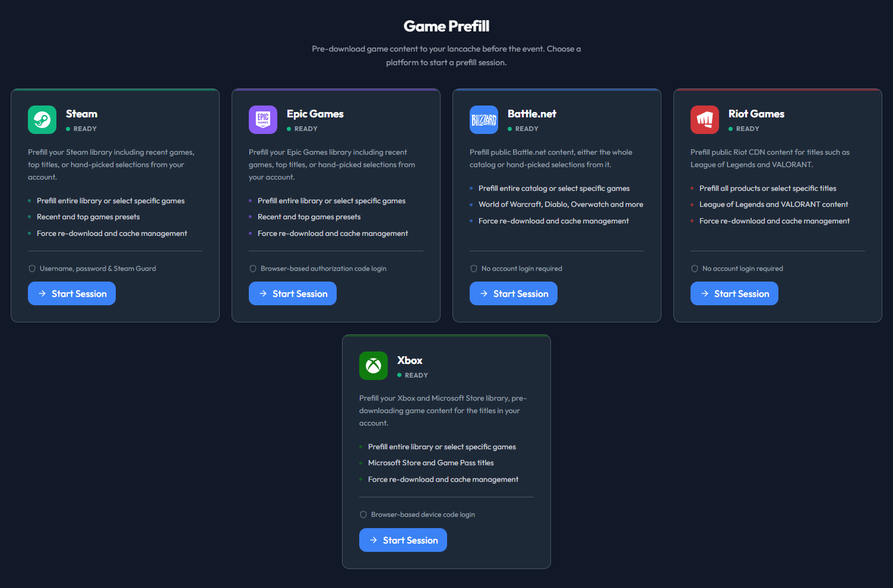
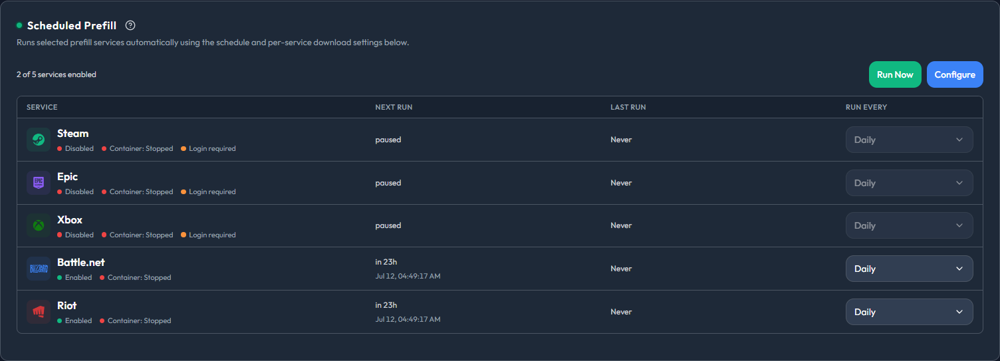
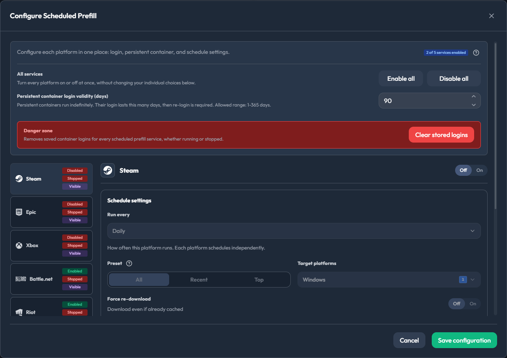

# 预填充 { #prefill-steam--epic }

预填充会在人们连接*之前*把游戏下载进你的缓存。等客人到场时，每次安装都从你的缓存读取，而不是走公共互联网——满速 LAN，没有带宽瓶颈。

Steam、Epic、Battle.net、Riot 和 Xbox 各自在独立的容器中运行，因此你可以同时预填充所有平台而互不干扰。进度会实时推送到 UI。

<div align="center" markdown>


<em>选择一个平台，开始一次预填充会话</em>
</div>

### 要求

- 已挂载 Docker 套接字（`/var/run/docker.sock`）
- 在 lancache-manager 中以管理员身份登录
- 预填充容器可以访问到你的缓存服务器（参见下方的[网络设置](#prefill-network)）

### 运行一次预填充

每个平台的流程都一样：

1. 打开**预填充**标签页，选择 **Steam**、**Epic Games**、**Battle.net**、**Riot Games** 或 **Xbox**
2. 登录（Steam 通过 Steam Guard 验证，Epic 通过 OAuth，Xbox 通过 Microsoft 设备代码；Battle.net 和 Riot 无需登录）
3. 从你的游戏库中选择游戏
4. 点击**开始会话**

就这么简单。让它继续运行——等客人到达时，一切都已经缓存好了。

!!! note
    预填充构建在社区守护进程之上：

    - **Steam**：[steam-prefill-daemon](https://github.com/regix1/steam-prefill-daemon)，[steam-lancache-prefill](https://github.com/tpill90/steam-lancache-prefill) 的分支，原作者 [@tpill90](https://github.com/tpill90)
    - **Epic**：[epic-prefill-daemon](https://github.com/regix1/epic-prefill-daemon)——通过 OAuth 登录账号
    - **Battle.net**：[battlenet-prefill-daemon](https://github.com/regix1/battlenet-prefill-daemon)——完全匿名，无需账号
    - **Riot**：[riot-prefill-daemon](https://github.com/regix1/riot-prefill-daemon)，[riot-lancache-prefill](https://github.com/tpill90/riot-lancache-prefill) 的分支——完全匿名；覆盖英雄联盟和无畏契约
    - **Xbox**：[xbox-prefill-daemon](https://github.com/regix1/xbox-prefill-daemon)——使用 Microsoft 设备代码登录（与 Epic 一样需要账号）

### 导入 Steam App ID

手头有来自 `steam-lancache-prefill` 或其他地方的 App ID 列表？可以跳过库浏览器：

1. 点击**选择应用**
2. 点击**导入应用 ID**
3. 以下列任一格式粘贴你的 ID：
   - 逗号分隔：`730, 570, 440`
   - JSON 数组：`[730, 570, 440]`
   - 每行一个
4. 点击**导入**

对话框会告诉你添加了多少个游戏、有多少已经在选中列表中、以及有多少 ID 不在你的 Steam 游戏库中（这些会在预填充时被跳过）。

!!! tip
    **从 `steam-lancache-prefill` 迁移过来？** 打开 `selectedAppsToPrefill.json`，把内容直接粘贴到导入框中——JSON 数组会按原样解析。

### 计划预填充 { #scheduled-prefill }

配置一次，从此不必在每场活动前手动预填充。打开**管理 → 计划任务**，找到计划预填充卡片。五个平台各自拥有独立的间隔、预设和游戏选择。

<div align="center" markdown>


<em>计划预填充——一眼看清各服务的状态、下次运行和上次运行时间</em>
</div>

<em>持久容器*是指你启动一次就让它一直运行的预填充容器，登录状态也保存在其中。这里只有一条规则贯穿始终：**计划运行只会复用已经在运行的持久容器，它从不自行启动容器。*</em>

所以在为某个服务安排计划之前，先启动它的持久容器，如果该平台需要账号就先登录。尚未就绪的服务会被*跳过*，标记为"需要登录"，其他服务照常运行。如果一次运行里只有跳过、没有真正执行的服务，会以警告结束，而不是失败。

它的具体行为：

- **按服务独立计划。** 每个服务都有自己的"运行频率"间隔。你也可以暂停某个服务，或设置为仅在启动时运行。
- **预设或手动选择游戏。** 预设有**全部**、**最近**和**前 N 项**三种。并非每个平台都支持全部预设：Epic 没有"最近"（它的 API 不提供最近游玩数据），Battle.net 和 Riot 只支持"全部"。手动挑选具体游戏会覆盖预设。
- **首次运行会在你保存后的一个间隔之后触发。** 保存本身不会立即开始预填充。卡片上的**立即运行**是唯一的即时触发方式。
- **新建的计划在*上次运行*处显示**从未运行**是正常的。** *下次运行*由间隔推算得出，而*上次运行*只统计真正完成的运行，所以在第一次运行完成之前会一直显示**从未运行**。
- **停止持久容器会让它登出。** 登录状态保存在容器自身的存储中；停止容器后，该服务在下次计划运行前需要重新登录。如果想显式清空，也有一个"清除已保存的登录"控件。
- **Battle.net 和 Riot 开箱即用。** 它们不需要账号，因此默认已启用——但它们的持久容器仍然必须处于运行状态。
- **目标平台筛选仅限 Steam。** Steam 可以预填充 Windows、Linux 或 macOS 的 depot（默认 Windows）；其他平台不支持目标平台筛选。
- **强制下载和并发数同样按服务单独设置。** 强制下载会重新拉取即使看起来已经完整的游戏（默认关闭）。最大并发数可以是自动，也可以固定为 1-256 个连接。
- 每个服务都可以选择正常显示或静默发送运行通知。

<div align="center" markdown>


<em>配置计划预填充——各平台的计划、预设和目标平台控制</em>
</div>

默认值和限制：

| 设置项 | 默认值 |
|---|---|
| 运行频率（每服务） | 24 小时 |
| 预设 | 全部（"前 N 项"预设使用排名前 50 的游戏） |
| 持久登录有效期 | 90 天 |
| 无进展超时（每次计划运行） | 30 分钟 |
| 强制下载 | 关闭 |
| 最大并发数 | 自动（固定范围：1-256） |
| 单服务最长运行时间 | 12 小时 |

计划任务页面的其余部分，对每个后台服务都采用相同的方式工作——日志轮转、失效扫描、游戏检测、缓存快照等等。每个服务都是一行，各有自己的间隔，行尾带一个**立即运行**控件：桌面端显示为播放图标，手机端显示为带文字的按钮。这里也有一行 **Xbox 游戏映射**，让 Xbox 游戏目录能按自己的计划刷新。

### 网络设置 { #prefill-network }

**大多数安装无需任何配置。** 如果你运行的是标准的 `lancache` + `lancache-dns` 容器，lancache-manager 会自动检测它们，预填充无需额外设置即可工作。

如果你的 DNS 不是标准的 `lancache-dns`（比如使用 AdGuard Home、Pi-hole、公共 DNS 等）或者路由方式比较特殊，设置一个环境变量就能解决：

| 你的环境 | 需要设置什么 |
|---|---|
| 标准 `lancache` + `lancache-dns` 容器 | 无需设置 |
| 单机安装（lancache 与 lancache-manager 在同一主机） | 无需设置 |
| AdGuard Home、Pi-hole 或任何 DNS 替代方案 | `Prefill__LancacheIp=<你的缓存 IP>` |
| 主机网络模式，且主机 DNS 未将 CDN 路由到你的缓存 | 通常无需设置——缓存会通过网桥网关自动检测并经心跳验证；如果网络面板仍然警告，再设置 `Prefill__LancacheIp=<你的缓存 IP>` |
| Caddy/Squid 等按 `Host:` 头路由的非 nginx 缓存 | `Prefill__LancacheIp=<你的缓存 IP>` |
| 希望无论环境如何都有可预测的行为 | 始终设置 `Prefill__LancacheIp` |

!!! tip
    **`Prefill__LancacheIp` 是通用覆盖项。** 设置后，预填充会直接通过 IP 与你的缓存通信，完全不再询问 DNS 缓存在哪里。网络模式和 DNS 服务器设置对 CDN 流量不再有影响。

`Prefill__LancacheIp`、`Prefill__LancacheDnsIp` 和 `Prefill__NetworkMode` 的完整说明与默认值位于[配置 → 预填充](configuration-reference.md#prefill-config)参考表中。

!!! important
    **`LancacheIp` 和 `LancacheDnsIp` 是两个不同的服务，即使在同一台机器上也是如此。**

    | | 是什么 | 端口 | 作用 |
    |---|---|---|---|
    | `LancacheIp` | **缓存服务器**（`lancachenet/monolithic`，或任何 HTTP 缓存） | HTTP / 80 | 保存实际的缓存游戏文件 |
    | `LancacheDnsIp` | **DNS 服务器**（`lancachenet/lancache-dns`、AdGuard Home、Pi-hole 等） | DNS / 53 | 把 `lancache.steamcontent.com` 转换成缓存的 IP |

    想象一座小镇：**缓存**是存放书的图书馆，**DNS 服务器**是你问路的问讯处。两者可以在同一栋楼里（同一个 IP，不同端口），但做的是不同的工作。设置 `LancacheIp` 相当于径直走向图书馆，所以 DNS 对缓存流量不再有影响。

!!! important
    `LANCACHE_IP` 只重定向 CDN 分块流量，而这本来就是 lancache 唯一会缓存的内容。Steam（`api.steampowered.com`）和 Epic（`*.epicgames.com`）的认证与清单端点仍然使用正常 DNS，不受影响。

#### 示例

**最可靠**——`LancacheIp` 让 CDN 路由不再依赖 DNS：

```yaml
environment:
  - Prefill__NetworkMode=host
  - Prefill__LancacheIp=192.168.1.10
```

**Bridge 模式配合非标准 DNS**（例如用 AdGuard Home 替代 lancache-dns）：

```yaml
environment:
  - Prefill__NetworkMode=bridge
  - Prefill__LancacheIp=192.168.1.10        # 缓存服务器
  - Prefill__LancacheDnsIp=192.168.1.20     # DNS 服务器
```

**Bridge 模式，标准 lancache-dns，无 IP 覆盖**（传统的 DNS 驱动路径）：

```yaml
environment:
  - Prefill__NetworkMode=bridge
  - Prefill__LancacheDnsIp=192.168.1.20
```

!!! tip
    **预填充容器没有互联网？** 试试 `Prefill__NetworkMode=bridge`。有些 Docker 环境会在 host 模式下阻断出站流量。

#### 网络诊断

每次预填充会话启动时都会运行一次连通性测试，并把结果写入日志：

```
═══════════════════════════════════════════════════════════════════════
  PREFILL CONTAINER NETWORK DIAGNOSTICS - prefill-daemon-abc123
═══════════════════════════════════════════════════════════════════════
  Internet connectivity: OK (reached api.steampowered.com)
  lancache.steamcontent.com resolved to 192.168.1.10
  DNS looks correct (private IP - likely your lancache server)
═══════════════════════════════════════════════════════════════════════
```

如果解析出的 IP 是公网地址（Steam 真实 CDN 的 IP 形如 `162.254.x.x`），说明流量绕过了你的缓存。设置 `Prefill__LancacheIp` 并重启会话。

??? tip "路由工作原理（高级）——请求究竟走哪条路径"

    ```mermaid
    ---
    config:
      flowchart:
        curve: basis
        padding: 12
    ---
    flowchart TD
      Start([需要从 CDN 主机名<br/>获取一个游戏分块])
      HasIp{LANCACHE_IP 可用？<br/>Prefill__LancacheIp 或<br/>自动检测并已验证}

      Start --> HasIp

      HasIp -->|是| Direct[直接连接该 IP<br/>Host 头 = CDN 主机名]
      Direct --> Hit([由你的缓存提供服务])

      HasIp -->|否| AskDns[向 DNS 询问<br/>CDN 主机名指向哪里]
      AskDns --> Mode{NetworkMode？}

      Mode -->|host| HostDns[使用主机自己的 DNS<br/>Prefill__LancacheDnsIp 被忽略]
      Mode -->|bridge| Bridge{设置了 Prefill__LancacheDnsIp？}

      Bridge -->|是| Forced[查询该 DNS 服务器]
      Bridge -->|否| Probe[守护进程探测 CDN 名、<br/>localhost，然后是网关]

      HostDns --> Resolved{DNS 返回了<br/>你的缓存 IP？}
      Forced --> Resolved
      Probe --> Resolved

      Resolved -->|是| Hit
      Resolved -->|否| Miss([公网 CDN IP<br/>流量绕开你的缓存])
    ```

    所有组合：

    | `NetworkMode` | `LancacheIp` | `LancacheDnsIp` | 结果 |
    |:---:|:---:|:---:|---|
    | `host` | 已设置 | （任意） | 可靠。已注入 `LANCACHE_IP`；DNS 无关紧要。 |
    | `host` | 未设置 | （任意） | 通常没问题。自动检测 + 心跳会注入 `LANCACHE_IP`；否则使用主机 DNS。host 模式下 DnsIp 会被丢弃。 |
    | `bridge` | 已设置 | 未设置 | 可靠。已注入 `LANCACHE_IP`；DNS 无关紧要。 |
    | `bridge` | 已设置 | 已设置 | 可靠。`LANCACHE_IP` 用于 CDN，DnsIp 用于认证/清单。 |
    | `bridge` | 未设置 | 已设置 | 如果 DnsIp 能把 CDN 解析到你的缓存则有效。 |
    | `bridge` | 未设置 | 未设置 | 通常没问题。自动检测会注入 `LANCACHE_IP`；否则守护进程探测 localhost/网关。 |

    **为什么 `LancacheIp` 总是有效：** 设置后，守护进程会请求 `GET http://192.168.1.10/depot/...`，并带上 `Host: lancache.steamcontent.com`。你的缓存按 `Host:` 路由并从缓存提供服务。DNS 不会被问及 CDN 域名。

-----
